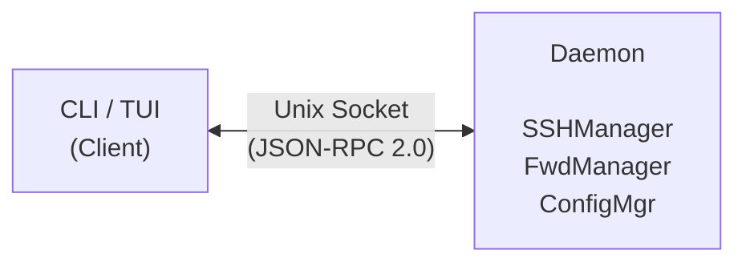
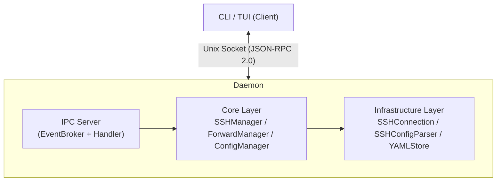

# MolePort

[日本語](README_ja.md)

SSH port forwarding manager with a daemon+client architecture.

Reads host information from `~/.ssh/config` and lets you configure, connect, and disconnect port forwarding via CLI or TUI.



## Features

- **SSH config integration** --- Automatically reads hosts from `~/.ssh/config` (supports Include directives)
- **3 forwarding types** --- Local (-L) / Remote (-R) / Dynamic SOCKS5 (-D)
- **Real-time monitoring** --- Displays connection status, uptime, and transferred data volume
- **Auto-reconnect** --- Automatic retry with exponential backoff
- **Session restore** --- Automatically restores previous active forwarding on startup
- **Daemon+client** --- Background daemon manages SSH connections; CLI/TUI operates as a client

## Requirements

- Go 1.25+
- Linux / macOS

## Installation

```bash
git clone https://github.com/ousiassllc/MolePort.git
cd MolePort
make install
```

`make install` runs `go install` to place the binary in `$(go env GOPATH)/bin`.
If that directory is not in your PATH, add it to your shell configuration:

```bash
export PATH="$PATH:$(go env GOPATH)/bin"
```

To build only (outputs to `./bin/moleport`):

```bash
make build
```

## Quick Start

```bash
# 1. Start the daemon
moleport daemon start

# 2. Connect to an SSH host
moleport connect prod-server

# 3. Add a forwarding rule
moleport add --host prod-server --type local --local-port 8080 --remote-host localhost --remote-port 80

# 4. Start forwarding
moleport start web

# 5. Monitor with the TUI dashboard
moleport tui
```

## CLI Commands

Running `moleport` without a subcommand launches the TUI dashboard (equivalent to `moleport tui`).

| Command | Description |
|---------|-------------|
| `moleport daemon start` | Start the daemon in the background |
| `moleport daemon stop [--purge]` | Stop the daemon (`--purge`: clear state) |
| `moleport daemon status` | Show daemon status |
| `moleport daemon kill` | Force terminate an unresponsive daemon |
| `moleport connect <host>` | Connect to an SSH host |
| `moleport disconnect <host>` | Disconnect from an SSH host |
| `moleport add [flags]` | Add a forwarding rule |
| `moleport delete <name>` | Delete a forwarding rule |
| `moleport start <name>` | Start forwarding |
| `moleport stop <name> / --all` | Stop forwarding (`--all`: stop all) |
| `moleport list [--json]` | List hosts and forwarding rules |
| `moleport status [name]` | Show connection status summary |
| `moleport config [--json]` | Show configuration |
| `moleport reload` | Reload SSH config |
| `moleport tui` | Launch the TUI dashboard |
| `moleport update [--check]` | Auto-update to latest version (`--check`: check only) |
| `moleport version` | Show version information |
| `moleport help` | Show help |

## TUI Key Bindings

| Key | Action |
|-----|--------|
| `↑`/`k` `↓`/`j` | Select item |
| `Enter` | Toggle connect/disconnect |
| `Tab` | Switch pane |
| `d` | Disconnect selected forwarding |
| `x` | Delete selected forwarding |
| `t` | Change theme |
| `l` | Change language |
| `v` | Show version info |
| `/` | Focus command input |
| `?` | Show help |
| `Esc` | Cancel |
| `q` / `Ctrl+C` | Quit |

## Architecture



## Configuration

Config file: `~/.config/moleport/config.yaml`

```yaml
ssh_config_path: "~/.ssh/config"

reconnect:
  enabled: true
  max_retries: 10
  initial_delay: "1s"
  max_delay: "60s"
  keepalive_interval: "30s"

session:
  auto_restore: true

log:
  level: "info"
  file: "~/.config/moleport/moleport.log"

language: "ja"

tui:
  theme:
    base: "dark"           # "dark" | "light"
    accent: "violet"       # "violet" | "blue" | "green" | "cyan" | "orange"

update_check:
  enabled: true            # false to disable update checks
  interval: "24h"          # check interval
```

## Host Key Verification

MolePort verifies host keys using `~/.ssh/known_hosts`. In environments where host keys may change (e.g., Tailscale SSH), connections can fail with `knownhosts: key mismatch`.

Setting `StrictHostKeyChecking no` in your SSH config tells MolePort to skip host key verification for that host.

```
# ~/.ssh/config
Host tailscale-host
    HostName 100.64.x.x
    StrictHostKeyChecking no
```

You can also configure multiple hosts at once:

```
Host ts-host1 ts-host2 ts-host3
    StrictHostKeyChecking no
```

> **Warning**: `StrictHostKeyChecking no` completely disables host key verification. Use it only for hosts on trusted networks.

## Development

```bash
make help        # Show available targets
make build       # Build
make run         # Build and run
make test        # Run tests
make test-race   # Run tests with race detector
make vet         # Run go vet
make fmt         # Run go fmt
make lint        # Run golangci-lint
make linterly    # Run linterly (file line count check)
make setup-tools # Install development tools (linterly, golangci-lint)
make clean       # Remove build artifacts
```

### Git Hooks (lefthook)

[lefthook](https://github.com/evilmartians/lefthook) runs automated checks on commit and push.

| Hook | Checks |
|------|--------|
| pre-commit | `gofmt` formatting, `go vet`, `golangci-lint`, `linterly` |
| pre-push | `go test -race` (tests with race detector), `go build` (build check), `golangci-lint` |

Setup:

```bash
# Install lefthook (if not already installed)
go install github.com/evilmartians/lefthook@latest

# Enable Git hooks
lefthook install
```

## License

MIT
