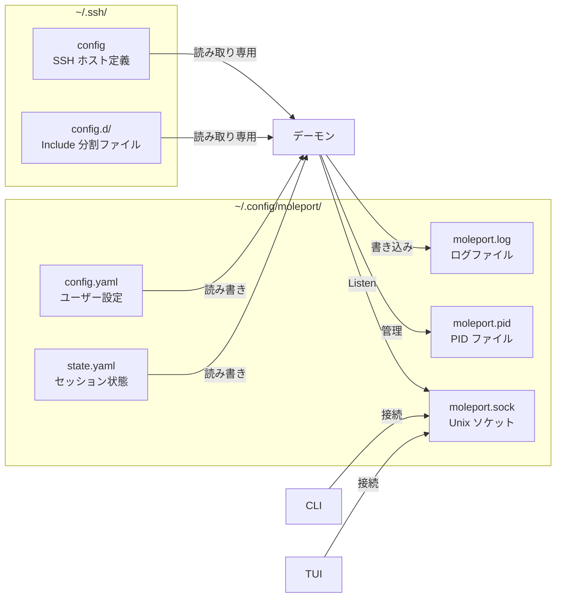
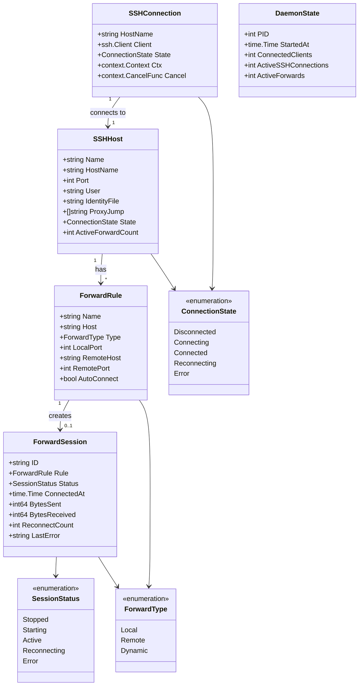
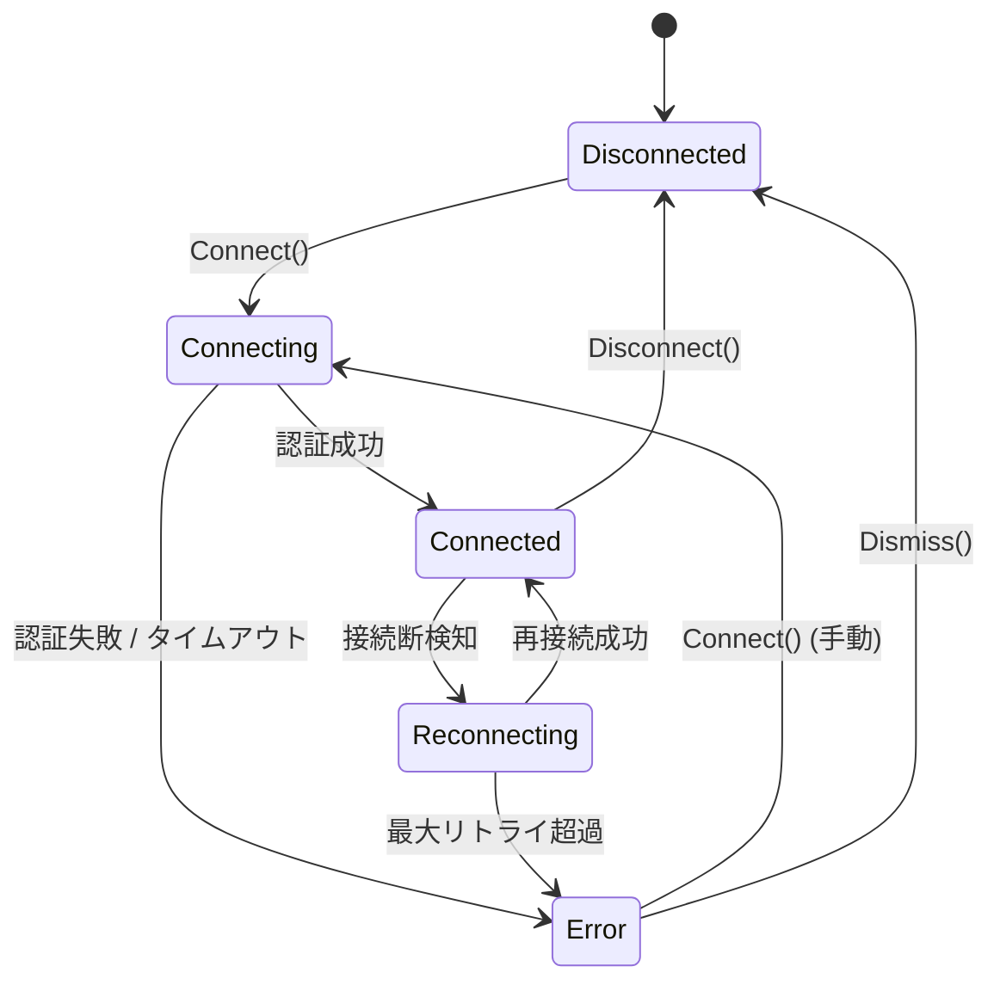
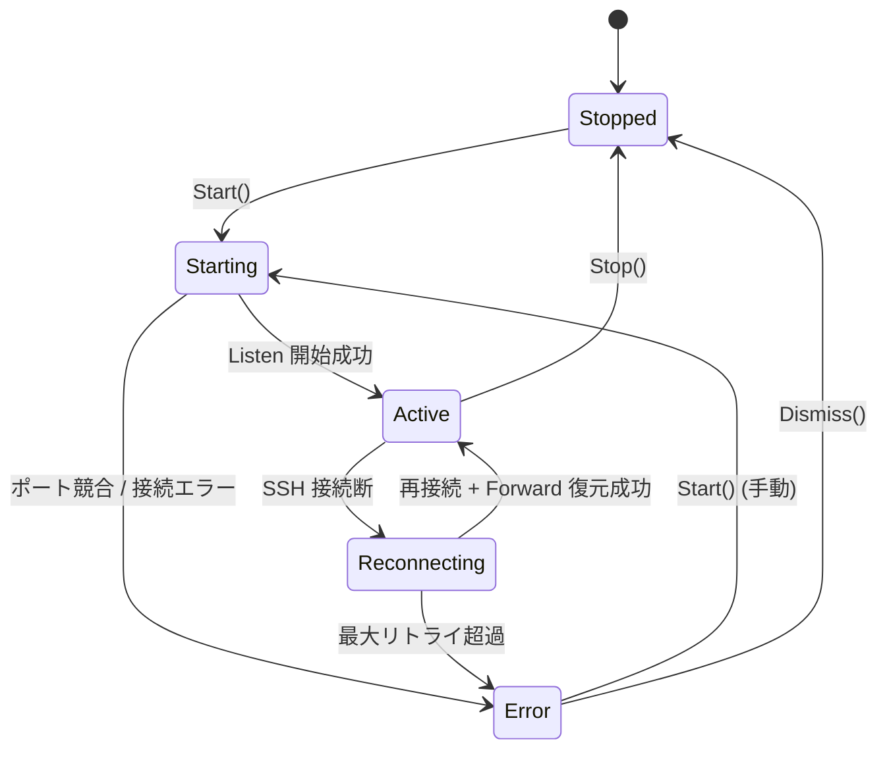

# MolePort データモデル設計

## 概要

MolePort はデータベースを使用せず、YAML ファイルで設定と状態を永続化する。
デーモンとクライアント間は JSON-RPC 2.0 でメッセージを交換する。
本ドキュメントでは、永続化ファイルの構造、アプリケーション内部のデータモデル、および IPC メッセージ型を定義する。

## ファイル構成



## 設定ファイル（config.yaml）

ユーザーが変更可能な設定を保持する。

### 構造

```yaml
# ~/.config/moleport/config.yaml

# SSH config のパス（デフォルト: ~/.ssh/config）
ssh_config_path: "~/.ssh/config"

# 再接続設定
reconnect:
  enabled: true          # 自動再接続の有効/無効
  max_retries: 10        # 最大リトライ回数（0 = 無制限）
  initial_delay: "1s"    # 初回リトライ待機時間
  max_delay: "60s"       # 最大リトライ待機時間

# セッション復元
session:
  auto_restore: true     # デーモン起動時に前回状態を自動復元

# ログ設定
log:
  level: "info"          # debug / info / warn / error
  file: "~/.config/moleport/moleport.log"

# ポートフォワーディングルール（永続化）
forwards:
  - name: "prod-web"
    host: "prod-server"
    type: "local"          # local / remote / dynamic
    local_port: 8080
    remote_host: "localhost"
    remote_port: 80
    auto_connect: true     # デーモン起動時に自動接続

  - name: "prod-db"
    host: "prod-server"
    type: "local"
    local_port: 5432
    remote_host: "localhost"
    remote_port: 5432
    auto_connect: true

  - name: "proxy"
    host: "staging"
    type: "dynamic"
    local_port: 1080
    auto_connect: false
```

### Go 型定義

```go
type Config struct {
    SSHConfigPath string          `yaml:"ssh_config_path"`
    Reconnect     ReconnectConfig `yaml:"reconnect"`
    Session       SessionConfig   `yaml:"session"`
    Log           LogConfig       `yaml:"log"`
    Forwards      []ForwardRule   `yaml:"forwards"`
}

type ReconnectConfig struct {
    Enabled      bool          `yaml:"enabled"`
    MaxRetries   int           `yaml:"max_retries"`
    InitialDelay time.Duration `yaml:"initial_delay"`
    MaxDelay     time.Duration `yaml:"max_delay"`
}

type SessionConfig struct {
    AutoRestore bool `yaml:"auto_restore"`
}

type LogConfig struct {
    Level string `yaml:"level"`
    File  string `yaml:"file"`
}

type ForwardRule struct {
    Name        string `yaml:"name"`
    Host        string `yaml:"host"`
    Type        string `yaml:"type"`         // "local" | "remote" | "dynamic"
    LocalPort   int    `yaml:"local_port"`
    RemoteHost  string `yaml:"remote_host"`  // dynamic の場合は不要
    RemotePort  int    `yaml:"remote_port"`  // dynamic の場合は不要
    AutoConnect bool   `yaml:"auto_connect"`
}
```

## 状態ファイル（state.yaml）

デーモン停止時のセッション状態を保持する。デーモン起動時の自動復元に使用する。

### 構造

```yaml
# ~/.config/moleport/state.yaml

last_updated: "2026-02-11T15:30:00+09:00"

# 停止時にアクティブだった転送ルール
active_forwards:
  - name: "prod-web"
    host: "prod-server"
    type: "local"
    local_port: 8080
    remote_host: "localhost"
    remote_port: 80

  - name: "prod-db"
    host: "prod-server"
    type: "local"
    local_port: 5432
    remote_host: "localhost"
    remote_port: 5432

# 最後に選択していたホスト（TUI 復元用）
selected_host: "prod-server"
```

### Go 型定義

```go
type State struct {
    LastUpdated    time.Time     `yaml:"last_updated"`
    ActiveForwards []ForwardRule `yaml:"active_forwards"`
    SelectedHost   string        `yaml:"selected_host"`
}
```

## PID ファイル（moleport.pid）

デーモンプロセスの PID を記録する単純なテキストファイル。

- **パス**: `~/.config/moleport/moleport.pid`
- **内容**: PID 番号のみ（例: `12345`）
- **パーミッション**: `0600`
- **ライフサイクル**: デーモン起動時に作成、停止時に削除

## 内部データモデル

アプリケーション実行中にメモリ上で管理するデータモデル。

### モデル関連図



### SSHHost

SSH config から読み込んだホスト情報と、実行時の接続状態を保持する。

| フィールド | 型 | 説明 |
|-----------|------|------|
| Name | string | SSH config のホスト名（エイリアス） |
| HostName | string | 実際のホストアドレス |
| Port | int | SSH ポート番号（デフォルト: 22） |
| User | string | 接続ユーザー名 |
| IdentityFile | string | 秘密鍵のパス |
| ProxyJump | []string | 踏み台サーバー |
| State | ConnectionState | 現在の接続状態 |
| ActiveForwardCount | int | アクティブな転送数 |

### ForwardSession

実行中のポートフォワーディングセッションの状態とメトリクスを保持する。

| フィールド | 型 | 説明 |
|-----------|------|------|
| ID | string | セッション一意 ID（`<host>-<type>-<localport>` 形式で自動生成） |
| Rule | ForwardRule | 転送ルール |
| Status | SessionStatus | セッション状態 |
| ConnectedAt | time.Time | 接続開始時刻 |
| BytesSent | int64 | 送信バイト数 |
| BytesReceived | int64 | 受信バイト数 |
| ReconnectCount | int | 再接続回数 |
| LastError | string | 最後のエラーメッセージ |

### DaemonState（新規）

デーモンプロセスの状態情報。`daemon.status` メソッドで返却される。

| フィールド | 型 | 説明 |
|-----------|------|------|
| PID | int | デーモンプロセスの PID |
| StartedAt | time.Time | デーモン起動時刻 |
| ConnectedClients | int | 接続中のクライアント数 |
| ActiveSSHConnections | int | アクティブな SSH 接続数 |
| ActiveForwards | int | アクティブなポートフォワーディング数 |

### 内部データモデルの Go 型定義

```go
// 接続状態
type ConnectionState int

const (
    Disconnected ConnectionState = iota
    Connecting
    Connected
    Reconnecting
    ConnectionError
)

// セッション状態
type SessionStatus int

const (
    Stopped SessionStatus = iota
    Starting
    Active
    SessionReconnecting
    SessionError
)

// 転送種別
type ForwardType int

const (
    Local   ForwardType = iota
    Remote
    Dynamic
)

// SSH ホスト情報
type SSHHost struct {
    Name              string          // SSH config のホスト名（エイリアス）
    HostName          string          // 実際のホストアドレス
    Port              int             // SSH ポート（デフォルト: 22）
    User              string          // 接続ユーザー名
    IdentityFile      string          // 秘密鍵のパス
    ProxyJump         []string        // 踏み台サーバー
    State             ConnectionState // 現在の接続状態
    ActiveForwardCount int            // アクティブな転送数
}

// 転送セッション（実行時状態 + メトリクス）
type ForwardSession struct {
    ID             string        // 一意 ID（<host>-<type>-<localport>）
    Rule           ForwardRule   // 転送ルール
    Status         SessionStatus // セッション状態
    ConnectedAt    time.Time     // 接続開始時刻
    BytesSent      int64         // 送信バイト数
    BytesReceived  int64         // 受信バイト数
    ReconnectCount int           // 再接続回数
    LastError      string        // 最後のエラーメッセージ
}

// デーモン状態
type DaemonState struct {
    PID                  int       // デーモンプロセスの PID
    StartedAt            time.Time // 起動時刻
    ConnectedClients     int       // 接続中クライアント数
    ActiveSSHConnections int       // アクティブ SSH 接続数
    ActiveForwards       int       // アクティブ転送数
}
```

**ForwardRule.Name の一意性**: ルール名はグローバルユニーク（全ホスト横断で一意）とする。`ForwardManager` がルール名のみで操作するため。省略時は `<host>-<type>-<localport>` 形式で自動生成される。

## 状態遷移図

### SSH 接続の状態遷移



### ポートフォワーディングの状態遷移



## IPC メッセージ型定義

JSON-RPC 2.0 の全メソッドについてリクエスト/レスポンスの Go 型定義を示す。

### 共通型

```go
// JSON-RPC 2.0 基本構造
type Request struct {
    JSONRPC string          `json:"jsonrpc"`           // "2.0"
    ID      *int            `json:"id,omitempty"`      // リクエスト ID（通知の場合は nil）
    Method  string          `json:"method"`
    Params  json.RawMessage `json:"params,omitempty"`
}

// Response.ID は *int を使用する。JSON-RPC 2.0 仕様では、パース不能な
// リクエストへのレスポンスで "id": null を返す必要があるため。
type Response struct {
    JSONRPC string          `json:"jsonrpc"`           // "2.0"
    ID      *int            `json:"id"`
    Result  json.RawMessage `json:"result,omitempty"`
    Error   *RPCError       `json:"error,omitempty"`
}

// Notification は JSON-RPC 2.0 通知（ID なし）を表す。
type Notification struct {
    JSONRPC string          `json:"jsonrpc"`
    Method  string          `json:"method"`
    Params  json.RawMessage `json:"params,omitempty"`
}

type RPCError struct {
    Code    int    `json:"code"`
    Message string `json:"message"`
    Data    any    `json:"data,omitempty"`
}
```

### ホスト管理

```go
// host.list
type HostListParams struct{}
type HostListResult struct {
    Hosts []HostInfo `json:"hosts"`
}
type HostInfo struct {
    Name              string `json:"name"`
    HostName          string `json:"hostname"`
    Port              int    `json:"port"`
    User              string `json:"user"`
    State             string `json:"state"`               // "disconnected" | "connecting" | "connected" | "reconnecting" | "error"
    ActiveForwardCount int   `json:"active_forward_count"`
}

// host.reload
type HostReloadParams struct{}
type HostReloadResult struct {
    Total   int      `json:"total"`
    Added   []string `json:"added"`
    Removed []string `json:"removed"`
}
```

### SSH 接続管理

```go
// ssh.connect
type SSHConnectParams struct {
    Host string `json:"host"`
}
type SSHConnectResult struct {
    Host   string `json:"host"`
    Status string `json:"status"` // "connected"
}

// ssh.disconnect
type SSHDisconnectParams struct {
    Host string `json:"host"`
}
type SSHDisconnectResult struct {
    Host   string `json:"host"`
    Status string `json:"status"` // "disconnected"
}
```

### ポートフォワーディング管理

```go
// forward.list
type ForwardListParams struct {
    Host string `json:"host,omitempty"` // 省略時は全ホスト
}
type ForwardListResult struct {
    Forwards []ForwardInfo `json:"forwards"`
}
type ForwardInfo struct {
    Name       string `json:"name"`
    Host       string `json:"host"`
    Type       string `json:"type"`        // "local" | "remote" | "dynamic"
    LocalPort  int    `json:"local_port"`
    RemoteHost string `json:"remote_host,omitempty"`
    RemotePort int    `json:"remote_port,omitempty"`
    AutoConnect bool  `json:"auto_connect"`
}

// forward.add
type ForwardAddParams struct {
    Name        string `json:"name,omitempty"`  // 省略時は自動生成
    Host        string `json:"host"`
    Type        string `json:"type"`
    LocalPort   int    `json:"local_port"`
    RemoteHost  string `json:"remote_host,omitempty"`
    RemotePort  int    `json:"remote_port,omitempty"`
    AutoConnect bool   `json:"auto_connect"`
}
type ForwardAddResult struct {
    Name string `json:"name"`
}

// forward.delete
type ForwardDeleteParams struct {
    Name string `json:"name"`
}
type ForwardDeleteResult struct {
    OK bool `json:"ok"`
}

// forward.start
type ForwardStartParams struct {
    Name string `json:"name"`
}
type ForwardStartResult struct {
    Name   string `json:"name"`
    Status string `json:"status"` // "active"
}

// forward.stop
type ForwardStopParams struct {
    Name string `json:"name"`
}
type ForwardStopResult struct {
    Name   string `json:"name"`
    Status string `json:"status"` // "stopped"
}
```

### セッション情報

```go
// session.list
type SessionListParams struct{}
type SessionListResult struct {
    Sessions []SessionInfo `json:"sessions"`
}
type SessionInfo struct {
    ID             string `json:"id"`
    Name           string `json:"name"`
    Host           string `json:"host"`
    Type           string `json:"type"`
    LocalPort      int    `json:"local_port"`
    RemoteHost     string `json:"remote_host,omitempty"`
    RemotePort     int    `json:"remote_port,omitempty"`
    Status         string `json:"status"`          // "stopped" | "starting" | "active" | "reconnecting" | "error"
    ConnectedAt    string `json:"connected_at,omitempty"` // RFC3339
    BytesSent      int64  `json:"bytes_sent"`
    BytesReceived  int64  `json:"bytes_received"`
    ReconnectCount int    `json:"reconnect_count"`
    LastError      string `json:"last_error,omitempty"`
}

// session.get
type SessionGetParams struct {
    Name string `json:"name"`
}
type SessionGetResult = SessionInfo
```

### 設定管理

```go
// config.get
type ConfigGetParams struct{}
type ConfigGetResult struct {
    SSHConfigPath string          `json:"ssh_config_path"`
    Reconnect     ReconnectInfo   `json:"reconnect"`
    Session       SessionCfgInfo  `json:"session"`
    Log           LogInfo         `json:"log"`
}
type ReconnectInfo struct {
    Enabled      bool   `json:"enabled"`
    MaxRetries   int    `json:"max_retries"`
    InitialDelay string `json:"initial_delay"`
    MaxDelay     string `json:"max_delay"`
}
type SessionCfgInfo struct {
    AutoRestore bool `json:"auto_restore"`
}
type LogInfo struct {
    Level string `json:"level"`
    File  string `json:"file"`
}

// config.update（部分更新: 指定したフィールドのみ変更）
type ConfigUpdateParams struct {
    SSHConfigPath *string               `json:"ssh_config_path,omitempty"`
    Reconnect     *ReconnectUpdateInfo  `json:"reconnect,omitempty"`
    Session       *SessionCfgUpdateInfo `json:"session,omitempty"`
    Log           *LogUpdateInfo        `json:"log,omitempty"`
}
type ConfigUpdateResult struct {
    OK bool `json:"ok"`
}

// 再接続設定の部分更新パラメータ（nil フィールドは変更なし）
type ReconnectUpdateInfo struct {
    Enabled      *bool   `json:"enabled,omitempty"`
    MaxRetries   *int    `json:"max_retries,omitempty"`
    InitialDelay *string `json:"initial_delay,omitempty"`
    MaxDelay     *string `json:"max_delay,omitempty"`
}

// セッション設定の部分更新パラメータ
type SessionCfgUpdateInfo struct {
    AutoRestore *bool `json:"auto_restore,omitempty"`
}

// ログ設定の部分更新パラメータ
type LogUpdateInfo struct {
    Level *string `json:"level,omitempty"`
    File  *string `json:"file,omitempty"`
}
```

### デーモン管理

```go
// daemon.status
type DaemonStatusParams struct{}
type DaemonStatusResult struct {
    PID                  int    `json:"pid"`
    StartedAt            string `json:"started_at"` // RFC3339
    Uptime               string `json:"uptime"`     // human-readable ("2h 30m")
    ConnectedClients     int    `json:"connected_clients"`
    ActiveSSHConnections int    `json:"active_ssh_connections"`
    ActiveForwards       int    `json:"active_forwards"`
}

// daemon.shutdown
type DaemonShutdownParams struct{}
type DaemonShutdownResult struct {
    OK bool `json:"ok"`
}
```

### イベントサブスクリプション

```go
// events.subscribe
type EventsSubscribeParams struct {
    Types []string `json:"types"` // "ssh" | "forward" | "metrics"
}
type EventsSubscribeResult struct {
    SubscriptionID string `json:"subscription_id"`
}

// events.unsubscribe
type EventsUnsubscribeParams struct {
    SubscriptionID string `json:"subscription_id"`
}
type EventsUnsubscribeResult struct {
    OK bool `json:"ok"`
}
```

### イベント通知

```go
// event.ssh（デーモン → クライアント通知）
type SSHEventNotification struct {
    Type  string `json:"type"`  // "connected" | "disconnected" | "reconnecting" | "error"
    Host  string `json:"host"`
    Error string `json:"error,omitempty"`
}

// event.forward（デーモン → クライアント通知）
type ForwardEventNotification struct {
    Type  string `json:"type"`  // "started" | "stopped" | "error"
    Name  string `json:"name"`
    Host  string `json:"host"`
    Error string `json:"error,omitempty"`
}

// event.metrics（デーモン → クライアント通知、定期送信）
type MetricsEventNotification struct {
    Sessions []SessionMetrics `json:"sessions"`
}
type SessionMetrics struct {
    Name          string `json:"name"`
    Status        string `json:"status"`
    BytesSent     int64  `json:"bytes_sent"`
    BytesReceived int64  `json:"bytes_received"`
    Uptime        string `json:"uptime"`
}
```

### JSON-RPC エラーコード

| コード | 定数名 | 説明 |
|-------|--------|------|
| -32700 | ParseError | JSON パースエラー |
| -32600 | InvalidRequest | 不正なリクエスト |
| -32601 | MethodNotFound | 存在しないメソッド |
| -32602 | InvalidParams | 不正なパラメータ |
| -32603 | InternalError | 内部エラー |
| 1001 | HostNotFound | 指定ホストが見つからない |
| 1002 | AlreadyConnected | 既に接続済み |
| 1003 | NotConnected | 未接続 |
| 1004 | RuleNotFound | 転送ルールが見つからない |
| 1005 | RuleAlreadyExists | ルール名が重複 |
| 1006 | PortConflict | ポートが使用中 |
| 1007 | AuthenticationFailed | SSH 認証失敗 |

## 改訂履歴

| 版 | 日付 | 変更内容 | 変更理由 |
|---|------|---------|---------|
| 1.0 | 2026-02-10 | 初版作成 | — |
| 1.1 | 2026-02-10 | 内部データモデルの Go 型定義を追加、ForwardRule.Name の一意性スコープを明確化 | 整合性チェック |
| 2.0 | 2026-02-11 | デーモン化対応: DaemonState 追加、PID ファイル定義、IPC メッセージ型定義（全メソッド）追加 | デーモン化対応 |
