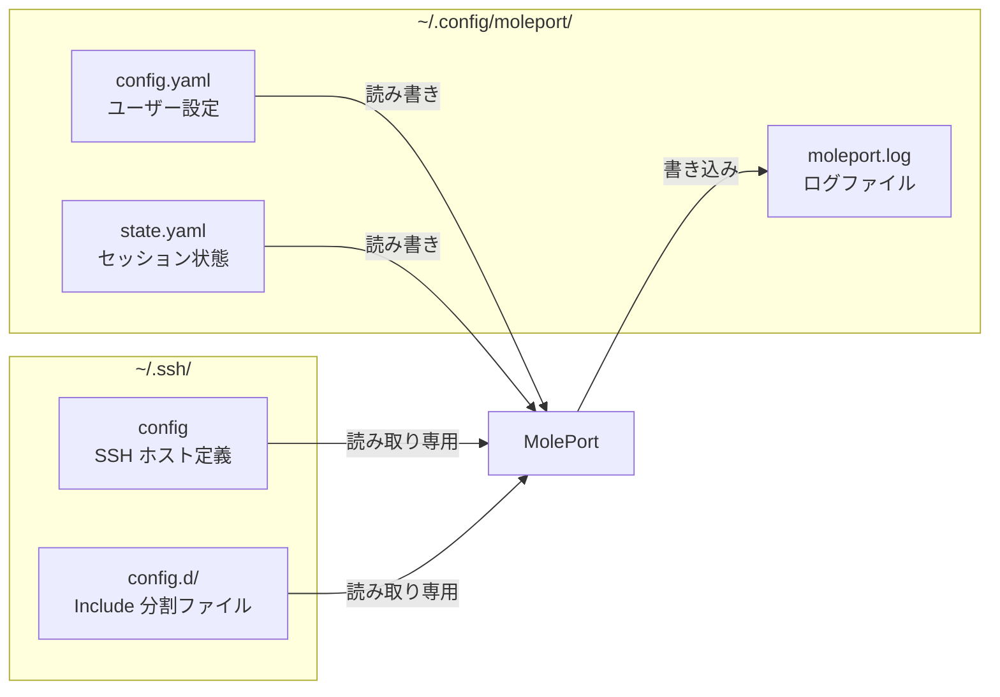
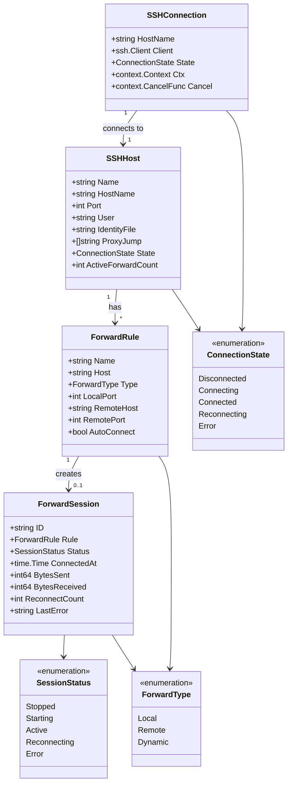
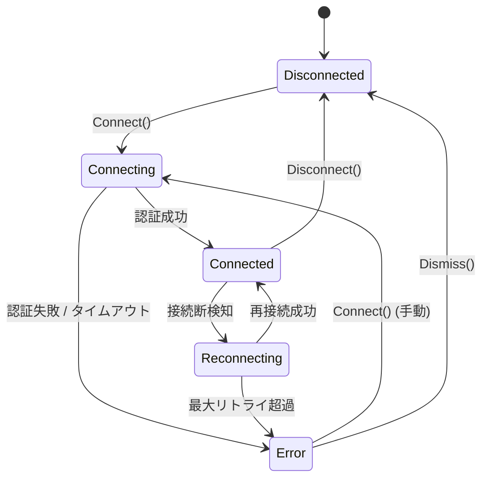
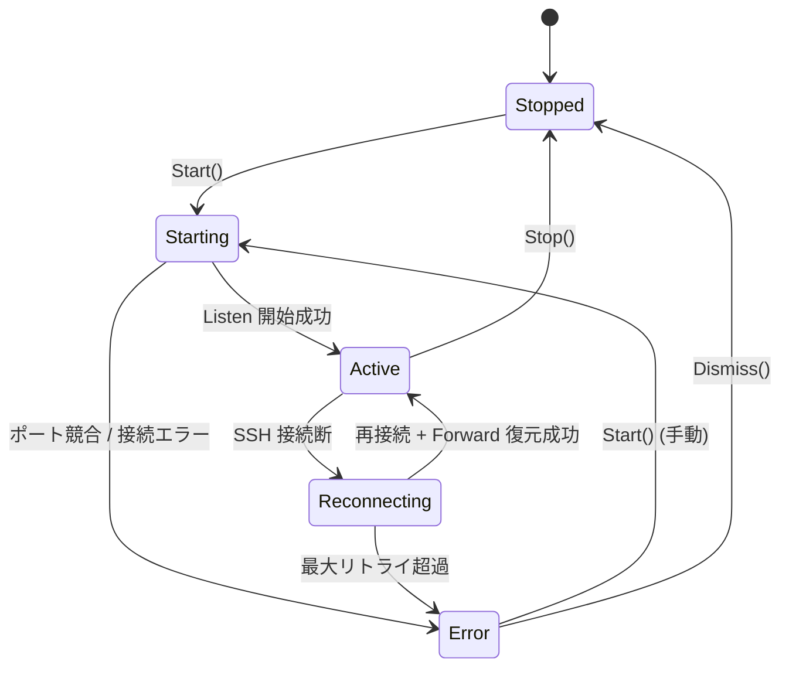

# MolePort データモデル設計

## 概要

MolePort はデータベースを使用せず、YAML ファイルで設定と状態を永続化する。
本ドキュメントでは、設定ファイル・状態ファイルの構造と、アプリケーション内部のデータモデルを定義する。

## ファイル構成



## 設定ファイル（config.yaml）

ユーザーが変更可能な設定を保持する。

### 構造

```yaml
# ~/.config/moleport/config.yaml

# SSH config のパス（デフォルト: ~/.ssh/config）
ssh_config_path: "~/.ssh/config"

# 再接続設定
reconnect:
  enabled: true          # 自動再接続の有効/無効
  max_retries: 10        # 最大リトライ回数（0 = 無制限）
  initial_delay: "1s"    # 初回リトライ待機時間
  max_delay: "60s"       # 最大リトライ待機時間

# セッション復元
session:
  auto_restore: true     # 起動時に前回状態を自動復元

# ログ設定
log:
  level: "info"          # debug / info / warn / error
  file: "~/.config/moleport/moleport.log"

# ポートフォワーディングルール（永続化）
forwards:
  - name: "prod-web"
    host: "prod-server"
    type: "local"          # local / remote / dynamic
    local_port: 8080
    remote_host: "localhost"
    remote_port: 80
    auto_connect: true     # 起動時に自動接続

  - name: "prod-db"
    host: "prod-server"
    type: "local"
    local_port: 5432
    remote_host: "localhost"
    remote_port: 5432
    auto_connect: true

  - name: "proxy"
    host: "staging"
    type: "dynamic"
    local_port: 1080
    auto_connect: false
```

### Go 型定義

```go
type Config struct {
    SSHConfigPath string          `yaml:"ssh_config_path"`
    Reconnect     ReconnectConfig `yaml:"reconnect"`
    Session       SessionConfig   `yaml:"session"`
    Log           LogConfig       `yaml:"log"`
    Forwards      []ForwardRule   `yaml:"forwards"`
}

type ReconnectConfig struct {
    Enabled      bool          `yaml:"enabled"`
    MaxRetries   int           `yaml:"max_retries"`
    InitialDelay time.Duration `yaml:"initial_delay"`
    MaxDelay     time.Duration `yaml:"max_delay"`
}

type SessionConfig struct {
    AutoRestore bool `yaml:"auto_restore"`
}

type LogConfig struct {
    Level string `yaml:"level"`
    File  string `yaml:"file"`
}

type ForwardRule struct {
    Name        string `yaml:"name"`
    Host        string `yaml:"host"`
    Type        string `yaml:"type"`         // "local" | "remote" | "dynamic"
    LocalPort   int    `yaml:"local_port"`
    RemoteHost  string `yaml:"remote_host"`  // dynamic の場合は不要
    RemotePort  int    `yaml:"remote_port"`  // dynamic の場合は不要
    AutoConnect bool   `yaml:"auto_connect"`
}
```

## 状態ファイル（state.yaml）

アプリケーション終了時のセッション状態を保持する。起動時の自動復元に使用する。

### 構造

```yaml
# ~/.config/moleport/state.yaml

last_updated: "2026-02-10T15:30:00+09:00"

# 終了時にアクティブだった転送ルール
active_forwards:
  - name: "prod-web"
    host: "prod-server"
    type: "local"
    local_port: 8080
    remote_host: "localhost"
    remote_port: 80

  - name: "prod-db"
    host: "prod-server"
    type: "local"
    local_port: 5432
    remote_host: "localhost"
    remote_port: 5432

# 最後に選択していたホスト
selected_host: "prod-server"
```

### Go 型定義

```go
type State struct {
    LastUpdated    time.Time     `yaml:"last_updated"`
    ActiveForwards []ForwardRule `yaml:"active_forwards"`
    SelectedHost   string        `yaml:"selected_host"`
}
```

## 内部データモデル

アプリケーション実行中にメモリ上で管理するデータモデル。

### モデル関連図



### SSHHost

SSH config から読み込んだホスト情報と、実行時の接続状態を保持する。

| フィールド | 型 | 説明 |
|-----------|------|------|
| Name | string | SSH config のホスト名（エイリアス） |
| HostName | string | 実際のホストアドレス |
| Port | int | SSH ポート番号（デフォルト: 22） |
| User | string | 接続ユーザー名 |
| IdentityFile | string | 秘密鍵のパス |
| ProxyJump | []string | 踏み台サーバー |
| State | ConnectionState | 現在の接続状態 |
| ActiveForwardCount | int | アクティブな転送数 |

### ForwardSession

実行中のポートフォワーディングセッションの状態とメトリクスを保持する。

| フィールド | 型 | 説明 |
|-----------|------|------|
| ID | string | セッション一意 ID（`<host>-<type>-<localport>` 形式で自動生成） |
| Rule | ForwardRule | 転送ルール |
| Status | SessionStatus | セッション状態 |
| ConnectedAt | time.Time | 接続開始時刻 |
| BytesSent | int64 | 送信バイト数 |
| BytesReceived | int64 | 受信バイト数 |
| ReconnectCount | int | 再接続回数 |
| LastError | string | 最後のエラーメッセージ |

### 内部データモデルの Go 型定義

```go
// 接続状態
type ConnectionState int

const (
    Disconnected ConnectionState = iota
    Connecting
    Connected
    Reconnecting
    ConnectionError
)

// セッション状態
type SessionStatus int

const (
    Stopped SessionStatus = iota
    Starting
    Active
    SessionReconnecting
    SessionError
)

// 転送種別
type ForwardType int

const (
    Local   ForwardType = iota
    Remote
    Dynamic
)

// SSH ホスト情報
type SSHHost struct {
    Name              string          // SSH config のホスト名（エイリアス）
    HostName          string          // 実際のホストアドレス
    Port              int             // SSH ポート（デフォルト: 22）
    User              string          // 接続ユーザー名
    IdentityFile      string          // 秘密鍵のパス
    ProxyJump         []string        // 踏み台サーバー
    State             ConnectionState // 現在の接続状態
    ActiveForwardCount int            // アクティブな転送数
}

// 転送セッション（実行時状態 + メトリクス）
type ForwardSession struct {
    ID             string        // 一意 ID（<host>-<type>-<localport>）
    Rule           ForwardRule   // 転送ルール
    Status         SessionStatus // セッション状態
    ConnectedAt    time.Time     // 接続開始時刻
    BytesSent      int64         // 送信バイト数
    BytesReceived  int64         // 受信バイト数
    ReconnectCount int           // 再接続回数
    LastError      string        // 最後のエラーメッセージ
}
```

**ForwardRule.Name の一意性**: ルール名はグローバルユニーク（全ホスト横断で一意）とする。`ForwardManager` がルール名のみで操作するため。省略時は `<host>-<type>-<localport>` 形式で自動生成される。

## 状態遷移図

### SSH 接続の状態遷移



### ポートフォワーディングの状態遷移



## 改訂履歴

| 版 | 日付 | 変更内容 | 変更理由 |
|---|------|---------|---------|
| 1.0 | 2026-02-10 | 初版作成 | — |
| 1.1 | 2026-02-10 | 内部データモデルの Go 型定義を追加、ForwardRule.Name の一意性スコープを明確化 | 整合性チェック |
