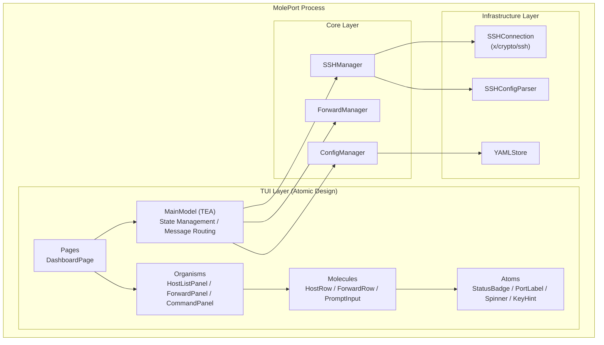
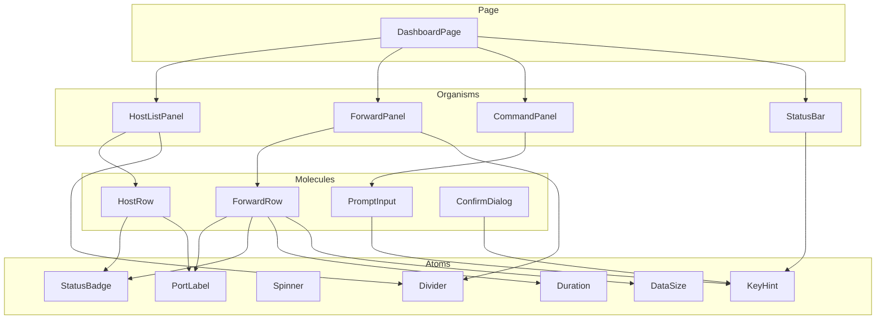
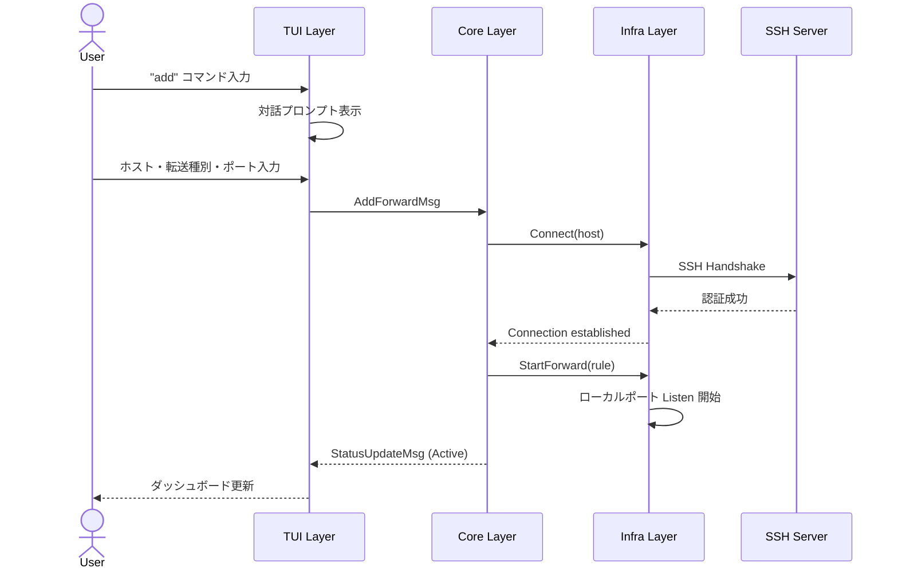
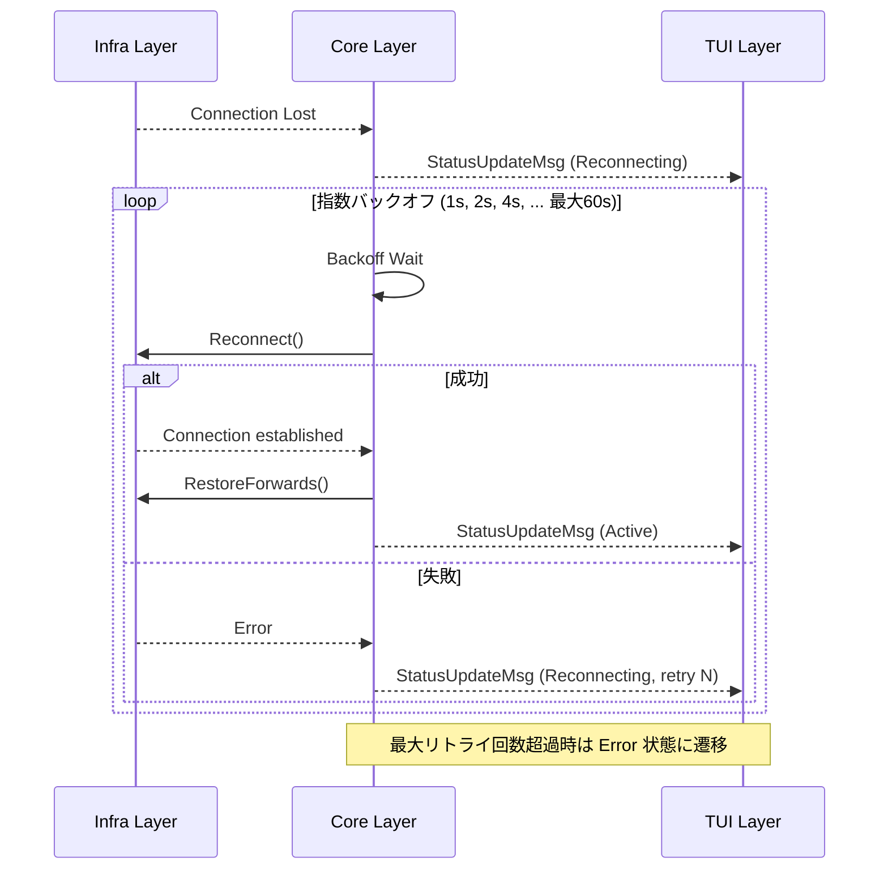
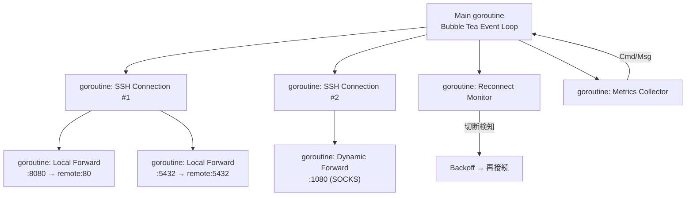

# MolePort アーキテクチャ設計

## 概要

MolePort は Go で実装される SSH ポートフォワーディング管理 TUI アプリケーションである。
Elm Architecture（TEA）に基づく Bubble Tea フレームワークを採用し、状態管理と UI レンダリングを分離する。
TUI コンポーネントは Atomic Design に基づいて階層的に設計する。

## 技術選定

| カテゴリ | 技術 | バージョン | 選定理由 |
|---------|------|-----------|---------|
| 言語 | Go | 1.23+ | シングルバイナリ配布、goroutine による並行処理、クロスコンパイル |
| TUI フレームワーク | [Bubble Tea](https://github.com/charmbracelet/bubbletea) | v1.x | Elm Architecture、エコシステム充実、活発なメンテナンス |
| TUI スタイリング | [Lip Gloss](https://github.com/charmbracelet/lipgloss) | v1.x | Bubble Tea との統合、宣言的スタイリング |
| TUI コンポーネント | [Bubbles](https://github.com/charmbracelet/bubbles) | v0.x | テキスト入力、リスト、テーブル等のウィジェット |
| SSH | [x/crypto/ssh](https://pkg.go.dev/golang.org/x/crypto/ssh) | latest | Go 標準拡張、外部依存なし、接続の完全制御 |
| SSH config 解析 | [ssh_config](https://github.com/kevinburke/ssh_config) | v1.x | SSH config の完全な解析（Include 対応） |
| YAML | [gopkg.in/yaml.v3](https://pkg.go.dev/gopkg.in/yaml.v3) | v3 | 設定ファイルの読み書き |
| ログ | [log/slog](https://pkg.go.dev/log/slog) | stdlib | Go 標準の構造化ログ |

## 全体構成図



## レイヤー構造

### TUI Layer（プレゼンテーション層 — Atomic Design）

- **責務**: ユーザー入力の受け付け、画面描画、メッセージのルーティング
- **設計方針**: Bubble Tea の Model-Update-View パターン + Atomic Design による階層化

#### Atoms（原子）

最小単位の UI パーツ。単体で意味を持ち、内部状態を持たない。

| コンポーネント | 責務 |
|-------------|------|
| `StatusBadge` | 接続状態の表示（`⬤ Active` / `○ Stopped` / `⚠ Error` / `↻ Reconnecting`） |
| `PortLabel` | ポート番号の書式化表示（`:8080`） |
| `Spinner` | 処理中アニメーション |
| `KeyHint` | キーバインドのヘルプ表示（`[Enter] Toggle  [d] Disconnect`） |
| `DataSize` | データ量の人間可読表示（`1.2MB`） |
| `Duration` | 経過時間の表示（`2h 15m`） |
| `Divider` | 区切り線 |

#### Molecules（分子）

Atoms を組み合わせた、意味のあるまとまり。

| コンポーネント | 構成 | 責務 |
|-------------|------|------|
| `HostRow` | StatusBadge + テキスト | 1ホスト分の情報行（ホスト名、アドレス、ユーザー、アクティブ転送数） |
| `ForwardRow` | PortLabel + StatusBadge + Duration + DataSize | 1転送ルール分の情報行（種別、ポート、状態、メトリクス） |
| `PromptInput` | テキスト入力 + KeyHint | 対話プロンプトの入力欄（補完・履歴付き） |
| `ConfirmDialog` | テキスト + KeyHint | 確認ダイアログ（Yes/No） |

#### Organisms（有機体）

Molecules を組み合わせた、独立した機能ブロック。

| コンポーネント | 構成 | 責務 |
|-------------|------|------|
| `HostListPanel` | HostRow[] + Divider | SSH ホスト一覧。選択・フィルタリング機能を持つ |
| `ForwardPanel` | ForwardRow[] + Divider | 選択ホストのポート転送一覧。トグル・削除操作を持つ |
| `CommandPanel` | PromptInput + 出力エリア | コマンド入力と対話プロンプトの表示 |
| `StatusBar` | テキスト + KeyHint | 全体の接続サマリーとグローバルキーバインド |

#### Pages（ページ）

Organisms を組み合わせた最終的な画面レイアウト。

| コンポーネント | 構成 | 責務 |
|-------------|------|------|
| `DashboardPage` | HostListPanel + ForwardPanel + CommandPanel + StatusBar | メインダッシュボード画面。ペイン切り替え管理 |

#### Atomic Design コンポーネント階層図



### Core Layer（ビジネスロジック層）

- **責務**: SSH 接続管理、ポートフォワーディング制御、設定管理
- **設計方針**: TUI に依存しない純粋なロジック。テスト容易性を確保する
- **主要コンポーネント**:
  - `SSHManager`: SSH 接続のライフサイクル管理（接続、切断、再接続）
  - `ForwardManager`: ポートフォワーディングルールの管理と実行
  - `ConfigManager`: 設定ファイルと状態ファイルの読み書き

### Infrastructure Layer（インフラ層）

- **責務**: 外部リソースとのやり取り（SSH 接続、ファイル I/O）
- **設計方針**: Core Layer から interface 経由で利用される
- **主要コンポーネント**:
  - `SSHConnection`: `x/crypto/ssh` のラッパー
  - `SSHConfigParser`: SSH config ファイルの解析
  - `YAMLStore`: YAML ファイルの読み書き

## ディレクトリ構成

```
moleport/
├── cmd/
│   └── moleport/
│       └── main.go                  # エントリポイント
├── internal/
│   ├── tui/                         # TUI Layer
│   │   ├── app.go                   # MainModel（TEA ルート）
│   │   ├── styles.go                # Lip Gloss スタイル定義
│   │   ├── keys.go                  # キーバインド定義
│   │   ├── atoms/                   # Atoms
│   │   │   ├── statusbadge.go
│   │   │   ├── portlabel.go
│   │   │   ├── spinner.go
│   │   │   ├── keyhint.go
│   │   │   ├── datasize.go
│   │   │   ├── duration.go
│   │   │   └── divider.go
│   │   ├── molecules/               # Molecules
│   │   │   ├── hostrow.go
│   │   │   ├── forwardrow.go
│   │   │   ├── promptinput.go
│   │   │   └── confirmdialog.go
│   │   ├── organisms/               # Organisms
│   │   │   ├── hostlistpanel.go
│   │   │   ├── forwardpanel.go
│   │   │   ├── commandpanel.go
│   │   │   └── statusbar.go
│   │   └── pages/                   # Pages
│   │       └── dashboard.go
│   ├── core/                        # Core Layer
│   │   ├── ssh.go                   # SSHManager
│   │   ├── forward.go               # ForwardManager
│   │   ├── config.go                # ConfigManager
│   │   └── types.go                 # 共通型定義
│   └── infra/                       # Infrastructure Layer
│       ├── sshconn.go               # SSH 接続ラッパー
│       ├── sshconfig.go             # SSH config 解析
│       └── yamlstore.go             # YAML ファイル操作
├── go.mod
├── go.sum
└── docs/                            # 設計ドキュメント
```

## 通信フロー

### ポートフォワーディング開始の流れ



### 自動再接続の流れ



## 並行処理モデル



- 各 SSH 接続は独立した goroutine で管理する
- 各ポートフォワーディングも独立した goroutine で処理する
- Bubble Tea の Cmd/Msg パターンで goroutine からの通知を UI に反映する
- `context.Context` でキャンセルを伝播し、グレースフルシャットダウンを実現する

## 改訂履歴

| 版 | 日付 | 変更内容 | 変更理由 |
|---|------|---------|---------|
| 1.0 | 2026-02-10 | 初版作成 | — |
| 1.1 | 2026-02-10 | TUI を Atomic Design に再設計、図を Mermaid に変更 | ユーザー要望 |
