# MolePort アーキテクチャ設計

## 概要

MolePort は Go で実装される SSH ポートフォワーディング管理ツールである。
バックグラウンドデーモンが SSH 接続とポートフォワーディングを永続管理し、CLI サブコマンドおよび TUI ダッシュボードがデーモンのクライアントとして動作する。
デーモンとクライアント間は Unix ドメインソケット上の JSON-RPC 2.0 プロトコルで通信する。

## 技術選定

| カテゴリ | 技術 | バージョン | 選定理由 |
|---------|------|-----------|---------|
| 言語 | Go | 1.23+ | シングルバイナリ配布、goroutine による並行処理、クロスコンパイル |
| TUI フレームワーク | [Bubble Tea](https://github.com/charmbracelet/bubbletea) | v1.x | Elm Architecture、エコシステム充実、活発なメンテナンス |
| TUI スタイリング | [Lip Gloss](https://github.com/charmbracelet/lipgloss) | v1.x | Bubble Tea との統合、宣言的スタイリング |
| TUI コンポーネント | [Bubbles](https://github.com/charmbracelet/bubbles) | v1.x | テキスト入力、リスト、テーブル等のウィジェット |
| SSH | [x/crypto/ssh](https://pkg.go.dev/golang.org/x/crypto/ssh) | latest | Go 標準拡張、外部依存なし、接続の完全制御 |
| SSH config 解析 | [ssh_config](https://github.com/kevinburke/ssh_config) | v1.x | SSH config の完全な解析（Include 対応） |
| YAML | [gopkg.in/yaml.v3](https://pkg.go.dev/gopkg.in/yaml.v3) | v3 | 設定ファイルの読み書き |
| ログ | [log/slog](https://pkg.go.dev/log/slog) | stdlib | Go 標準の構造化ログ |
| IPC | JSON-RPC 2.0 over Unix Domain Socket | — | 標準化された RPC プロトコル。リクエスト/レスポンス/通知の明確な区別。デバッグ容易 |

## 全体構成図

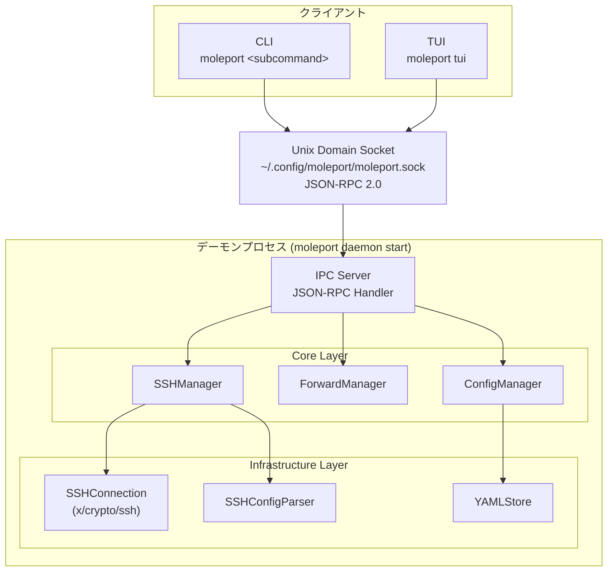

## アーキテクチャの変更点（v1 → v2）

### v1（現行: モノリシック TUI）

```
MolePort プロセス = TUI + Core + Infra（単一プロセス）
```

- TUI が直接 Core Layer を呼び出す
- プロセス終了 = 全接続終了
- TUI を閉じるとポートフォワーディングも停止

### v2（新設計: デーモン + クライアント）

```
デーモンプロセス = IPC Server + Core + Infra（常駐）
クライアント    = CLI / TUI（必要時に起動・終了）
```

- デーモンがバックグラウンドで常駐し、SSH 接続を維持
- CLI/TUI はクライアントとして接続し、操作・監視を行う
- TUI を閉じてもポートフォワーディングは継続
- 複数クライアントが同時接続可能

## デーモンプロセス

### ライフサイクル

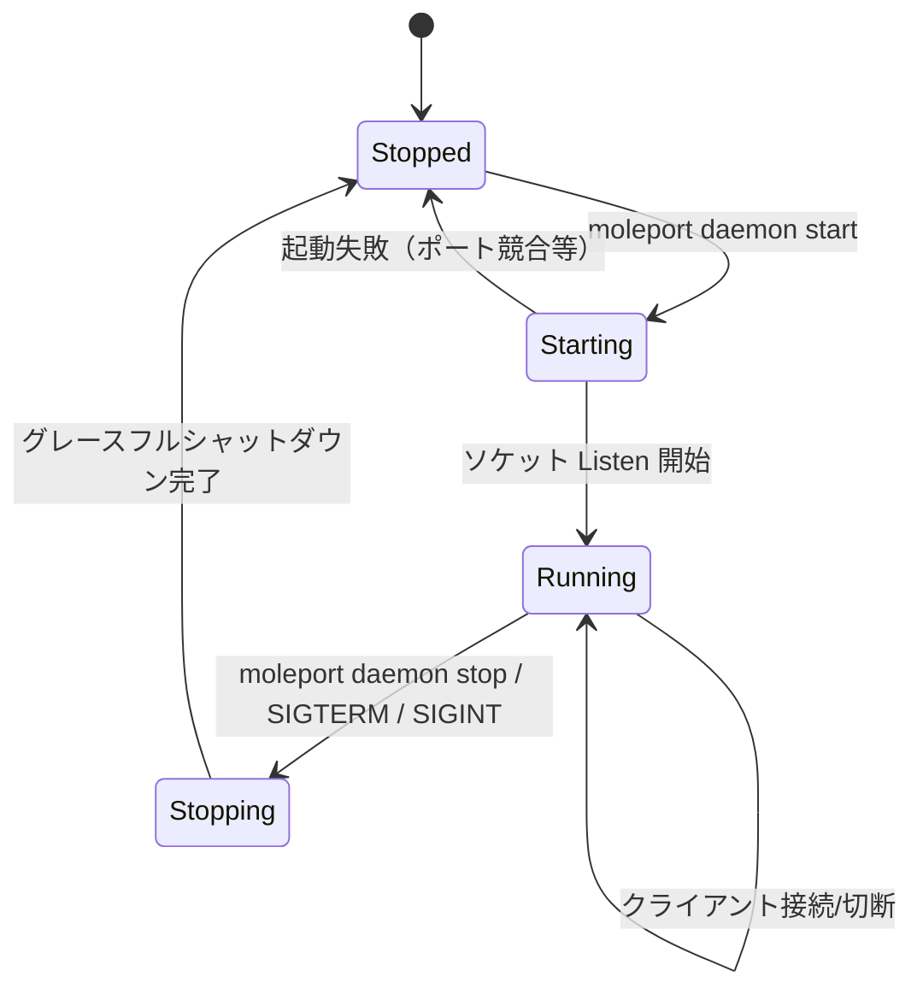

### 起動シーケンス

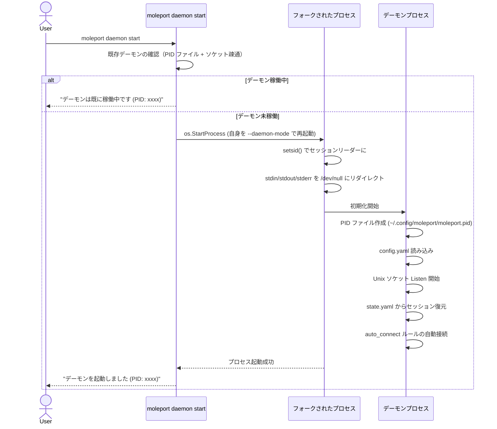

### 停止シーケンス

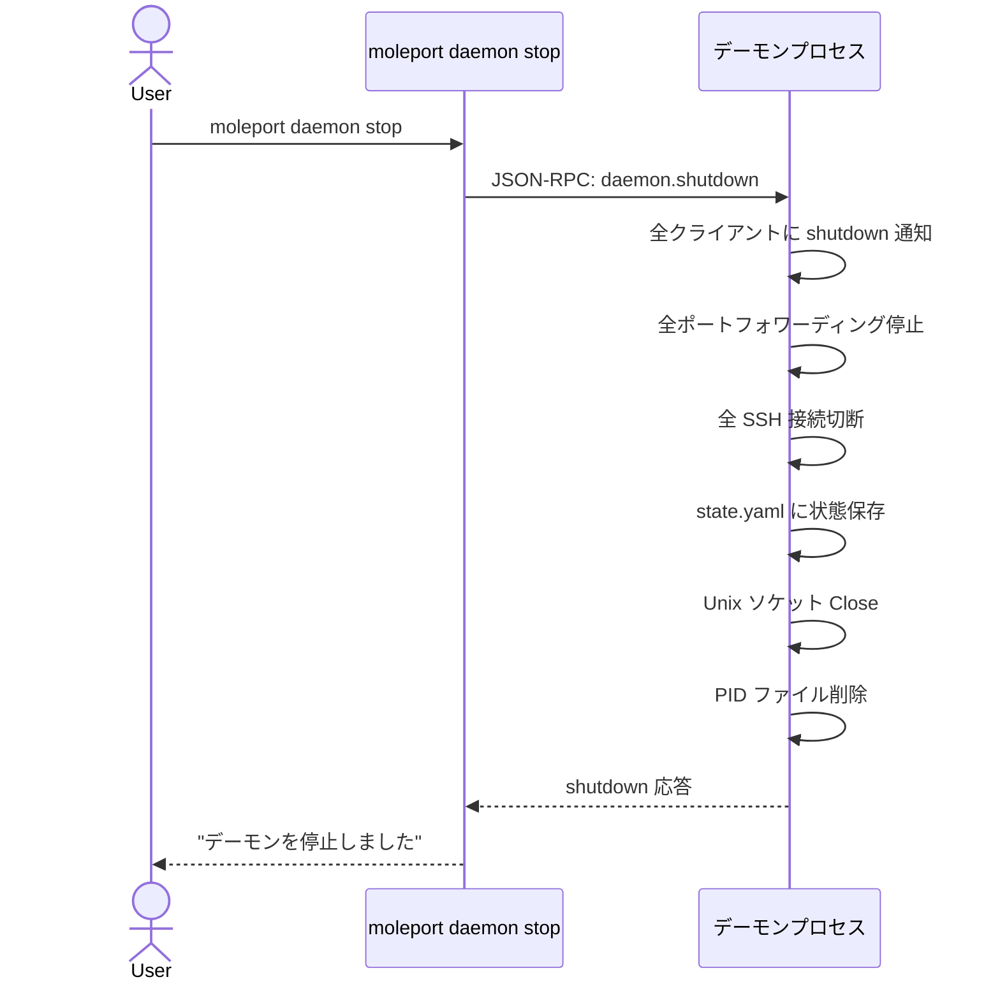

### PID ファイル管理

- パス: `~/.config/moleport/moleport.pid`
- 起動時に PID ファイルを作成（排他ロック `flock`）
- 既存 PID ファイルがある場合は、プロセスの生存確認を行う
  - 生存中 → 起動を拒否
  - 死亡済み（stale PID）→ PID ファイルを削除して起動続行
- 終了時に PID ファイルを削除

## IPC 通信

### 概要

クライアント（CLI/TUI）とデーモン間は Unix ドメインソケット上で JSON-RPC 2.0 プロトコルにより通信する。

- **ソケットパス**: `~/.config/moleport/moleport.sock`
- **プロトコル**: JSON-RPC 2.0（改行区切り NDJSON）
- **方向**:
  - クライアント → デーモン: リクエスト（`method` + `params`）
  - デーモン → クライアント: レスポンス（`result` / `error`）
  - デーモン → クライアント: 通知（`method` + `params`, `id` なし）

### 通信パターン

#### パターン1: 同期リクエスト/レスポンス（CLI 向け）

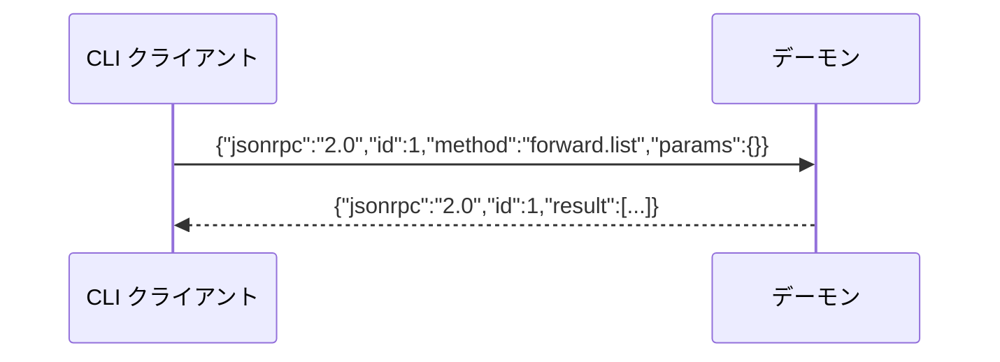

CLI は1回のリクエスト/レスポンスで完結し、接続を切断する。

#### パターン2: サブスクリプション（TUI 向け）

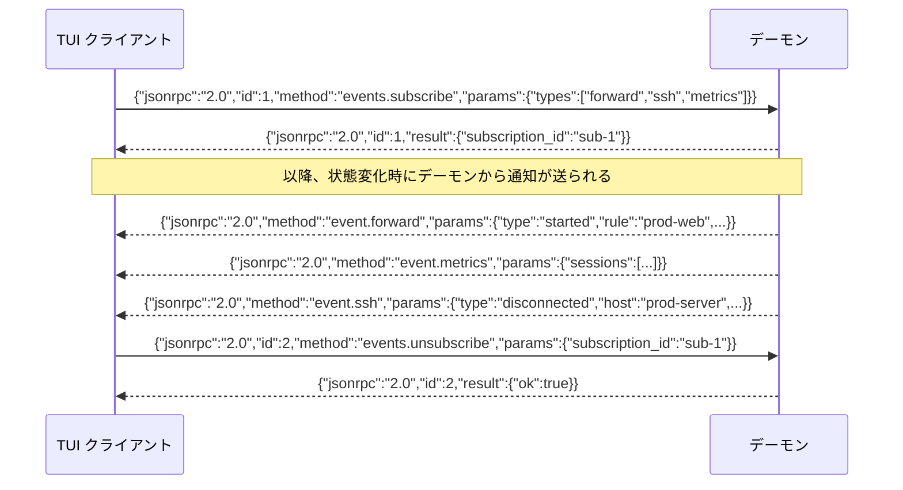

TUI は `events.subscribe` でイベントストリームを開始し、接続中はデーモンから通知を受け続ける。

### JSON-RPC メソッド一覧

| メソッド | 方向 | 説明 |
|---------|------|------|
| `host.list` | req/res | SSH ホスト一覧を取得 |
| `host.reload` | req/res | SSH config を再読み込み |
| `ssh.connect` | req/res | SSH ホストに接続 |
| `ssh.disconnect` | req/res | SSH ホストを切断 |
| `forward.list` | req/res | 転送ルール一覧を取得 |
| `forward.add` | req/res | 転送ルールを追加 |
| `forward.delete` | req/res | 転送ルールを削除 |
| `forward.start` | req/res | ポートフォワーディングを開始 |
| `forward.stop` | req/res | ポートフォワーディングを停止 |
| `session.list` | req/res | アクティブセッション一覧を取得 |
| `session.get` | req/res | セッション詳細を取得 |
| `config.get` | req/res | 設定を取得 |
| `config.update` | req/res | 設定を更新 |
| `daemon.status` | req/res | デーモンの状態を取得 |
| `daemon.shutdown` | req/res | デーモンを停止 |
| `events.subscribe` | req/res | イベントストリームを開始 |
| `events.unsubscribe` | req/res | イベントストリームを停止 |
| `credential.request` | notification | クレデンシャル入力要求（デーモン → クライアント） |
| `credential.response` | req/res | クレデンシャル入力応答（クライアント → デーモン） |
| `event.ssh` | notification | SSH 状態変化通知 |
| `event.forward` | notification | 転送状態変化通知 |
| `event.metrics` | notification | メトリクス更新通知 |

## レイヤー構造

### IPC Layer（通信層）— 新規

- **責務**: JSON-RPC 2.0 メッセージのシリアライズ/デシリアライズ、ルーティング、イベント配信
- **設計方針**: プロトコルの詳細を隠蔽し、Core Layer とクライアントを疎結合にする
- **主要コンポーネント**:
  - `IPCServer`: Unix ソケット上で JSON-RPC リクエストを受け付け、ハンドラにディスパッチ
  - `IPCClient`: CLI/TUI が使用するクライアントライブラリ。メソッド呼び出しとイベント受信を提供
  - `EventBroker`: サブスクリプション管理とイベント配信

### Core Layer（ビジネスロジック層）

- **責務**: SSH 接続管理、ポートフォワーディング制御、設定管理
- **設計方針**: IPC に依存しない純粋なロジック。テスト容易性を確保する
- **主要コンポーネント**:
  - `SSHManager`: SSH 接続のライフサイクル管理（接続、切断、再接続）
  - `ForwardManager`: ポートフォワーディングルールの管理と実行
  - `ConfigManager`: 設定ファイルと状態ファイルの読み書き
- **変更なし**: v1 の Core Layer をそのまま活用。TUI 依存がないため移行がスムーズ

### Infrastructure Layer（インフラ層）

- **責務**: 外部リソースとのやり取り（SSH 接続、ファイル I/O）
- **設計方針**: Core Layer から interface 経由で利用される
- **主要コンポーネント**:
  - `SSHConnection`: `x/crypto/ssh` のラッパー
  - `SSHConfigParser`: SSH config ファイルの解析
  - `YAMLStore`: YAML ファイルの読み書き
- **変更なし**: v1 の Infrastructure Layer をそのまま活用

### TUI Layer（プレゼンテーション層 — Atomic Design）

- **責務**: ユーザー入力の受け付け、画面描画
- **設計方針**: Bubble Tea の Model-Update-View パターン + Atomic Design
- **変更点**: Core Layer の直接呼び出しから IPC Client 経由に変更
  - `MainModel` が `IPCClient` を保持
  - コマンド実行 → IPC リクエスト
  - イベント受信 → Bubble Tea Msg に変換して UI 更新

#### Atomic Design コンポーネント階層図

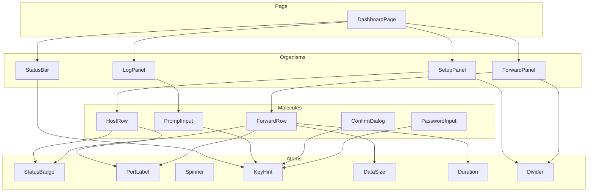

### CLI Layer（コマンドライン層）— 新規

- **責務**: CLI サブコマンドの解析と実行
- **設計方針**: 各サブコマンドが IPC Client を介してデーモンに操作を要求し、結果を表示する
- **主要コンポーネント**:
  - `CLIRouter`: サブコマンドの解析とディスパッチ（Go 標準の `flag` パッケージ）
  - 各サブコマンドハンドラ: `daemon`, `connect`, `disconnect`, `add`, `delete`, `start`, `stop`, `list`, `status`, `config`, `reload`, `tui`, `help`, `version`

## ディレクトリ構成

```
moleport/
├── cmd/
│   └── moleport/
│       └── main.go                  # エントリポイント（CLI ルーター）
├── internal/
│   ├── daemon/                      # デーモンプロセス
│   │   ├── daemon.go                # Daemon（起動・停止・ライフサイクル管理）
│   │   ├── ensure.go                # デーモン起動確認・IPC 接続ヘルパー
│   │   ├── fork.go                  # フォーク処理（self-fork）
│   │   └── pidfile.go               # PID ファイル管理
│   ├── ipc/                         # IPC 通信層
│   │   ├── server.go                # IPCServer（JSON-RPC サーバー）
│   │   ├── client.go                # IPCClient（JSON-RPC クライアント）
│   │   ├── handler.go               # RPC メソッドハンドラ
│   │   ├── handler_convert.go       # コアエラー・型の RPC 変換
│   │   ├── broker.go                # EventBroker（イベント配信）
│   │   └── protocol.go              # JSON-RPC メッセージ型定義
│   ├── cli/                         # CLI サブコマンド
│   │   ├── root.go                  # CLIRouter（サブコマンド解析）
│   │   ├── credential.go            # CLI 用クレデンシャルハンドラ
│   │   ├── daemon_cmd.go            # moleport daemon start/stop/status
│   │   ├── connect_cmd.go           # moleport connect <host>
│   │   ├── disconnect_cmd.go        # moleport disconnect <host>
│   │   ├── add_cmd.go               # moleport add
│   │   ├── delete_cmd.go            # moleport delete <name>
│   │   ├── start_cmd.go             # moleport start
│   │   ├── stop_cmd.go              # moleport stop
│   │   ├── list_cmd.go              # moleport list
│   │   ├── status_cmd.go            # moleport status
│   │   ├── config_cmd.go            # moleport config
│   │   ├── reload_cmd.go            # moleport reload
│   │   ├── help_cmd.go              # moleport help
│   │   ├── version_cmd.go           # moleport version
│   │   └── tui_cmd.go               # moleport tui
│   ├── tui/                         # TUI Layer（Atomic Design）
│   │   ├── app/
│   │   │   ├── app.go               # MainModel（IPCClient 経由に変更）
│   │   │   └── convert.go           # IPC/コア型変換
│   │   ├── styles.go
│   │   ├── keys.go
│   │   ├── messages.go
│   │   ├── atoms/
│   │   ├── molecules/
│   │   ├── organisms/
│   │   └── pages/
│   ├── core/                        # Core Layer
│   │   ├── ssh.go
│   │   ├── forward.go
│   │   ├── config.go
│   │   ├── socks5.go                # SOCKS5 プロキシ
│   │   └── types.go
│   └── infra/                       # Infrastructure Layer
│       ├── sshconn.go
│       ├── sshconfig.go
│       ├── auth.go
│       ├── yamlstore.go
│       └── util.go
├── go.mod
├── go.sum
└── docs/
```

## 通信フロー

### CLI からのポートフォワーディング開始

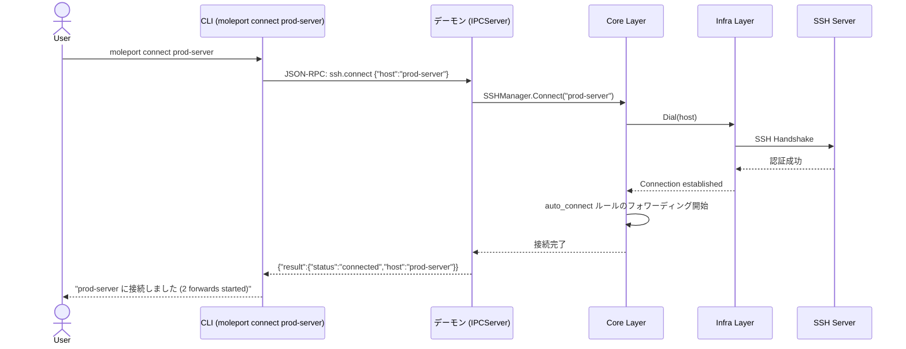

### クレデンシャルコールバック（パスワード認証の例）

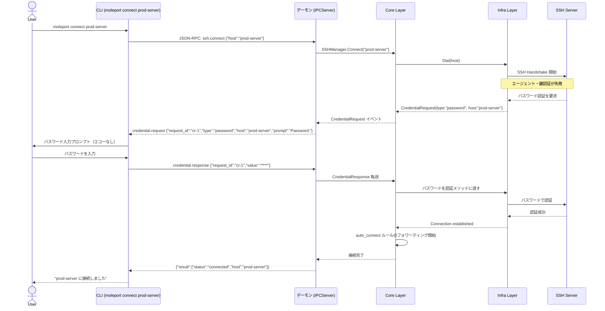

### クレデンシャルコールバック（keyboard-interactive 複数チャレンジの例）

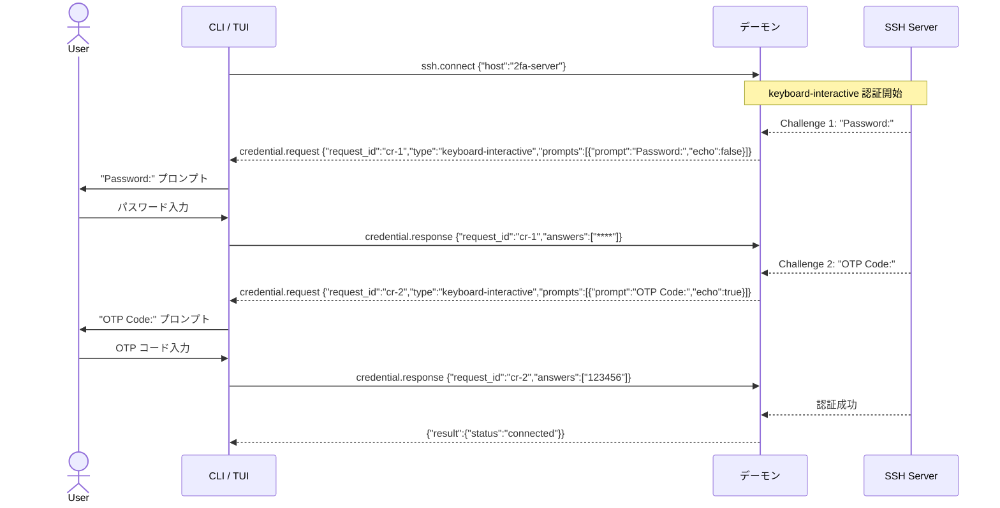

### セッション復元時の pending_auth フロー

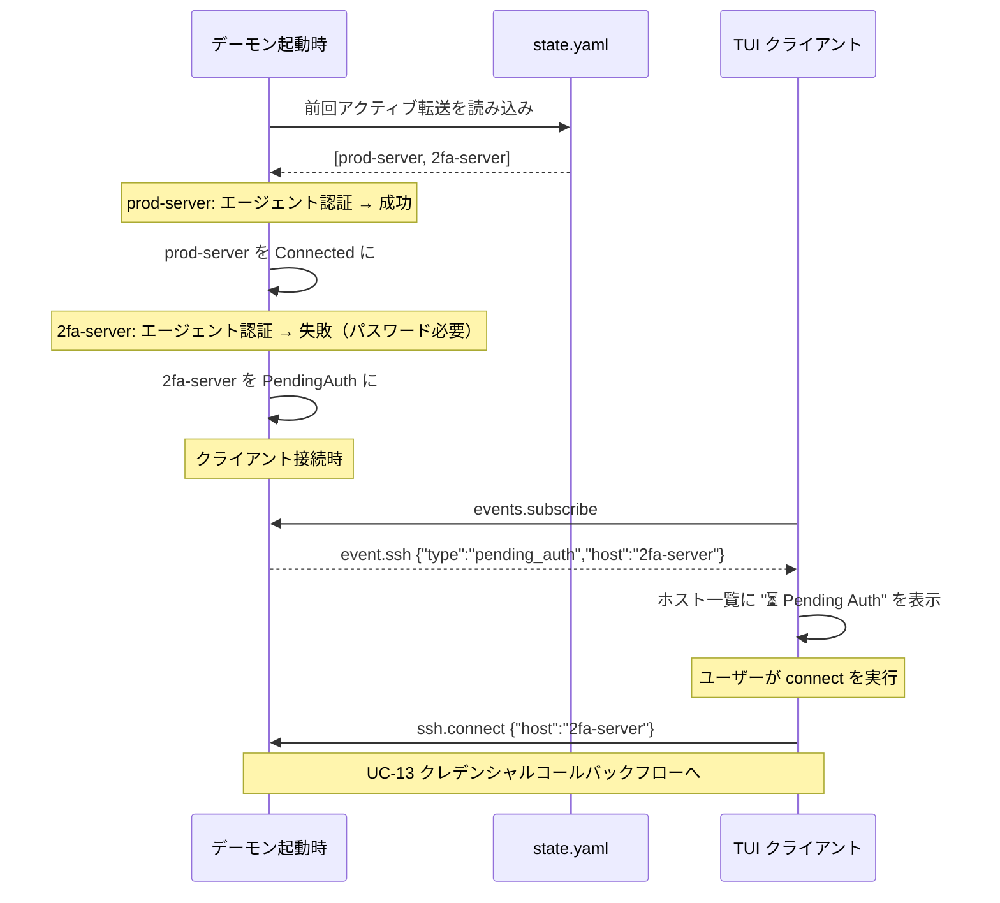

### TUI のリアルタイム更新

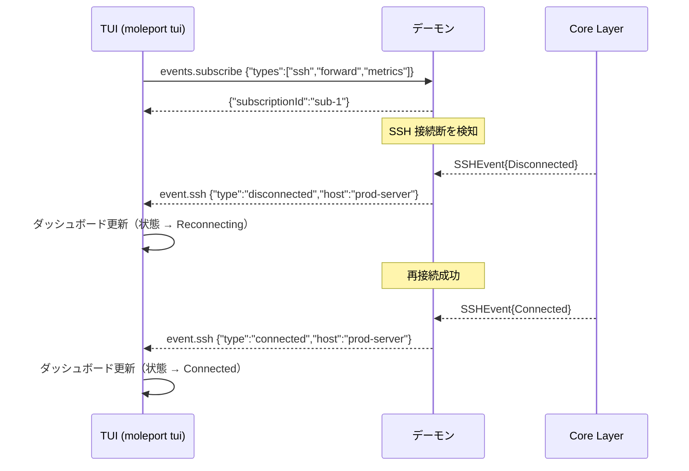

## 並行処理モデル

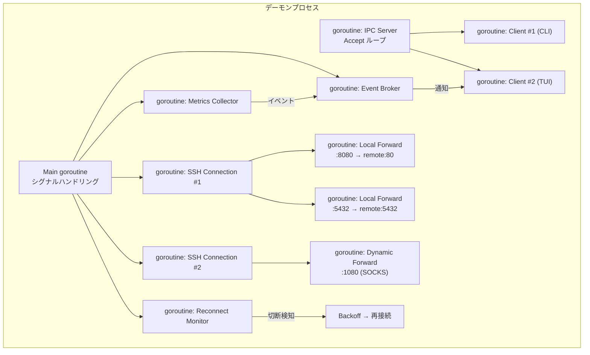

- 各クライアント接続は独立した goroutine で処理
- Event Broker がイベントを集約し、サブスクライブ中のクライアントに配信
- `context.Context` でキャンセルを伝播し、グレースフルシャットダウンを実現
- Core Layer / Infra Layer の並行処理モデルは v1 から変更なし

## ファイルレイアウト

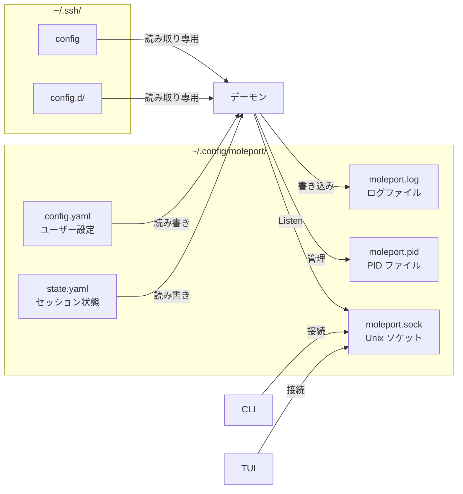

## 改訂履歴

| 版 | 日付 | 変更内容 | 変更理由 |
|---|------|---------|---------|
| 1.0 | 2026-02-10 | 初版作成 | — |
| 1.1 | 2026-02-10 | TUI を Atomic Design に再設計、図を Mermaid に変更 | ユーザー要望 |
| 2.0 | 2026-02-11 | デーモン + クライアントアーキテクチャに全面改訂。IPC Layer / CLI Layer 追加。JSON-RPC 2.0 over Unix Socket 採用 | デーモン化対応 |
| 2.1 | 2026-02-11 | クレデンシャルコールバック通信フロー追加、credential.request/response メソッド追加、pending_auth 状態フロー追加、PasswordInput コンポーネント追加 | #11 クレデンシャル入力機能追加 |
