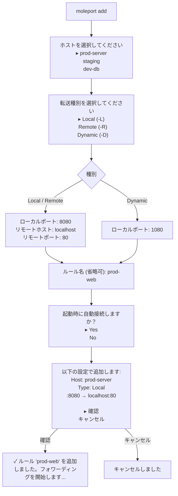
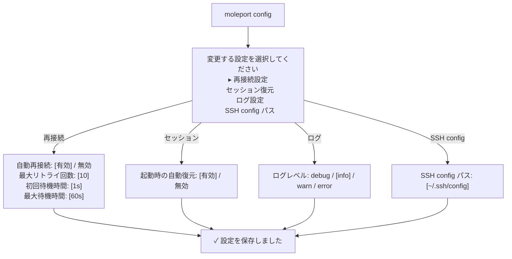

# MolePort コマンド仕様

## 概要

MolePort はサブコマンド形式の CLI で操作する。
バイナリ名は `moleport`（正式名）と `mp`（エイリアス）の両方が利用可能。

```
moleport <subcommand> [options] [arguments]
mp <subcommand> [options] [arguments]
```

## サブコマンド一覧

| サブコマンド | 引数 | 説明 |
|------------|------|------|
| `daemon start` | — | デーモンをバックグラウンドで起動 |
| `daemon stop` | — | デーモンを停止 |
| `daemon status` | — | デーモンの稼働状態を表示 |
| `connect` | `<host>` | SSH ホストに接続 |
| `disconnect` | `<host>` | SSH ホストを切断 |
| `add` | — | 転送ルールを対話形式で追加 |
| `delete` | `<name>` | 転送ルールを削除 |
| `start` | `<name>` | 転送ルールのフォワーディングを開始 |
| `stop` | `<name>` | 転送ルールのフォワーディングを停止 |
| `list` | `[--host <host>]` | ホスト・転送ルールの一覧を表示 |
| `status` | — | 全体の接続状態サマリーを表示 |
| `config` | — | 設定を対話形式で変更 |
| `reload` | — | SSH config を再読み込み |
| `tui` | — | TUI ダッシュボードを起動 |
| `help` | `[<subcommand>]` | ヘルプを表示 |
| `version` | — | バージョン情報を表示 |

## サブコマンド詳細

---

### daemon start

デーモンをバックグラウンドで起動する。

```
moleport daemon start
```

**動作**:
1. 既存デーモンの稼働確認（PID ファイル + ソケット疎通）
2. 未稼働なら自己フォークしてバックグラウンド化
3. PID ファイル・Unix ソケットを作成
4. config.yaml 読み込み、セッション復元、auto_connect 実行

**出力例**:

```
$ moleport daemon start
デーモンを起動しました (PID: 12345)

$ moleport daemon start
デーモンは既に稼働中です (PID: 12345)
```

---

### daemon stop

デーモンを停止する。

```
moleport daemon stop
```

**動作**:
1. デーモンに shutdown リクエストを送信
2. 全接続をグレースフルに切断し、状態を保存

**出力例**:

```
$ moleport daemon stop
デーモンを停止しました

$ moleport daemon stop
デーモンは稼働していません
```

---

### daemon status

デーモンの稼働状態を表示する。

```
moleport daemon status
```

**出力例**:

```
$ moleport daemon status
MolePort Daemon:
  PID:        12345
  Uptime:     3h 30m
  Clients:    1 connected
  SSH:        2 connections
  Forwards:   3 active

$ moleport daemon status
デーモンは稼働していません
```

---

### connect

SSH ホストに接続する。auto_connect ルールのフォワーディングも自動的に開始される。

```
moleport connect <host>
```

**出力例**:

```
$ moleport connect prod-server
prod-server に接続しました
  ✓ prod-web (L :8080 → localhost:80) を開始しました
  ✓ prod-db (L :5432 → localhost:5432) を開始しました
```

**エラー例**:

```
$ moleport connect unknown-host
エラー: ホスト 'unknown-host' が見つかりません

$ moleport connect prod-server
prod-server は既に接続済みです
```

---

### disconnect

SSH ホストを切断する。当該ホストの全フォワーディングも停止する。

```
moleport disconnect <host>
```

**出力例**:

```
$ moleport disconnect prod-server
prod-server を切断しました (2 forwards stopped)
```

---

### add

転送ルールを対話形式で追加する。

```
moleport add
```

**対話フロー**:



**入力バリデーション**:

| 項目 | バリデーション | エラーメッセージ |
|------|-------------|----------------|
| ローカルポート | 1–65535 の範囲 | `ポート番号は 1〜65535 の範囲で入力してください` |
| ローカルポート | 既に使用中でないこと | `ポート 8080 は既に使用中です。別のポートを指定してください` |
| リモートポート | 1–65535 の範囲 | `ポート番号は 1〜65535 の範囲で入力してください` |
| ルール名 | グローバルユニークであること | `ルール名 "prod-web" は既に存在します` |
| ルール名 | 省略時は自動生成 | `<host>-<type>-<localport>`（例: `prod-server-local-8080`） |

---

### delete

転送ルールを削除する。

```
moleport delete <name>
```

**出力例**:

```
$ moleport delete prod-web
ルール 'prod-web' を削除しますか？ [y/N]: y
✓ ルール 'prod-web' を削除しました

$ moleport delete unknown
エラー: ルール 'unknown' が見つかりません
```

---

### start

転送ルールのフォワーディングを開始する。SSH 未接続の場合は自動的に接続する。

```
moleport start <name>
```

**出力例**:

```
$ moleport start prod-web
✓ prod-web (L :8080 → localhost:80) を開始しました
```

---

### stop

転送ルールのフォワーディングを停止する。SSH 接続は維持する。

```
moleport stop <name>
```

**出力例**:

```
$ moleport stop prod-web
✓ prod-web (L :8080 → localhost:80) を停止しました
```

---

### list

全ホストと転送ルールの一覧を表示する。

```
moleport list [--host <host>]
```

**出力例**:

```
$ moleport list
SSH Hosts (3 hosts, 1 connected):

● prod-server (192.168.1.10:22, user)
  L  :8080  ───►  localhost:80     ⬤ Active   2h 15m  ↑1.2MB ↓340KB
  L  :5432  ───►  localhost:5432   ⬤ Active   45m     ↑52KB  ↓128KB

○ staging (10.0.0.5:22, deploy)
  D  :1080                         ○ Stopped

○ dev-db (172.16.0.3:5432, admin)
  (転送ルールなし)

$ moleport list --host prod-server
● prod-server (192.168.1.10:22, user)
  L  :8080  ───►  localhost:80     ⬤ Active   2h 15m  ↑1.2MB ↓340KB
  L  :5432  ───►  localhost:5432   ⬤ Active   45m     ↑52KB  ↓128KB
```

---

### status

全体の接続状態をサマリー表示する。

```
moleport status
```

**出力例**:

```
$ moleport status
MolePort Status:
  Daemon:    ⬤ Running (PID: 12345, uptime: 3h 30m)
  Hosts:     3 total, 1 connected
  Forwards:  3 total, 2 active, 1 stopped
  Traffic:   ↑1.3MB ↓468KB
```

---

### config

設定を対話形式で変更する。

```
moleport config
```

**対話フロー**:



---

### reload

SSH config を再読み込みし、ホスト一覧を更新する。

```
moleport reload
```

**出力例**:

```
$ moleport reload
SSH config を再読み込みしました
  4 ホスト読み込み（新規: 1, 削除: 0）
  + new-server が追加されました
```

---

### tui

デーモンに接続し、TUI ダッシュボードを起動する。

```
moleport tui
```

**動作**:
1. デーモンに IPC 接続
2. イベントサブスクリプション開始
3. ダッシュボード表示
4. TUI 終了時: サブスクリプション解除、IPC 切断（デーモンは継続）

**エラー**:

```
$ moleport tui
エラー: デーモンが稼働していません。moleport daemon start で起動してください。
```

---

### help

ヘルプを表示する。

```
moleport help [<subcommand>]
```

**出力例**:

```
$ moleport help
MolePort - SSH ポートフォワーディングマネージャ

Usage:
  moleport <command> [arguments]

Commands:
  daemon start     デーモンをバックグラウンドで起動
  daemon stop      デーモンを停止
  daemon status    デーモンの稼働状態を表示
  connect <host>   SSH ホストに接続
  disconnect <host> SSH ホストを切断
  add              転送ルールを対話形式で追加
  delete <name>    転送ルールを削除
  start <name>     フォワーディングを開始
  stop <name>      フォワーディングを停止
  list             ホスト・転送ルールの一覧
  status           接続状態のサマリー
  config           設定を対話形式で変更
  reload           SSH config を再読み込み
  tui              TUI ダッシュボードを起動
  help             このヘルプを表示
  version          バージョン情報を表示

Alias:
  mp               moleport のエイリアス
```

---

### version

バージョン情報を表示する。

```
moleport version
```

**出力例**:

```
$ moleport version
MolePort v0.2.0 (go1.23.0, linux/amd64)
```

## TUI 内コマンド

TUI ダッシュボード内のコマンド入力欄で使用できるコマンド。
内部的に IPC 経由でデーモンに送信される。

| コマンド | 短縮形 | 説明 |
|---------|--------|------|
| `add` | `a` | 新しいポートフォワーディングルールを追加する |
| `delete` | `rm` | ポートフォワーディングルールを削除する |
| `connect` | `c` | SSH ホストに接続する |
| `disconnect` | `dc` | SSH ホストを切断する |
| `start` | — | 転送ルールのフォワーディングを開始する |
| `stop` | — | 転送ルールのフォワーディングを停止する |
| `list` | `ls` | 全ホスト・全転送ルールの一覧を表示する |
| `status` | `st` | 接続状態のサマリーを表示する |
| `config` | `cfg` | 設定を変更する |
| `reload` | — | SSH config を再読み込みする |
| `help` | `?` | コマンドヘルプを表示する |
| `quit` | `q` | TUI を終了する（デーモンは継続） |

## TUI キーバインド

| キー | コンテキスト | 動作 |
|------|-----------|------|
| `↑` / `k` | ホスト一覧 / 転送一覧 | 上の項目を選択 |
| `↓` / `j` | ホスト一覧 / 転送一覧 | 下の項目を選択 |
| `Enter` | ホスト一覧 | 選択中のホストに SSH 接続 |
| `Enter` | 転送一覧 | 選択中の転送をトグル（開始/停止） |
| `Tab` | 全体 | ペイン間のフォーカス移動 |
| `d` | 転送一覧 | 選択中の転送を停止 |
| `x` | 転送一覧 | 選択中の転送を削除（確認あり） |
| `?` | 全体 | ヘルプ表示 |
| `/` | 全体 | コマンド入力欄にフォーカス |
| `Esc` | コマンド入力 | コマンド入力をキャンセル・フォーカス解除 |
| `Ctrl+C` | 全体 | TUI を終了（デーモンは継続） |

## デーモン未稼働時の動作

デーモンが稼働していない状態で CLI コマンドを実行した場合、統一されたエラーメッセージを表示する。

```
$ moleport connect prod-server
エラー: デーモンが稼働していません。moleport daemon start で起動してください。
```

`daemon start` と `help` と `version` 以外の全サブコマンドでこのエラーを返す。

## 改訂履歴

| 版 | 日付 | 変更内容 | 変更理由 |
|---|------|---------|---------|
| 1.0 | 2026-02-10 | 初版作成 | — |
| 2.0 | 2026-02-11 | TUI 内コマンドから CLI サブコマンド体系に全面改訂。daemon/connect/disconnect/add/delete/start/stop/list/status/config/reload/tui/help/version を定義 | デーモン化対応 |
