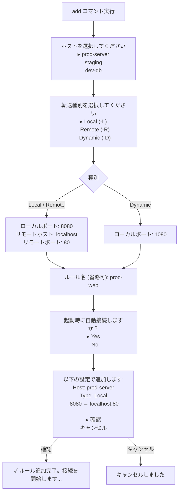
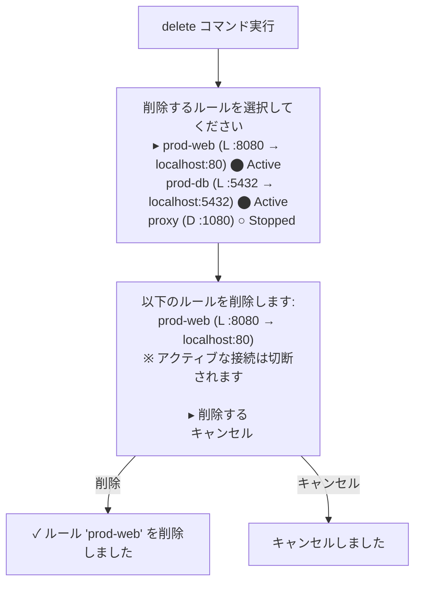
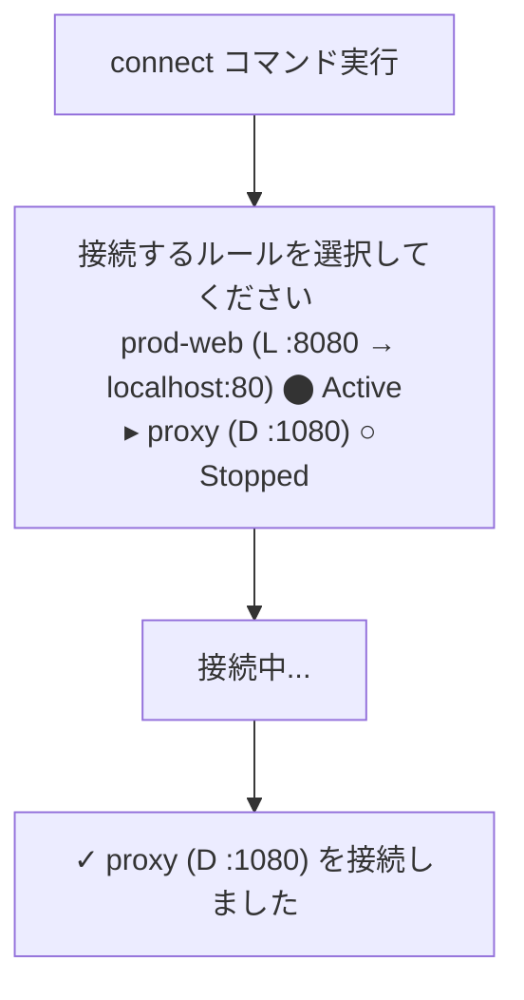
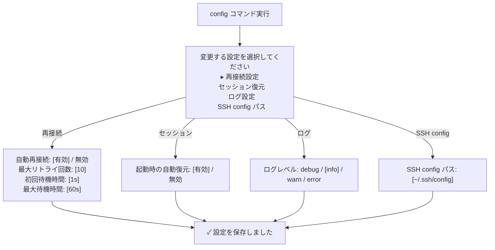
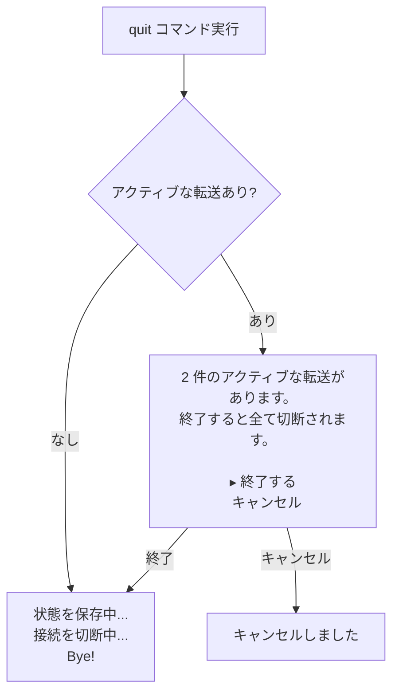

# MolePort コマンド仕様

## 概要

MolePort はダッシュボード下部のコマンド入力欄から対話プロンプト形式で操作する。
コマンドを入力すると対話形式で必要な情報を聞かれ、ステップごとに値を入力する。

## コマンド一覧

| コマンド | 短縮形 | 説明 |
|---------|--------|------|
| `add` | `a` | 新しいポートフォワーディングルールを追加する |
| `delete` | `rm` | ポートフォワーディングルールを削除する |
| `connect` | `c` | 停止中の転送を接続する |
| `disconnect` | `dc` | アクティブな転送を切断する |
| `list` | `ls` | 全ホスト・全転送ルールの一覧を表示する |
| `status` | `st` | 接続状態のサマリーを表示する |
| `config` | `cfg` | 設定を変更する |
| `reload` | — | SSH config を再読み込みする |
| `help` | `?` | コマンドヘルプを表示する |
| `quit` | `q` | MolePort を終了する |

## コマンド詳細

### add（転送ルール追加）

新しいポートフォワーディングルールを対話形式で追加する。

#### 対話フロー



#### 入力バリデーション

| 項目 | バリデーション | エラーメッセージ |
|------|-------------|----------------|
| ローカルポート | 1–65535 の範囲 | `ポート番号は 1〜65535 の範囲で入力してください` |
| ローカルポート | 既に使用中でないこと | `ポート 8080 は既に使用中です。別のポートを指定してください` |
| リモートポート | 1–65535 の範囲 | `ポート番号は 1〜65535 の範囲で入力してください` |
| ルール名 | 全ホスト横断でグローバルユニークであること | `ルール名 "prod-web" は既に存在します` |
| ルール名 | 省略時は自動生成 | `<host>-<type>-<localport>`（例: `prod-server-local-8080`） |

### delete（転送ルール削除）

登録済みのポートフォワーディングルールを削除する。

#### 対話フロー



### connect / disconnect（接続・切断）

転送ルールの接続状態をトグルする。

#### 対話フロー



- `connect`: 停止中のルールのみ表示する
- `disconnect`: アクティブなルールのみ表示する
- 対象が1件の場合は選択をスキップし直接実行する

### list（一覧表示）

全ホストと転送ルールの一覧を整形表示する。

#### 出力例

```
SSH Hosts (3 hosts, 2 connected):

● prod-server (192.168.1.10:22, user)
  L  :8080  ───►  localhost:80     ⬤ Active   2h 15m  ↑1.2MB ↓340KB
  L  :5432  ───►  localhost:5432   ⬤ Active   45m     ↑52KB  ↓128KB

○ staging (10.0.0.5:22, deploy)
  D  :1080                         ○ Stopped

○ dev-db (172.16.0.3:5432, admin)
  (転送ルールなし)
```

### status（状態サマリー）

全体の接続状態をサマリー表示する。

#### 出力例

```
MolePort Status:
  Hosts:     3 total, 1 connected
  Forwards:  3 total, 2 active, 1 stopped
  Uptime:    2h 30m
  Traffic:   ↑1.3MB ↓468KB
```

### config（設定変更）

MolePort の設定を対話形式で変更する。

#### 対話フロー



### reload（SSH config 再読み込み）

SSH config ファイルを再読み込みし、ホスト一覧を更新する。

```
> reload
↻ SSH config を再読み込み中...
✓ 4 ホストを読み込みました（新規: 1, 削除: 0）
  + new-server が追加されました
```

### help（ヘルプ表示）

利用可能なコマンドとキーバインドの一覧を表示する。

#### 出力例

```
Commands:
  add (a)          新しい転送ルールを追加
  delete (rm)      転送ルールを削除
  connect (c)      転送を接続
  disconnect (dc)  転送を切断
  list (ls)        全ルールの一覧表示
  status (st)      接続状態のサマリー
  config (cfg)     設定を変更
  reload           SSH config を再読み込み
  help (?)         このヘルプを表示
  quit (q)         MolePort を終了

Keybindings:
  ↑/↓              ホスト・ルール選択
  Enter             転送のトグル（接続/切断）
  Tab               ペイン切り替え
  d                 選択中の転送を切断
  x                 選択中の転送を削除
  ?                 ヘルプ表示
  Ctrl+C / q        終了
```

### quit（終了）

MolePort を終了する。アクティブな転送がある場合は確認する。

#### 対話フロー



## キーバインド一覧

| キー | コンテキスト | 動作 |
|------|-----------|------|
| `↑` / `k` | ホスト一覧 / 転送一覧 | 上の項目を選択 |
| `↓` / `j` | ホスト一覧 / 転送一覧 | 下の項目を選択 |
| `Enter` | 転送一覧 | 選択中の転送をトグル（接続/切断） |
| `Tab` | 全体 | ペイン間のフォーカス移動 |
| `d` | 転送一覧 | 選択中の転送を切断 |
| `x` | 転送一覧 | 選択中の転送を削除（確認あり） |
| `?` | 全体 | ヘルプ表示 |
| `/` | 全体 | コマンド入力欄にフォーカス |
| `Esc` | コマンド入力 | コマンド入力をキャンセル・フォーカス解除 |
| `Ctrl+C` | 全体 | MolePort を終了 |

## 改訂履歴

| 版 | 日付 | 変更内容 | 変更理由 |
|---|------|---------|---------|
| 1.0 | 2026-02-10 | 初版作成 | — |
