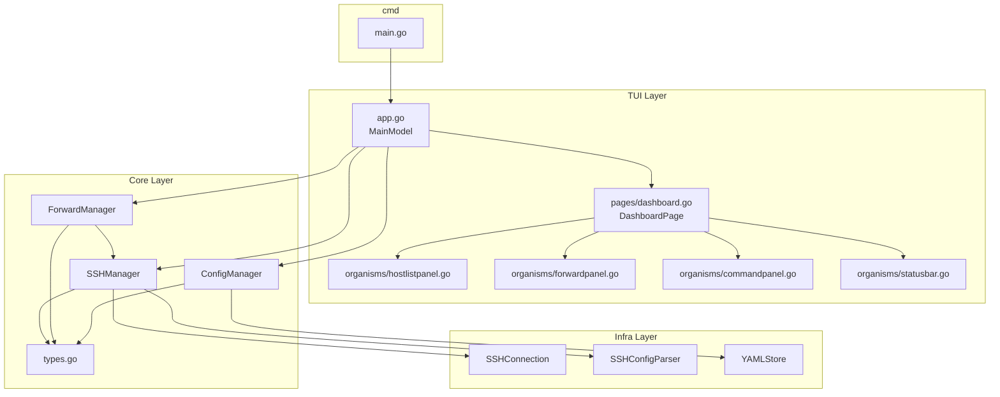
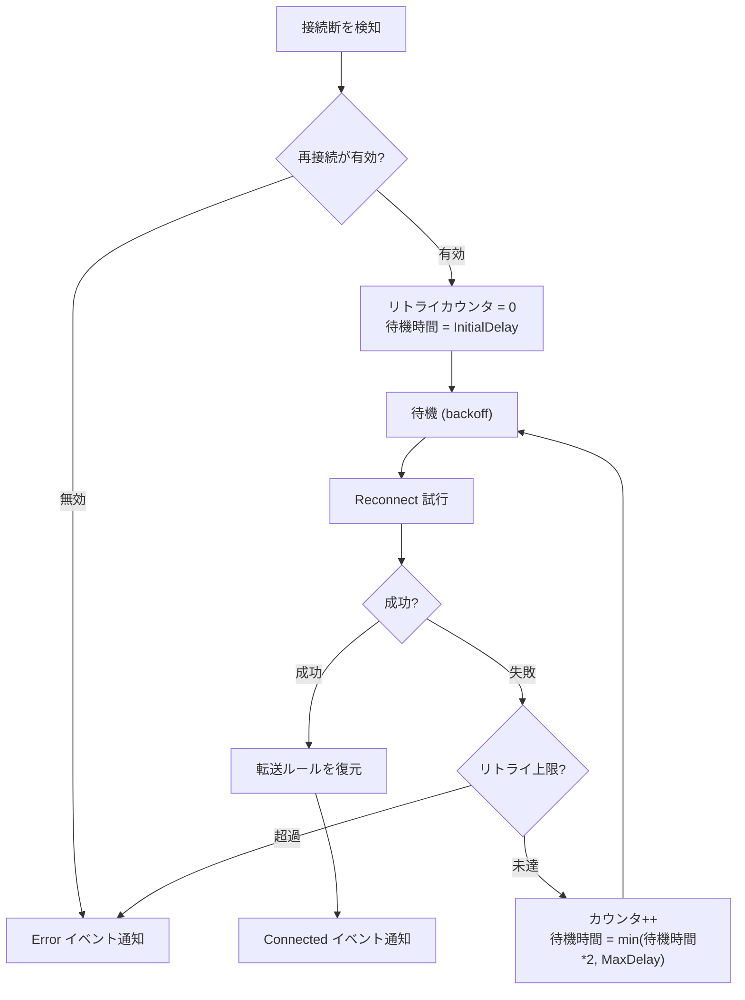
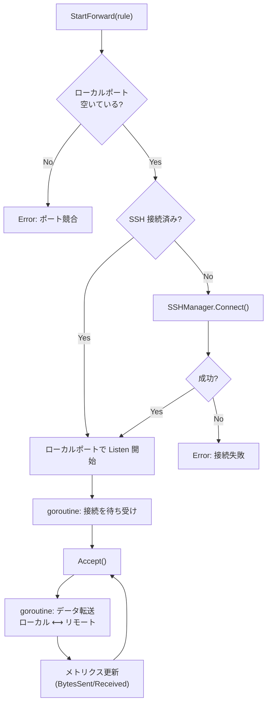
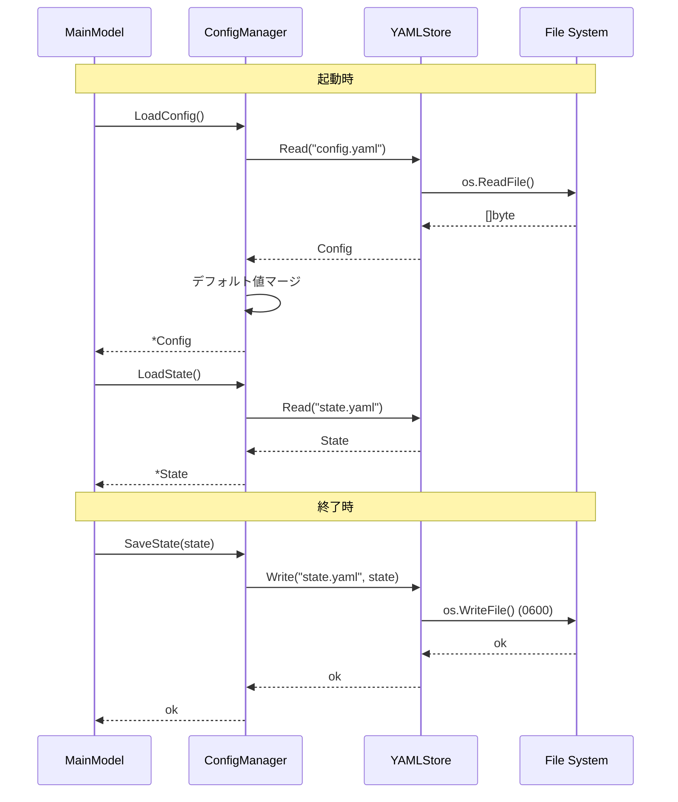

# MolePort コンポーネント設計

## 概要

本ドキュメントでは、アーキテクチャ設計で定義した各レイヤーのコンポーネントについて、責務・インターフェース・依存関係を詳細に定義する。

## コンポーネント依存関係



## Core Layer コンポーネント

### SSHManager

SSH 接続のライフサイクルを管理する。

#### 責務

- SSH config の読み込みとホスト一覧の提供
- SSH 接続の確立・切断
- 自動再接続の制御
- 接続状態の管理と通知

#### インターフェース

```go
type SSHManager interface {
    // ホスト管理
    LoadHosts() ([]SSHHost, error)
    ReloadHosts() ([]SSHHost, error)
    GetHost(name string) (*SSHHost, error)

    // 接続管理
    Connect(hostName string) error
    Disconnect(hostName string) error
    IsConnected(hostName string) bool

    // 接続取得（ForwardManager が使用）
    GetConnection(hostName string) (*ssh.Client, error)

    // 状態監視
    Subscribe() <-chan SSHEvent
}

type SSHEvent struct {
    Type     SSHEventType  // Connected, Disconnected, Reconnecting, Error
    HostName string
    Error    error
}
```

#### 再接続ロジック



### ForwardManager

ポートフォワーディングルールの管理と実行を担う。

#### 責務

- 転送ルールの CRUD
- ポートフォワーディングの開始・停止
- メトリクス（転送データ量、接続時間）の収集
- ポート競合の検出

#### インターフェース

```go
type ForwardManager interface {
    // ルール管理
    AddRule(rule ForwardRule) error
    DeleteRule(name string) error
    GetRules() []ForwardRule
    GetRulesByHost(hostName string) []ForwardRule

    // 転送制御
    StartForward(ruleName string) error
    StopForward(ruleName string) error
    StopAllForwards() error

    // セッション情報
    GetSession(ruleName string) (*ForwardSession, error)
    GetAllSessions() []ForwardSession

    // 状態監視
    Subscribe() <-chan ForwardEvent
}

type ForwardEvent struct {
    Type     ForwardEventType  // Started, Stopped, Error, MetricsUpdated
    RuleName string
    Session  *ForwardSession
    Error    error
}
```

#### ポートフォワーディングの内部処理



### ConfigManager

設定ファイルと状態ファイルの永続化を管理する。

#### 責務

- `config.yaml` の読み込み・保存
- `state.yaml` の読み込み・保存
- デフォルト値の適用
- 設定変更の検証

#### インターフェース

```go
type ConfigManager interface {
    // 設定
    LoadConfig() (*Config, error)
    SaveConfig(config *Config) error
    GetConfig() *Config
    UpdateConfig(fn func(*Config)) error

    // 状態
    LoadState() (*State, error)
    SaveState(state *State) error

    // パス
    ConfigDir() string  // ~/.config/moleport/
}
```

#### ファイル操作フロー



## Infra Layer コンポーネント

### SSHConnection

`golang.org/x/crypto/ssh` のラッパー。SSH 接続の確立とポートフォワーディングの低レベル操作を提供する。

#### インターフェース

```go
type SSHConnection interface {
    // 接続
    Dial(host SSHHost) (*ssh.Client, error)
    Close() error

    // ポートフォワーディング
    LocalForward(ctx context.Context, localPort int, remoteAddr string) (net.Listener, error)
    RemoteForward(ctx context.Context, remotePort int, localAddr string) (net.Listener, error)
    DynamicForward(ctx context.Context, localPort int) (net.Listener, error)

    // 状態
    IsAlive() bool
    KeepAlive(ctx context.Context, interval time.Duration)
}
```

### SSHConfigParser

SSH config ファイルを解析し、ホスト定義を抽出する。

#### インターフェース

```go
type SSHConfigParser interface {
    // 解析
    Parse(configPath string) ([]SSHHost, error)

    // Include ディレクティブの解決込み
    // ワイルドカードホスト (*) は除外する
    // Host と Match ブロックを解析する
}
```

#### 解析対象フィールド

| SSH config フィールド | SSHHost フィールド | 備考 |
|---------------------|-------------------|------|
| Host | Name | ワイルドカード `*` は除外 |
| HostName | HostName | |
| Port | Port | デフォルト: 22 |
| User | User | デフォルト: 現在のユーザー |
| IdentityFile | IdentityFile | `~` を展開する |
| ProxyJump | ProxyJump | 多段 SSH 対応 |

### YAMLStore

YAML ファイルの読み書きを担う汎用ストア。

#### インターフェース

```go
type YAMLStore interface {
    // 読み込み（ファイルが存在しない場合は空の値を返す）
    Read(path string, dest interface{}) error

    // 書き込み（ディレクトリが存在しない場合は作成、パーミッション 0600）
    Write(path string, data interface{}) error

    // 存在チェック
    Exists(path string) bool
}
```

## TUI コンポーネント（Organisms 詳細）

### HostListPanel

#### 責務

- SSH ホスト一覧の表示
- ホスト選択（カーソル操作）
- 選択ホスト変更時のイベント発行

#### TEA インターフェース

```go
type HostListPanel struct {
    hosts    []SSHHost
    cursor   int
    focused  bool
}

// Msg
type HostSelectedMsg struct {
    Host SSHHost
}

func (m HostListPanel) Update(msg tea.Msg) (HostListPanel, tea.Cmd)
func (m HostListPanel) View() string
```

### ForwardPanel

#### 責務

- 選択中ホストのポート転送ルール一覧表示
- メトリクスのリアルタイム更新
- トグル・切断・削除操作

#### TEA インターフェース

```go
type ForwardPanel struct {
    sessions []ForwardSession
    cursor   int
    focused  bool
}

// Msg
type ForwardToggleMsg struct{ RuleName string }
type ForwardDeleteMsg struct{ RuleName string }
type MetricsTickMsg struct{}

func (m ForwardPanel) Update(msg tea.Msg) (ForwardPanel, tea.Cmd)
func (m ForwardPanel) View() string
```

### CommandPanel

#### 責務

- コマンド入力の受け付け
- 対話プロンプトの表示と入力処理
- コマンド履歴の管理
- 実行結果の表示

#### TEA インターフェース

```go
type CommandPanel struct {
    input      textinput.Model
    output     []string
    prompt     *PromptState  // 対話プロンプト実行中の状態
    history    []string
    historyIdx int
    focused    bool
}

type PromptState struct {
    Steps   []PromptStep
    Current int
    Values  map[string]interface{}
}

func (m CommandPanel) Update(msg tea.Msg) (CommandPanel, tea.Cmd)
func (m CommandPanel) View() string
```

### StatusBar

#### 責務

- 全体の接続サマリー表示（接続中ホスト数、アクティブ転送数）
- グローバルキーバインドのヒント表示

#### TEA インターフェース

```go
type StatusBar struct {
    totalHosts      int
    connectedHosts  int
    totalForwards   int
    activeForwards  int
}

func (m StatusBar) Update(msg tea.Msg) (StatusBar, tea.Cmd)
func (m StatusBar) View() string
```

## キーバインド管理方針

キーバインドは `MainModel` で一元管理し、フォーカス中のペインに応じてディスパッチする。

- **グローバルキー**（`Tab`, `?`, `/`, `Ctrl+C`）: `MainModel.Update` で直接処理
- **ペインローカルキー**（`j`/`k`, `Enter`, `d`, `x`）: フォーカス中の Organism に委譲
- キー定義は `internal/tui/keys.go` に集約する

## 改訂履歴

| 版 | 日付 | 変更内容 | 変更理由 |
|---|------|---------|---------|
| 1.0 | 2026-02-10 | 初版作成 | — |
| 1.1 | 2026-02-10 | StatusBar TEA インターフェース追加、ForwardManager 依存パス修正、キーバインド管理方針追加 | 整合性チェック |
