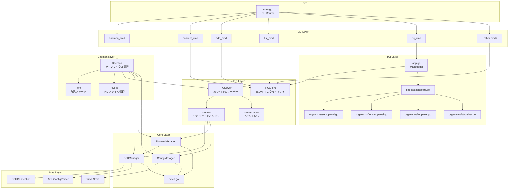
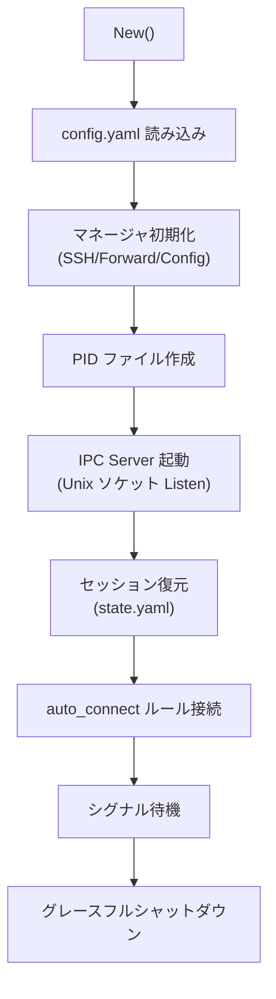
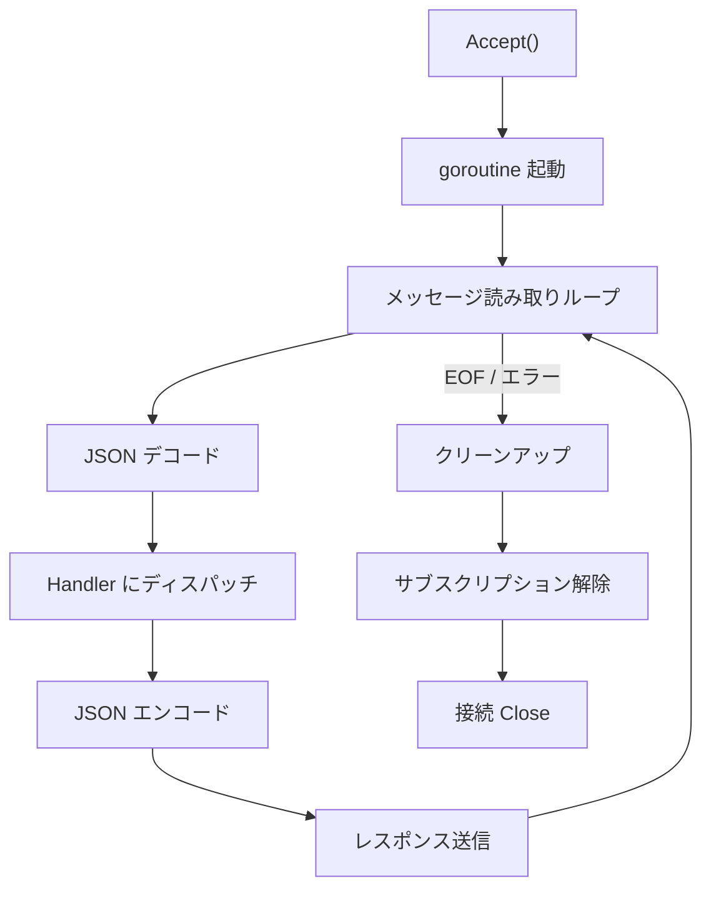
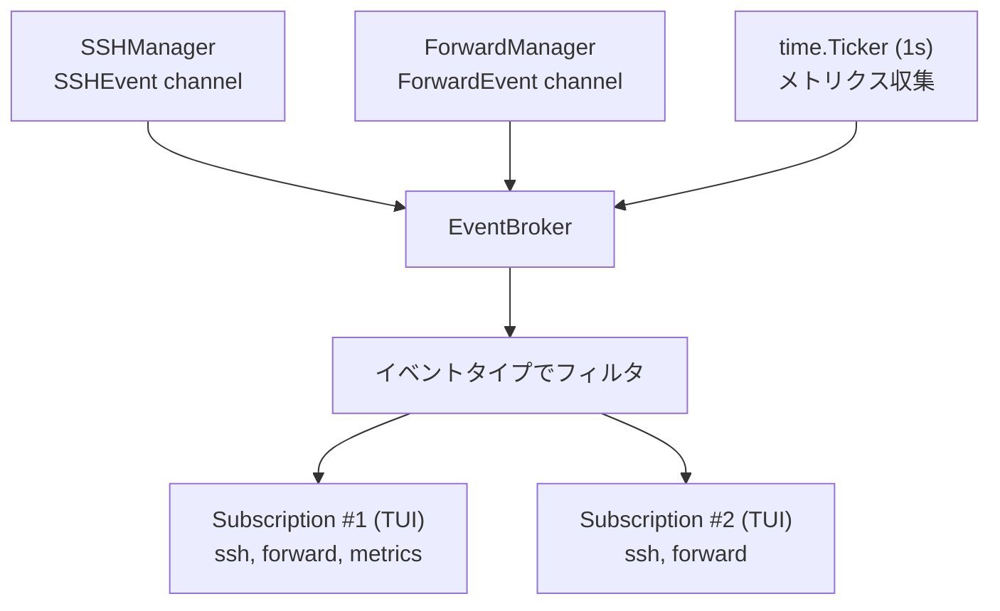
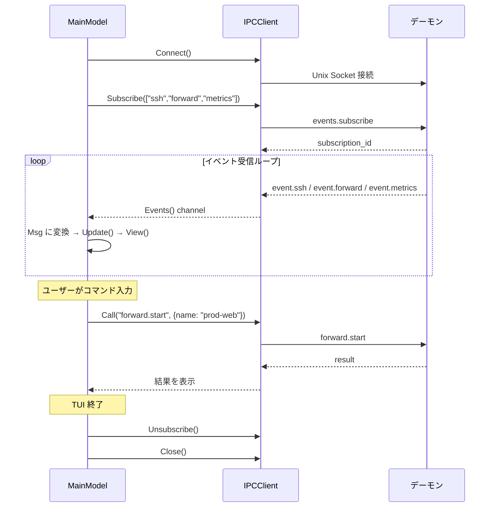

# MolePort コンポーネント設計

## 概要

本ドキュメントでは、アーキテクチャ設計で定義した各レイヤーのコンポーネントについて、責務・インターフェース・依存関係を詳細に定義する。

## コンポーネント依存関係



## Daemon Layer コンポーネント

### Daemon

デーモンプロセスのライフサイクルを管理する。

#### 責務

- デーモンの起動・初期化・停止
- 各マネージャ（SSH/Forward/Config）の初期化と依存注入
- IPC Server の起動
- セッション復元の実行
- シグナルハンドリング（SIGTERM/SIGINT）
- グレースフルシャットダウンの制御

#### インターフェース

```go
type Daemon struct {
    configDir  string
    startedAt  time.Time
    cfgMgr     ConfigManager
    sshMgr     SSHManager
    fwdMgr     ForwardManager
    broker     *EventBroker
    handler    *Handler
    server     *IPCServer
    pidFile    *PIDFile
    ctx        context.Context
    cancel     context.CancelFunc
}

func New(configDir string) (*Daemon, error)
func (d *Daemon) Start(ctx context.Context) error     // 初期化 + IPC Server 起動 + セッション復元
func (d *Daemon) Stop() error      // グレースフルシャットダウン
func (d *Daemon) Wait() error      // 終了シグナルを待機
```

#### 起動シーケンス



### PIDFile

PID ファイルの作成・検証・削除を管理する。

#### インターフェース

```go
type PIDFile struct {
    path string
    file *os.File
}

func NewPIDFile(path string) *PIDFile
func (p *PIDFile) Acquire() error     // PID ファイル作成 + flock
func (p *PIDFile) Release() error     // PID ファイル削除 + flock 解放
func IsRunning(path string) (bool, int)  // 既存デーモンの稼働確認（PID + プロセス生存チェック）
```

### Fork

デーモンの自己フォーク処理を提供する。

#### インターフェース

```go
// StartDaemonProcess は現在のバイナリを --daemon-mode フラグ付きで再起動し、
// バックグラウンドプロセスとして動作させる
func StartDaemonProcess() (pid int, err error)

// IsDaemonMode は --daemon-mode フラグが指定されているかを返す
func IsDaemonMode() bool
```

## IPC Layer コンポーネント

### IPCServer

Unix ドメインソケット上で JSON-RPC 2.0 リクエストを受け付け、ハンドラにディスパッチする。

#### 責務

- Unix ソケットの Listen / Accept
- クライアント接続の goroutine 管理
- JSON-RPC メッセージのデコード/エンコード
- メソッド名に基づくハンドラへのディスパッチ
- イベント通知の送信

#### インターフェース

```go
// HandlerFunc は RPC リクエストを処理するハンドラ関数の型。
type HandlerFunc func(clientID string, method string, params json.RawMessage) (any, *RPCError)

type IPCServer struct {
    socketPath           string
    listener             net.Listener
    handler              HandlerFunc
    clients              map[string]*clientConn
    mu                   sync.RWMutex
    OnClientConnected    func(clientID string)
    OnClientDisconnected func(clientID string)
}

func NewIPCServer(socketPath string, handler HandlerFunc) *IPCServer
func (s *IPCServer) Start(ctx context.Context) error
func (s *IPCServer) Stop() error
func (s *IPCServer) ConnectedClients() int
func (s *IPCServer) SendNotification(clientID string, notification Notification) error
func (s *IPCServer) BroadcastNotification(notification Notification)
```

#### クライアント接続処理フロー



### IPCClient

CLI/TUI が使用する JSON-RPC 2.0 クライアント。

#### 責務

- Unix ソケットへの接続
- JSON-RPC リクエストの送信とレスポンスの受信
- イベント通知の受信（サブスクリプション時）
- 接続状態の管理

#### インターフェース

```go
type IPCClient struct {
    socketPath string
    conn       net.Conn
    nextID     int64
    pending    map[int]chan *Response
    eventCh    chan *Notification
    mu         sync.Mutex
}

func NewIPCClient(socketPath string) *IPCClient
func (c *IPCClient) Connect() error
func (c *IPCClient) Close() error

// 同期リクエスト（CLI 向け）
func (c *IPCClient) Call(ctx context.Context, method string, params any, result any) error

// イベントサブスクリプション（TUI 向け）
func (c *IPCClient) Subscribe(ctx context.Context, types []string) (string, error)
func (c *IPCClient) Unsubscribe(ctx context.Context, subscriptionID string) error
func (c *IPCClient) Events() <-chan *Notification

// クレデンシャルコールバック（CLI/TUI が実装する）
func (c *IPCClient) SetCredentialHandler(handler CredentialHandler)

// ヘルパーメソッド
func (c *IPCClient) IsConnected() bool
```

#### CredentialHandler

CLI と TUI がそれぞれ実装する、クレデンシャル入力のコールバック関数型。

```go
// CredentialHandler はクレデンシャル要求を処理するコールバック関数の型。
// IPCClient が credential.request 通知を受信した際に呼び出される。
type CredentialHandler func(req CredentialRequestNotification) (*CredentialResponseParams, error)
```

**CLI 実装**: `internal/cli/credential.go`
- `golang.org/x/term` を使用してターミナルの秘密入力（エコーなし）を実装
- keyboard-interactive の場合は `echo` フラグに応じてエコー表示を切り替え

**TUI 実装**: `internal/tui/molecules/passwordinput.go`
- Bubble Tea の `textinput` をベースにマスク表示の入力フィールドを実装
- `echo: true` の場合は通常表示、`false` の場合は `*` でマスク

### Handler

JSON-RPC メソッドを Core Layer のマネージャに委譲する。

#### 責務

- メソッド名のルーティング
- パラメータのバリデーションと型変換
- Core Layer の呼び出しとレスポンスの構築

#### インターフェース

```go
type Handler struct {
    sshMgr SSHManager
    fwdMgr ForwardManager
    cfgMgr ConfigManager
    broker *EventBroker
    daemon DaemonInfo
}

func NewHandler(sshMgr SSHManager, fwdMgr ForwardManager, cfgMgr ConfigManager, broker *EventBroker, daemon DaemonInfo) *Handler
func (h *Handler) Handle(clientID string, method string, params json.RawMessage) (any, *RPCError)
```

#### メソッドルーティング

```go
// Handle 内部のルーティング（概要）
switch method {
case "host.list":            return h.hostList()
case "host.reload":          return h.hostReload()
case "ssh.connect":          return h.sshConnect(clientID, params)  // クレデンシャルコールバック対応
case "ssh.disconnect":       return h.sshDisconnect(params)
case "forward.list":         return h.forwardList(params)
case "forward.add":          return h.forwardAdd(params)
case "forward.delete":       return h.forwardDelete(params)
case "forward.start":        return h.forwardStart(params)
case "forward.stop":         return h.forwardStop(params)
case "forward.stopAll":      return h.forwardStopAll()
case "session.list":         return h.sessionList()
case "session.get":          return h.sessionGet(params)
case "config.get":           return h.configGet()
case "config.update":        return h.configUpdate(params)
case "daemon.status":        return h.daemonStatus()
case "daemon.shutdown":      return h.daemonShutdown(params)
case "events.subscribe":     return h.eventsSubscribe(clientID, params)
case "events.unsubscribe":   return h.eventsUnsubscribe(params)
case "credential.response":  return h.credentialResponse(params)   // 新規
default:                     return nil, &RPCError{Code: MethodNotFound, Message: "method not found: " + method}
}
```

#### sshConnect のクレデンシャルコールバック実装

`ssh.connect` ハンドラは、`ConnectWithCallback` に渡す `CredentialCallback` を構築する。
このコールバックは IPC 経由でクライアントにクレデンシャル要求を送信し、応答を待機する。

```go
func (h *Handler) sshConnect(clientID string, params json.RawMessage) (any, *RPCError) {
    // ...パラメータ解析...

    // クレデンシャルコールバックを構築
    cb := func(req CredentialRequest) (CredentialResponse, error) {
        reqID := generateRequestID()
        req.RequestID = reqID

        // クライアントに credential.request 通知を送信
        h.sendNotification(clientID, "credential.request", req)

        // credential.response を待機（30秒タイムアウト）
        select {
        case resp := <-h.waitCredentialResponse(reqID):
            if resp.Cancelled {
                return CredentialResponse{}, ErrCredentialCancelled
            }
            return resp, nil
        case <-time.After(30 * time.Second):
            return CredentialResponse{}, ErrCredentialTimeout
        }
    }

    err := h.sshMgr.ConnectWithCallback(host, cb)
    // ...
}
```

### EventBroker

Core Layer からのイベントを集約し、サブスクライブ中のクライアントに配信する。

#### 責務

- サブスクリプションの管理（追加・削除）
- Core Layer イベント（SSHEvent / ForwardEvent）の受信
- メトリクス更新の定期送信
- クライアントへの通知配信

#### インターフェース

```go
// NotifySender はクライアントに通知を送信する関数の型。
type NotifySender func(clientID string, notification Notification) error

type EventBroker struct {
    subscriptions map[string]*Subscription // subscriptionID -> Subscription
    clientSubs    map[string][]string      // clientID -> []subscriptionID
    sender        NotifySender
    mu            sync.RWMutex
}

type Subscription struct {
    ID       string
    ClientID string
    Types    map[string]bool // "ssh" | "forward" | "metrics"
}

func NewEventBroker(sender NotifySender) *EventBroker
func (b *EventBroker) Subscribe(clientID string, types []string) string
func (b *EventBroker) Unsubscribe(subscriptionID string) bool
func (b *EventBroker) RemoveClient(clientID string)
func (b *EventBroker) HandleSSHEvent(evt core.SSHEvent)
func (b *EventBroker) HandleForwardEvent(evt core.ForwardEvent)
```

#### イベント配信フロー



## CLI Layer コンポーネント

### CLIRouter（main.go）

コマンドラインのサブコマンドを解析し、対応するハンドラにディスパッチする。

#### 責務

- サブコマンドの解析（Go 標準 `flag` パッケージ）
- ヘルプ・バージョン表示
- `--daemon-mode` フラグの検出（デーモンプロセス内で使用）

#### インターフェース

```go
func main() {
    if daemon.IsDaemonMode() {
        // デーモンプロセスとして起動
        runDaemon()
        return
    }

    // サブコマンドの解析とディスパッチ
    switch subcommand {
    case "daemon":  runDaemonCmd(args)
    case "connect": runConnectCmd(args)
    case "disconnect": runDisconnectCmd(args)
    case "add":     runAddCmd(args)
    case "delete":  runDeleteCmd(args)
    case "start":   runStartCmd(args)
    case "stop":    runStopCmd(args)
    case "list":    runListCmd(args)
    case "status":  runStatusCmd(args)
    case "config":  runConfigCmd(args)
    case "reload":  runReloadCmd(args)
    case "tui":     runTUICmd(args)
    case "help":    runHelpCmd(args)
    case "version": runVersionCmd()
    default:        printUsage()
    }
}
```

### 各サブコマンドハンドラ

CLI サブコマンドは共通パターンに従う:
1. IPCClient を作成し、デーモンに接続
2. JSON-RPC メソッドを呼び出し
3. レスポンスをフォーマットして表示
4. 接続を切断

```go
// 共通パターンの例: connect コマンド
func runConnectCmd(args []string) {
    host := args[0]
    client := ipc.NewIPCClient(socketPath())
    if err := client.Connect(); err != nil {
        // デーモン未稼働時のエラーメッセージ
        fmt.Fprintln(os.Stderr, "デーモンが稼働していません。moleport daemon start で起動してください。")
        os.Exit(1)
    }
    defer client.Close()

    var result SSHConnectResult
    if err := client.Call("ssh.connect", SSHConnectParams{Host: host}, &result); err != nil {
        fmt.Fprintln(os.Stderr, err)
        os.Exit(1)
    }
    fmt.Printf("%s に接続しました\n", result.Host)
}
```

## Core Layer コンポーネント

### SSHManager（変更あり）

SSH 接続のライフサイクルを管理する。

#### 責務

- SSH config の読み込みとホスト一覧の提供
- SSH 接続の確立・切断
- 自動再接続の制御
- 接続状態の管理と通知
- **（追加）クレデンシャルコールバック経由の認証制御**
- **（追加）セッション復元時の pending_auth 状態管理**

#### インターフェース

```go
// CredentialCallback は認証時にクレデンシャル入力を要求するコールバック。
// IPC Handler がクライアントへの通知・応答受信を実装する。
type CredentialCallback func(req CredentialRequest) (CredentialResponse, error)

type SSHManager interface {
    LoadHosts() ([]SSHHost, error)
    ReloadHosts() ([]SSHHost, error)
    GetHosts() []SSHHost
    GetHost(name string) (*SSHHost, error)
    Connect(hostName string) error                               // エージェント・鍵のみで接続（セッション復元用）
    ConnectWithCallback(hostName string, cb CredentialCallback) error  // クレデンシャルコールバック付き接続
    Disconnect(hostName string) error
    IsConnected(hostName string) bool
    GetConnection(hostName string) (*ssh.Client, error)
    GetSSHConnection(hostName string) (SSHConnection, error)
    GetPendingAuthHosts() []string                               // pending_auth 状態のホスト一覧
    Subscribe() <-chan SSHEvent
    Close()
}
```

#### Connect と ConnectWithCallback の使い分け

| メソッド | 用途 | クレデンシャルが必要な場合 |
|---------|------|------------------------|
| `Connect` | セッション復元・auto_connect・自動再接続 | `PendingAuth` 状態にしてイベント通知 |
| `ConnectWithCallback` | `ssh.connect` IPC リクエスト経由 | コールバックでクライアントに入力を要求 |

### ForwardManager

ポートフォワーディングルールの管理と実行を担う。

#### インターフェース

```go
type ForwardManager interface {
    AddRule(rule ForwardRule) (string, error)
    DeleteRule(name string) error
    GetRules() []ForwardRule
    GetRulesByHost(hostName string) []ForwardRule
    StartForward(ruleName string) error
    StopForward(ruleName string) error
    StopAllForwards() error
    GetSession(ruleName string) (*ForwardSession, error)
    GetAllSessions() []ForwardSession
    Subscribe() <-chan ForwardEvent
    Close()
}
```

### ConfigManager

設定ファイルと状態ファイルの永続化を管理する。

#### インターフェース

```go
type ConfigManager interface {
    LoadConfig() (*Config, error)
    SaveConfig(config *Config) error
    GetConfig() *Config
    UpdateConfig(fn func(*Config)) error
    LoadState() (*State, error)
    SaveState(state *State) error
    DeleteState() error
    ConfigDir() string
}
```

## Infra Layer コンポーネント

### SSHConnection（変更あり）

`Dial` メソッドにクレデンシャルコールバックを受け取るオプションを追加する。

```go
type SSHConnection interface {
    // Dial はホストへ SSH 接続を確立する。
    // cb が nil の場合はエージェント・鍵ファイルのみで認証を試みる。
    // cb が non-nil の場合はパスワード・パスフレーズ・keyboard-interactive もフォールバックとして試行する。
    Dial(host SSHHost, cb CredentialCallback) (*ssh.Client, error)
    Close() error
    LocalForward(ctx context.Context, localPort int, remoteAddr string) (net.Listener, error)
    RemoteForward(ctx context.Context, remotePort int, localAddr string) (net.Listener, error)
    DynamicForward(ctx context.Context, localPort int) (net.Listener, error)
    IsAlive() bool
    KeepAlive(ctx context.Context, interval time.Duration)
}
```

#### buildAuthMethods の変更

`internal/infra/auth.go` の `buildAuthMethods` にクレデンシャルコールバック対応を追加する。

```go
// buildAuthMethods はホスト情報とクレデンシャルコールバックをもとに認証メソッドのリストを構築する。
func buildAuthMethods(host SSHHost, cb CredentialCallback) ([]ssh.AuthMethod, io.Closer) {
    var methods []ssh.AuthMethod
    var agentCloser io.Closer

    // 1. SSH エージェントを試行（既存）
    if agentAuth, conn, err := trySSHAgent(); err == nil {
        methods = append(methods, agentAuth)
        agentCloser = conn
    }

    // 2. ホスト固有の IdentityFile（既存 + パスフレーズ対応追加）
    if host.IdentityFile != "" {
        if keyAuth, err := tryKeyFile(host.IdentityFile); err == nil {
            methods = append(methods, keyAuth)
        } else if cb != nil && isPassphraseError(err) {
            // パスフレーズ付き鍵: コールバックでパスフレーズを要求
            methods = append(methods, passphraseAuthMethod(host, host.IdentityFile, cb))
        }
    }

    // 3. デフォルト鍵パス（既存 + パスフレーズ対応追加）
    // ...

    // 4. パスワード認証（cb が non-nil の場合のみ追加）
    if cb != nil {
        methods = append(methods, passwordAuthMethod(host, cb))
    }

    // 5. keyboard-interactive 認証（cb が non-nil の場合のみ追加）
    if cb != nil {
        methods = append(methods, keyboardInteractiveAuthMethod(host, cb))
    }

    return methods, agentCloser
}
```

### SSHConfigParser

```go
type SSHConfigParser interface {
    Parse(configPath string) ([]SSHHost, error)
}
```

### YAMLStore

```go
type YAMLStore interface {
    Read(path string, dest interface{}) error
    Write(path string, data interface{}) error
    Exists(path string) bool
}
```

## TUI コンポーネント

### MainModel（変更あり）

v1 では Core Layer を直接呼び出していたが、v2 では IPCClient 経由でデーモンに接続する。

#### 変更点

```go
// v1: Core Layer 直接
type MainModel struct {
    sshMgr  SSHManager
    fwdMgr  ForwardManager
    cfgMgr  ConfigManager
    // ...
}

// v2: IPCClient 経由
type MainModel struct {
    client  *IPCClient
    // ...
}
```

#### 責務

- IPC Client を使ったデーモンとの通信
- イベントサブスクリプションの管理
- 受信イベントの Bubble Tea Msg への変換
- ダッシュボードの状態管理と描画

#### TUI ⟷ デーモン通信フロー



### Organisms

SetupPanel / ForwardPanel / LogPanel / StatusBar の構造は維持。
データの取得元が Core Layer 直接から IPCClient 経由に変わるのみ。

## キーバインド管理方針

キーバインドは `MainModel` で一元管理し、フォーカス中のペインに応じてディスパッチする。

- **グローバルキー**（`Tab`, `?`, `/`, `Ctrl+C`）: `MainModel.Update` で直接処理
- **ペインローカルキー**（`j`/`k`, `Enter`, `d`, `x`）: フォーカス中の Organism に委譲
- キー定義は `internal/tui/keys.go` に集約する

## 改訂履歴

| 版 | 日付 | 変更内容 | 変更理由 |
|---|------|---------|---------|
| 1.0 | 2026-02-10 | 初版作成 | — |
| 1.1 | 2026-02-10 | StatusBar TEA インターフェース追加、ForwardManager 依存パス修正、キーバインド管理方針追加 | 整合性チェック |
| 2.0 | 2026-02-11 | デーモン化対応: Daemon/IPC/CLI Layer コンポーネント追加、TUI の IPCClient 経由化 | デーモン化対応 |
| 2.1 | 2026-02-11 | SSHManager に ConnectWithCallback/GetPendingAuthHosts 追加、SSHConnection.Dial にコールバック引数追加、buildAuthMethods のパスフレーズ/パスワード/KI 対応、Handler のクレデンシャルコールバック実装、CredentialHandler インターフェース追加 | #11 クレデンシャル入力機能追加 |
