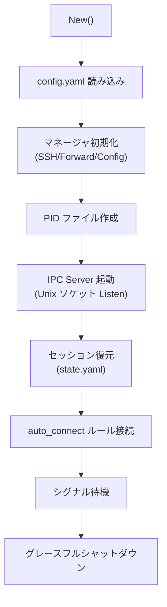
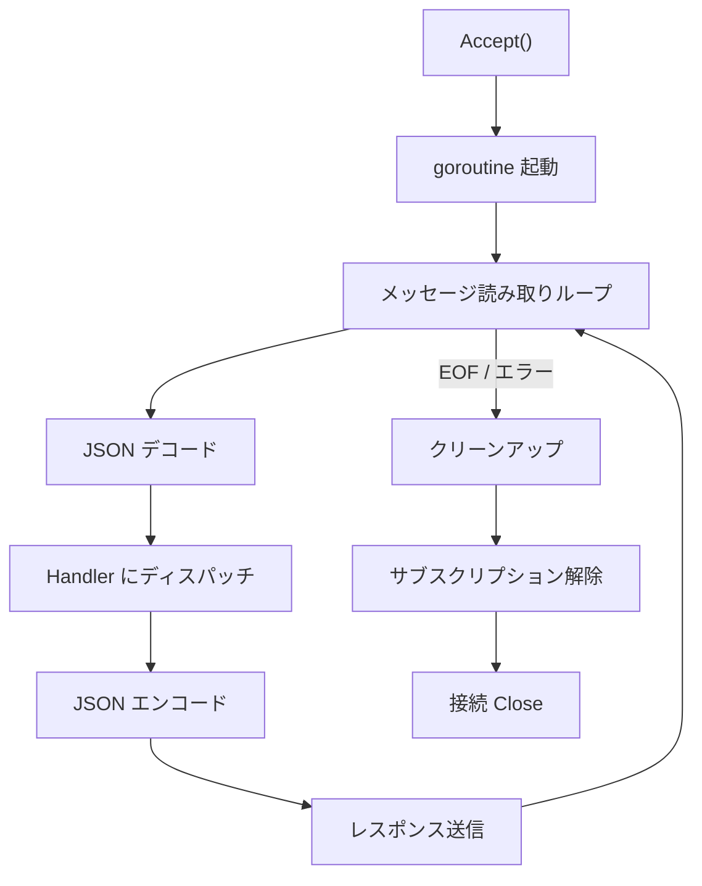
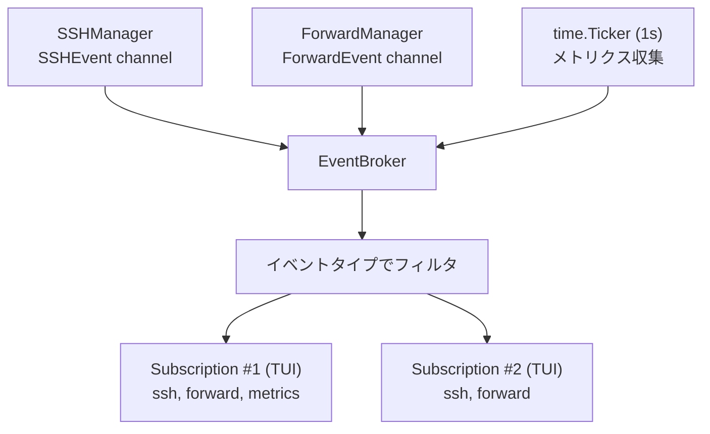
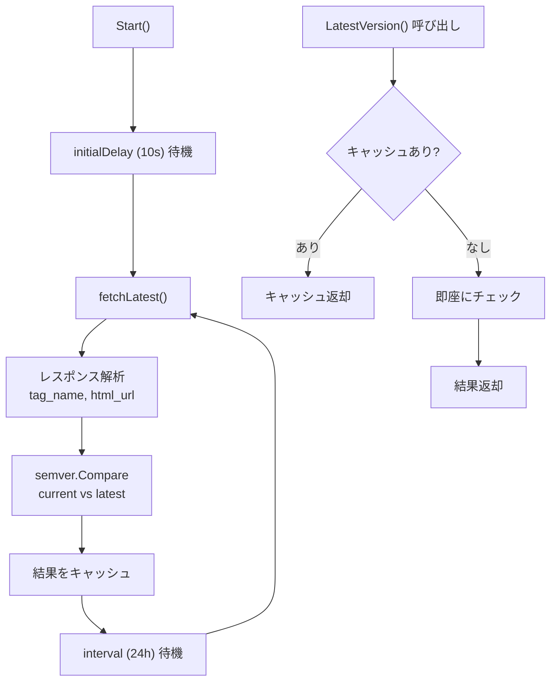
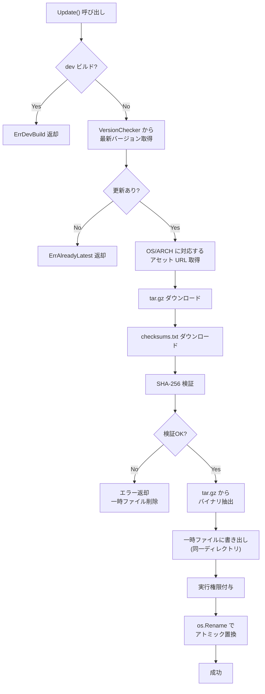
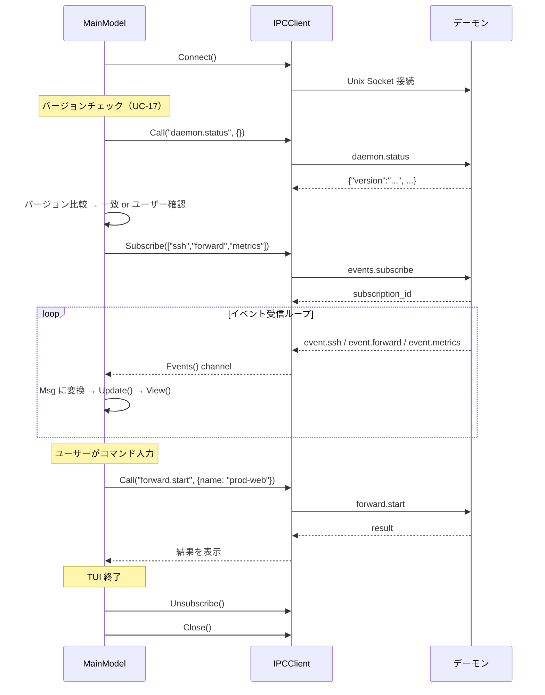

# MolePort コンポーネント設計

## 概要

本ドキュメントでは、アーキテクチャ設計で定義した各レイヤーのコンポーネントについて、責務・インターフェース・依存関係を詳細に定義する。

## コンポーネント依存関係


```mermaid
graph TD
    subgraph "cmd"
        Main["main.go<br/>CLI Router"]
    end

    subgraph "Daemon Layer"
        DaemonProc["Daemon<br/>ライフサイクル管理"]
        PIDFile["PIDFile<br/>PID ファイル管理"]
        Fork["Fork<br/>自己フォーク"]
    end

    subgraph "IPC Layer"
        subgraph "ipc/"
            IPCSrv["IPCServer<br/>JSON-RPC サーバー"]
            Broker["EventBroker<br/>イベント配信"]
        end
        subgraph "ipc/handler/"
            Handler["Handler<br/>RPC メソッドハンドラ"]
        end
        subgraph "ipc/client/"
            IPCCli["IPCClient<br/>JSON-RPC クライアント"]
        end
        subgraph "ipc/protocol/"
            Proto["Protocol<br/>メッセージ型定義"]
        end
    end

    subgraph "CLI Layer"
        DaemonCmd["daemon_cmd"]
        ConnectCmd["connect_cmd"]
        AddCmd["add_cmd"]
        ListCmd["list_cmd"]
        TUICmd["tui_cmd"]
        UpdateCmd["update_cmd"]
        OtherCmd["...other cmds"]
    end

    subgraph "i18n"
        I18n["i18n.go<br/>Localizer・T()・SetLang()"]
        Resolver["resolver.go<br/>Resolve() 関数"]
        Locales["locales/<br/>ja.yaml・en.yaml"]
    end

    subgraph "TUI Layer"
        App["app.go<br/>MainModel"]
        ThemePkg["theme/<br/>Theme・Presets"]
        Dashboard["pages/dashboard.go"]
        ThemePg["pages/theme.go"]
        LangPg["pages/lang.go"]
        SP["organisms/setuppanel.go"]
        FP["organisms/forwardpanel.go"]
        LP["organisms/logpanel.go"]
        SB["organisms/statusbar.go"]
        TG["organisms/themegrid.go"]
    end

    subgraph "Core Layer"
        subgraph "core/"
            Types["types_*.go<br/>共有型定義"]
            Cfg["ConfigManager"]
        end
        subgraph "core/ssh/"
            SSH["SSHManager"]
        end
        subgraph "core/forward/"
            Fwd["ForwardManager"]
        end
        subgraph "core/update/"
            VerChk["VersionChecker"]
            Updater["Updater<br/>セルフアップデート"]
        end
    end

    subgraph "Infra Layer"
        Conn["SSHConnection"]
        Parser["SSHConfigParser"]
        Store["YAMLStore"]
    end

    Main --> DaemonCmd
    Main --> ConnectCmd
    Main --> AddCmd
    Main --> ListCmd
    Main --> TUICmd
    Main --> UpdateCmd
    Main --> OtherCmd

    UpdateCmd --> Updater
    UpdateCmd --> IPCCli
    UpdateCmd --> I18n
    Updater --> VerChk

    DaemonCmd --> DaemonProc
    DaemonProc --> Fork
    DaemonProc --> PIDFile
    DaemonProc --> IPCSrv
    DaemonProc --> SSH
    DaemonProc --> Fwd
    DaemonProc --> Cfg
    DaemonProc --> VerChk

    ConnectCmd --> IPCCli
    AddCmd --> IPCCli
    ListCmd --> IPCCli
    OtherCmd --> IPCCli

    TUICmd --> App
    App --> IPCCli
    App --> ThemePkg
    App --> I18n
    App --> Dashboard
    App --> ThemePg
    App --> LangPg
    LangPg --> I18n

    I18n --> Locales
    I18n --> Resolver

    DaemonCmd --> I18n
    ConnectCmd --> I18n
    AddCmd --> I18n
    ListCmd --> I18n
    OtherCmd --> I18n

    Dashboard --> SP
    Dashboard --> FP
    Dashboard --> LP
    Dashboard --> SB
    ThemePg --> TG
    TG --> ThemePkg

    IPCSrv --> Handler
    IPCSrv --> Broker
    Handler --> SSH
    Handler --> Fwd
    Handler --> Cfg
    Handler --> VerChk
    Handler --> Proto
    IPCCli --> Proto

    SSH --> Conn
    SSH --> Parser
    SSH --> Types
    Fwd --> SSH
    Fwd --> Types
    Cfg --> Store
    Cfg --> Types
```

## Daemon Layer コンポーネント

### Daemon

デーモンプロセスのライフサイクルを管理する。

#### 責務

- デーモンの起動・初期化・停止
- 各マネージャ（SSH/Forward/Config）の初期化と依存注入
- IPC Server の起動
- セッション復元の実行
- config.yaml の `auto_connect` ルールの自動開始
- **SSH イベントルーティング**: SSH 接続断検知時にフォワードを `SessionReconnecting` に更新し、再接続成功時にフォワード復元を実行する（`daemon_state.go` の `startEventRouting`）
- シグナルハンドリング（SIGTERM/SIGINT）
- グレースフルシャットダウンの制御

#### インターフェース

```go
type Daemon struct {
    configDir  string
    startedAt  time.Time
    cfgMgr     ConfigManager
    sshMgr     SSHManager
    fwdMgr     ForwardManager
    broker     *EventBroker
    handler    *Handler
    server     *IPCServer
    pidFile    *PIDFile
    ctx        context.Context
    cancel     context.CancelFunc
}

func New(configDir string, version string) (*Daemon, error)
func (d *Daemon) Start(ctx context.Context) error     // 初期化 + IPC Server 起動 + セッション復元
func (d *Daemon) Stop() error      // グレースフルシャットダウン
func (d *Daemon) Shutdown(purge bool) error  // シャットダウン（purge=true で設定も削除）
func (d *Daemon) Wait() error      // 終了シグナルを待機
```

#### 起動シーケンス


```mermaid
flowchart TD
    New["New()"] --> LoadCfg["config.yaml 読み込み"]
    LoadCfg --> InitMgr["マネージャ初期化<br/>(SSH/Forward/Config)"]
    InitMgr --> PID["PID ファイル作成"]
    PID --> IPC["IPC Server 起動<br/>(Unix ソケット Listen)"]
    IPC --> Restore["セッション復元<br/>(state.yaml)"]
    Restore --> Auto["auto_connect ルール接続"]
    Auto --> Wait["シグナル待機"]
    Wait --> Shutdown["グレースフルシャットダウン"]
```

### PIDFile

PID ファイルの作成・検証・削除を管理する。

#### インターフェース

```go
type PIDFile struct {
    path string
    file *os.File
}

func NewPIDFile(path string) *PIDFile
func (p *PIDFile) Acquire() error     // PID ファイル作成 + flock
func (p *PIDFile) Release() error     // PID ファイル削除 + flock 解放
func IsRunning(path string) (bool, int)  // 既存デーモンの稼働確認（PID + プロセス生存チェック）
func KillProcess(pidPath string) error   // PID ファイルからプロセスを特定して停止
```

### Fork

デーモンの自己フォーク処理を提供する。

#### インターフェース

```go
// StartDaemonProcess は現在のバイナリを --daemon-mode フラグ付きで再起動し、
// バックグラウンドプロセスとして動作させる
func StartDaemonProcess(configDir string) (int, error)

// IsDaemonMode は --daemon-mode フラグが指定されているかを返す
func IsDaemonMode() bool
```

## IPC Layer コンポーネント

> **パッケージ構成**: `ipc/`（サーバー・broker）、`ipc/protocol/`（メッセージ型）、`ipc/handler/`（RPCハンドラ）、`ipc/client/`（クライアント）

### IPCServer (`ipc/`)

Unix ドメインソケット上で JSON-RPC 2.0 リクエストを受け付け、ハンドラにディスパッチする。

#### 責務

- Unix ソケットの Listen / Accept
- クライアント接続の goroutine 管理
- JSON-RPC メッセージのデコード/エンコード
- メソッド名に基づくハンドラへのディスパッチ
- イベント通知の送信

#### インターフェース

```go
// HandlerFunc は RPC リクエストを処理するハンドラ関数の型。
type HandlerFunc func(clientID string, method string, params json.RawMessage) (any, *RPCError)

type IPCServer struct {
    socketPath           string
    listener             net.Listener
    handler              HandlerFunc
    clients              map[string]*clientConn
    mu                   sync.RWMutex
    OnClientConnected    func(clientID string)
    OnClientDisconnected func(clientID string)
}

func NewIPCServer(socketPath string, handler HandlerFunc) *IPCServer
func (s *IPCServer) Start(ctx context.Context) error
func (s *IPCServer) Stop() error
func (s *IPCServer) ConnectedClients() int
func (s *IPCServer) SendNotification(clientID string, notification Notification) error
func (s *IPCServer) BroadcastNotification(notification Notification)
```

#### クライアント接続処理フロー


```mermaid
flowchart TD
    Accept["Accept()"] --> Goroutine["goroutine 起動"]
    Goroutine --> ReadLoop["メッセージ読み取りループ"]
    ReadLoop --> Decode["JSON デコード"]
    Decode --> Dispatch["Handler にディスパッチ"]
    Dispatch --> Encode["JSON エンコード"]
    Encode --> Send["レスポンス送信"]
    Send --> ReadLoop

    ReadLoop --> |EOF / エラー| Cleanup["クリーンアップ"]
    Cleanup --> UnSub["サブスクリプション解除"]
    UnSub --> Close["接続 Close"]
```

### IPCClient (`ipc/client/`)

CLI/TUI が使用する JSON-RPC 2.0 クライアント。

#### 責務

- Unix ソケットへの接続
- JSON-RPC リクエストの送信とレスポンスの受信
- イベント通知の受信（サブスクリプション時）
- 接続状態の管理

#### インターフェース

```go
type IPCClient struct {
    socketPath string
    conn       net.Conn
    nextID     int64
    pending    map[int]chan *Response
    eventCh    chan *Notification
    mu         sync.Mutex
}

func NewIPCClient(socketPath string) *IPCClient
func (c *IPCClient) Connect() error
func (c *IPCClient) Close() error

// 同期リクエスト（CLI 向け）
func (c *IPCClient) Call(ctx context.Context, method string, params any, result any) error

// イベントサブスクリプション（TUI 向け）
func (c *IPCClient) Subscribe(ctx context.Context, types []string) (string, error)
func (c *IPCClient) Unsubscribe(ctx context.Context, subscriptionID string) error
func (c *IPCClient) Events() <-chan *Notification

// クレデンシャルコールバック（CLI/TUI が実装する）
func (c *IPCClient) SetCredentialHandler(handler CredentialHandler)

// ヘルパーメソッド
func (c *IPCClient) IsConnected() bool
```

#### CredentialHandler

CLI と TUI がそれぞれ実装する、クレデンシャル入力のコールバック関数型。

```go
// CredentialHandler はクレデンシャル要求を処理するコールバック関数の型。
// IPCClient が credential.request 通知を受信した際に呼び出される。
type CredentialHandler func(req CredentialRequestNotification) (*CredentialResponseParams, error)
```

**CLI 実装**: `internal/cli/credential.go`
- `golang.org/x/term` を使用してターミナルの秘密入力（エコーなし）を実装
- keyboard-interactive の場合は `echo` フラグに応じてエコー表示を切り替え

**TUI 実装**: `internal/tui/molecules/passwordinput.go`
- Bubble Tea の `textinput` をベースにマスク表示の入力フィールドを実装
- `echo: true` の場合は通常表示、`false` の場合は `*` でマスク

### Handler (`ipc/handler/`)

JSON-RPC メソッドを Core Layer のマネージャに委譲する。ドメイン別にファイルを分割する。

| ファイル | 担当メソッド |
|---------|------------|
| `handler.go` | ディスパッチャ・初期化・`parseParams` |
| `handler_host.go` | `host.list`, `host.reload` |
| `handler_ssh.go` | `ssh.connect`, `ssh.disconnect`, `credential.*` |
| `handler_forward.go` | `forward.add/delete/start/stop/list/stopAll` |
| `handler_session.go` | `session.list`, `session.get` |
| `config/handler.go` | `config.get`, `config.update`（サブパッケージ） |
| `handler_daemon.go` | `daemon.status`, `daemon.shutdown` |
| `handler_version.go` | `version.check` |
| `handler_events.go` | `events.subscribe/unsubscribe` |

#### 責務

- メソッド名のルーティング
- パラメータのバリデーションと型変換
- Core Layer の呼び出しとレスポンスの構築

#### インターフェース

```go
type Handler struct {
    sshMgr         SSHManager
    fwdMgr         ForwardManager
    cfgMgr         ConfigManager
    broker         *EventBroker
    daemon         DaemonInfo
    versionChecker VersionChecker
}

func NewHandler(sshMgr SSHManager, fwdMgr ForwardManager, cfgMgr ConfigManager, broker *EventBroker, daemon DaemonInfo, versionChecker VersionChecker) *Handler
func (h *Handler) Handle(clientID string, method string, params json.RawMessage) (any, *RPCError)
```

#### メソッドルーティング

```go
// Handle 内部のルーティング（概要）
switch method {
case "host.list":            return h.hostList()
case "host.reload":          return h.hostReload()
case "ssh.connect":          return h.sshConnect(clientID, params)  // クレデンシャルコールバック対応
case "ssh.disconnect":       return h.sshDisconnect(params)
case "forward.list":         return h.forwardList(params)
case "forward.add":          return h.forwardAdd(params)
case "forward.delete":       return h.forwardDelete(params)
case "forward.start":        return h.forwardStart(clientID, params)  // クレデンシャルコールバック対応
case "forward.stop":         return h.forwardStop(params)
case "forward.stopAll":      return h.forwardStopAll()
case "session.list":         return h.sessionList()
case "session.get":          return h.sessionGet(params)
case "config.get":           return h.configH.Get()
case "config.update":        return h.configH.Update(params)
case "daemon.status":        return h.daemonStatus()
case "daemon.shutdown":      return h.daemonShutdown(params)
case "version.check":        return h.versionCheck()
case "events.subscribe":     return h.eventsSubscribe(clientID, params)
case "events.unsubscribe":   return h.eventsUnsubscribe(params)
case "credential.response":  return h.credentialResponse(params)   // 新規
default:                     return nil, &RPCError{Code: MethodNotFound, Message: "method not found: " + method}
}
```

#### sshConnect のクレデンシャルコールバック実装

`ssh.connect` ハンドラは、`ConnectWithCallback` に渡す `CredentialCallback` を構築する。
このコールバックは IPC 経由でクライアントにクレデンシャル要求を送信し、応答を待機する。

```go
func (h *Handler) sshConnect(clientID string, params json.RawMessage) (any, *RPCError) {
    // ...パラメータ解析...

    // クレデンシャルコールバックを構築
    cb := func(req CredentialRequest) (CredentialResponse, error) {
        reqID := generateRequestID()
        req.RequestID = reqID

        // クライアントに credential.request 通知を送信
        h.sendNotification(clientID, "credential.request", req)

        // credential.response を待機（30秒タイムアウト）
        select {
        case resp := <-h.waitCredentialResponse(reqID):
            if resp.Cancelled {
                return CredentialResponse{}, ErrCredentialCancelled
            }
            return resp, nil
        case <-time.After(30 * time.Second):
            return CredentialResponse{}, ErrCredentialTimeout
        }
    }

    err := h.sshMgr.ConnectWithCallback(host, cb)
    // ...
}
```

#### forwardStart のクレデンシャルコールバック対応

`forward.start` ハンドラは、クレデンシャルコールバックを `StartForward` に渡し、StartForward 内部で SSH 接続を処理する。
これにより `forward.start` 経由でもパスワード認証等が可能になる。

```go
func (h *Handler) forwardStart(clientID string, params json.RawMessage) (any, *RPCError) {
    // ...パラメータ解析...

    // クレデンシャルコールバックを StartForward に渡す。
    // StartForward 内で SSH 未接続時にコールバック付きで接続するため、
    // パスワード認証や keyboard-interactive 認証もサポートされる。
    session, err := h.fwdMgr.GetSession(p.Name)
    if err != nil {
        return nil, toRPCError(err, InternalError)
    }
    cb := h.buildCredentialCallback(clientID, session.Rule.Host)
    if err := h.fwdMgr.StartForward(p.Name, cb); err != nil {
        return nil, toRPCError(err, InternalError)
    }
    return ForwardStartResult{Name: p.Name, Status: "active"}, nil
}
```

### EventBroker

Core Layer からのイベントを集約し、サブスクライブ中のクライアントに配信する。

#### 責務

- サブスクリプションの管理（追加・削除）
- Core Layer イベント（SSHEvent / ForwardEvent）の受信
- メトリクス更新の定期送信
- クライアントへの通知配信

#### インターフェース

```go
// NotifySender はクライアントに通知を送信する関数の型。
type NotifySender func(clientID string, notification Notification) error

type EventBroker struct {
    subscriptions map[string]*Subscription // subscriptionID -> Subscription
    clientSubs    map[string][]string      // clientID -> []subscriptionID
    sender        NotifySender
    mu            sync.RWMutex
}

type Subscription struct {
    ID       string
    ClientID string
    Types    map[string]bool // "ssh" | "forward" | "metrics"
}

func NewEventBroker(sender NotifySender) *EventBroker
func (b *EventBroker) Subscribe(clientID string, types []string) string
func (b *EventBroker) Unsubscribe(subscriptionID string) bool
func (b *EventBroker) RemoveClient(clientID string)
func (b *EventBroker) HandleSSHEvent(evt core.SSHEvent)
func (b *EventBroker) HandleForwardEvent(evt core.ForwardEvent)
```

#### イベント配信フロー


```mermaid
flowchart TD
    SSHMgr["SSHManager<br/>SSHEvent channel"] --> Broker["EventBroker"]
    FwdMgr["ForwardManager<br/>ForwardEvent channel"] --> Broker
    Ticker["time.Ticker (1s)<br/>メトリクス収集"] --> Broker

    Broker --> Filter["イベントタイプでフィルタ"]
    Filter --> Sub1["Subscription #1 (TUI)<br/>ssh, forward, metrics"]
    Filter --> Sub2["Subscription #2 (TUI)<br/>ssh, forward"]
```

## CLI Layer コンポーネント

### CLIRouter（main.go）

コマンドラインのサブコマンドを解析し、対応するハンドラにディスパッチする。

#### 責務

- サブコマンドの解析（Go 標準 `flag` パッケージ）
- ヘルプ・バージョン表示
- `--daemon-mode` フラグの検出（デーモンプロセス内で使用）

#### インターフェース

```go
func main() {
    if daemon.IsDaemonMode() {
        // デーモンプロセスとして起動
        runDaemon()
        return
    }

    // サブコマンドの解析とディスパッチ
    switch subcommand {
    case "daemon":  runDaemonCmd(args)
    case "connect": runConnectCmd(args)
    case "disconnect": runDisconnectCmd(args)
    case "add":     runAddCmd(args)
    case "delete":  runDeleteCmd(args)
    case "start":   runStartCmd(args)
    case "stop":    runStopCmd(args)
    case "list":    runListCmd(args)
    case "status":  runStatusCmd(args)
    case "config":  runConfigCmd(args)
    case "reload":  runReloadCmd(args)
    case "tui":     runTUICmd(args)
    case "help":    runHelpCmd(args)
    case "version": runVersionCmd()
    default:        printUsage()
    }
}
```

### 各サブコマンドハンドラ

CLI サブコマンドは共通パターンに従う:
1. IPCClient を作成し、デーモンに接続
2. JSON-RPC メソッドを呼び出し
3. レスポンスをフォーマットして表示
4. 接続を切断

```go
// 共通パターンの例: connect コマンド
func runConnectCmd(args []string) {
    host := args[0]
    client := ipc.NewIPCClient(socketPath())
    if err := client.Connect(); err != nil {
        // デーモン未稼働時のエラーメッセージ
        fmt.Fprintln(os.Stderr, "デーモンが稼働していません。moleport daemon start で起動してください。")
        os.Exit(1)
    }
    defer client.Close()

    var result SSHConnectResult
    if err := client.Call("ssh.connect", SSHConnectParams{Host: host}, &result); err != nil {
        fmt.Fprintln(os.Stderr, err)
        os.Exit(1)
    }
    fmt.Printf("%s に接続しました\n", result.Host)
}
```

## i18n コンポーネント

> **パッケージ**: `internal/i18n/`

### Localizer (`i18n/i18n.go`)

翻訳テキストの管理・提供を担うグローバルコンポーネント。`go:embed` で翻訳 YAML ファイルをバイナリに埋め込む。

#### 責務

- 翻訳 YAML ファイルのパース・キャッシュ
- 翻訳キーから翻訳テキストの取得（`T()` 関数）
- `text/template` による動的テキスト生成（変数埋め込み）
- ランタイムでの言語切り替え（`SetLang()`）
- 対応言語一覧の提供

#### インターフェース

```go
//go:embed locales/*.yaml
var localeFS embed.FS

// Lang は対応言語を表す型。
type Lang string

const (
    LangJA Lang = "ja"
    LangEN Lang = "en"
)

// LangInfo は言語の表示情報を保持する。
type LangInfo struct {
    Code  Lang   // "ja", "en"
    Label string // その言語自体での表示名: "日本語", "English"
}

// SupportedLangs は対応言語の一覧を返す。
func SupportedLangs() []LangInfo

// DefaultLang はデフォルト言語を返す。
func DefaultLang() Lang  // LangEN

// SetLang は現在の言語を設定し、翻訳データをロードする。
func SetLang(lang Lang) error

// CurrentLang は現在設定されている言語を返す。
func CurrentLang() Lang

// T は翻訳キーに対応するテキストを返す。
// data が指定された場合、text/template で変数を展開する。
// キーが見つからない場合はキー自体を返す（開発時のデバッグ容易性）。
func T(key string, data ...any) string
```

#### 翻訳キー解決

```go
// T("cli.daemon.started", map[string]any{"PID": 1234})
// → ja: "デーモンを起動しました (PID: 1234)"
// → en: "Daemon started (PID: 1234)"

// T("tui.keys.help")
// → ja: "ヘルプ"
// → en: "Help"
```

#### 内部構造

```go
// localizer はグローバルな翻訳管理インスタンス。
// sync.RWMutex で保護し、SetLang() による並行安全な切り替えを保証する。
type localizer struct {
    mu       sync.RWMutex
    lang     Lang
    messages map[string]string  // フラット化されたキー→テキストのマップ
    tmplCache map[string]*template.Template
}

// YAML のネスト構造をドット区切りフラットマップに変換する。
// 例: {"cli": {"help": {"title": "..."}}} → {"cli.help.title": "..."}
func flattenYAML(data map[string]any, prefix string) map[string]string
```

### Resolve 関数 (`i18n/resolver.go`)

パッケージレベル関数として言語の自動解決を担う。`ConfigManager` への直接依存はなく、呼び出し元が `configLang` 引数を渡す。

#### 責務

- 渡された `configLang` 引数（config.yaml の `language` フィールド値）の検証
- 環境変数（`LC_ALL`, `LANG`）からの言語コード抽出
- 優先順位に基づく言語決定

#### インターフェース

```go
// Resolve は使用する言語を解決する。
// 優先順位: configLang（config.yaml）→ LC_ALL → LANG → DefaultLang。
// configLang が空文字列の場合は環境変数にフォールバックする。
func Resolve(configLang string) Lang

// ParseLangEnv は環境変数の値から言語コードを抽出する。
// 例: "ja_JP.UTF-8" → "ja", "en_US" → "en", "C" → ""
func ParseLangEnv(envValue string) string
```

## Core Layer コンポーネント

> **パッケージ構成**: `core/`（共有型定義・設定・SOCKS5）、`core/ssh/`（SSH接続管理）、`core/forward/`（フォワード管理）

### SSHManager (`core/ssh/`)

SSH 接続のライフサイクルを管理する。ファイルを責務別に分割する。

| ファイル | 責務 |
|---------|------|
| `manager.go` | インターフェース定義・初期化・基本クエリ |
| `lifecycle.go` | `Connect`/`ConnectWithCallback`/`Disconnect` |
| `reconnect.go` | 自動再接続（ジッター付き指数バックオフ、ホスト別ポリシー解決） |
| `hosts.go` | ホスト管理（`LoadHosts`/`ReloadHosts`/`GetHosts`） |

#### 責務

- SSH config の読み込みとホスト一覧の提供
- SSH 接続の確立・切断
- ジッター付き指数バックオフによる自動再接続の制御
- ホスト別再接続ポリシーの解決（グローバル設定 + ホスト別オーバーライドのマージ）
- 接続状態の管理と通知
- 再接続時の認証失敗（パスワード認証のみのホスト）で `PendingAuth` 状態に遷移
- **（追加）クレデンシャルコールバック経由の認証制御**
- **（追加）セッション復元時の pending_auth 状態管理**

#### インターフェース

```go
// CredentialCallback は認証時にクレデンシャル入力を要求するコールバック。
// IPC Handler がクライアントへの通知・応答受信を実装する。
type CredentialCallback func(req CredentialRequest) (CredentialResponse, error)

type SSHManager interface {
    LoadHosts() ([]SSHHost, error)
    ReloadHosts() ([]SSHHost, error)
    GetHosts() []SSHHost
    GetHost(name string) (*SSHHost, error)
    Connect(hostName string) error                               // エージェント・鍵のみで接続（セッション復元用）
    ConnectWithCallback(hostName string, cb CredentialCallback) error  // クレデンシャルコールバック付き接続
    Disconnect(hostName string) error
    IsConnected(hostName string) bool
    GetConnection(hostName string) (*ssh.Client, error)
    GetSSHConnection(hostName string) (SSHConnection, error)
    GetPendingAuthHosts() []string                               // pending_auth 状態のホスト一覧
    Subscribe() <-chan SSHEvent
    Close()
}
```

#### Connect と ConnectWithCallback の使い分け

| メソッド | 用途 | クレデンシャルが必要な場合 |
|---------|------|------------------------|
| `Connect` | セッション復元・auto_connect・自動再接続 | `PendingAuth` 状態にしてイベント通知 |
| `ConnectWithCallback` | `ssh.connect` / `forward.start` IPC リクエスト経由 | コールバックでクライアントに入力を要求 |

### ForwardManager (`core/forward/`)

ポートフォワーディングルールの管理と実行を担う。ファイルを責務別に分割する。

| ファイル | 責務 |
|---------|------|
| `manager.go` | インターフェース定義・初期化・ルール管理 |
| `lifecycle.go` | `StartForward`/`StopForward`/`StopAllForwards` |
| `bridge.go` | 接続ブリッジ（`acceptLoop`/`dialRemote`/`bridge`/SOCKS5） |
| `reconnect.go` | `MarkReconnecting`/`RestoreForwards`/`FailReconnecting` |
| `events.go` | セッション照会・イベント管理 |

#### 責務

- フォワードルールの CRUD（追加・削除・取得）
- フォワードの開始・停止
- **（追加）SSH 再接続後のフォワード復元**: `SessionReconnecting` 状態の全ルールを再開し、`ReconnectCount` をインクリメントする
- セッションのメトリクス管理
- フォワードイベントの通知

#### インターフェース

```go
type ForwardManager interface {
    AddRule(rule ForwardRule) (string, error)
    DeleteRule(name string) error
    GetRules() []ForwardRule
    GetRulesByHost(hostName string) []ForwardRule
    StartForward(ruleName string, cb CredentialCallback) error
    StopForward(ruleName string) error
    StopAllForwards() error
    RestoreForwards(hostName string) []ForwardRestoreResult  // SSH 再接続後のフォワード復元
    MarkReconnecting(hostName string)                        // 当該ホストのアクティブセッションを SessionReconnecting に
    FailReconnecting(hostName string)                        // 再接続失敗時に SessionReconnecting 状態のフォワードを Error 状態に
    GetSession(ruleName string) (*ForwardSession, error)
    GetAllSessions() []ForwardSession
    Subscribe() <-chan ForwardEvent
    Close()
}

// ForwardRestoreResult はフォワード復元の結果を表す。
type ForwardRestoreResult struct {
    RuleName string
    OK       bool   // 復元成功
    Error    string // 失敗時のエラーメッセージ
}
```

### ConfigManager (`core/`)

設定ファイルと状態ファイルの永続化を管理する。`core/` ベースパッケージに残る。

#### インターフェース

```go
type ConfigManager interface {
    LoadConfig() (*Config, error)
    SaveConfig(config *Config) error
    GetConfig() *Config
    UpdateConfig(fn func(*Config)) error
    LoadState() (*State, error)
    SaveState(state *State) error
    DeleteState() error
    ConfigDir() string
}
```

### VersionChecker (`core/update/`)

GitHub Releases API からの最新バージョン取得、キャッシュ管理、セマンティックバージョン比較を担う。

#### 責務

- GitHub Releases API からの最新リリース情報の取得（`GET /repos/{owner}/{repo}/releases/latest`）
- チェック結果のメモリキャッシュ（設定間隔で自動更新）
- セマンティックバージョニング比較（`golang.org/x/mod/semver`）
- 定期チェックの goroutine 管理
- HTTP タイムアウト制御（5 秒）

#### インターフェース

```go
type VersionChecker struct {
    currentVersion string
    repoOwner      string
    repoName       string
    httpClient     *http.Client
    interval       time.Duration
    enabled        bool
    cache          *VersionCheckResult
    mu             sync.RWMutex
    ctx            context.Context
    cancel         context.CancelFunc
}

// New はバージョンチェッカーを生成する。
// enabled が false の場合、定期チェックは開始されない。
func New(currentVersion string, enabled bool, interval time.Duration) *VersionChecker

// Start は定期チェックの goroutine を開始する。
// 初回チェックは initialDelay 後に実行される。
func (vc *VersionChecker) Start(ctx context.Context, initialDelay time.Duration)

// Stop は定期チェックを停止する。
func (vc *VersionChecker) Stop()

// LatestVersion はキャッシュ済みの結果を返す。
// キャッシュがない場合は即座にチェックを実行する。
func (vc *VersionChecker) LatestVersion(ctx context.Context) (*VersionCheckResult, error)

// UpdateAvailable は更新が利用可能かどうかを返す。
func (vc *VersionChecker) UpdateAvailable() bool
```

#### 内部フロー


```mermaid
flowchart TD
    Start["Start()"] --> Delay["initialDelay (10s) 待機"]
    Delay --> Check["fetchLatest()"]
    Check --> Parse["レスポンス解析<br/>tag_name, html_url"]
    Parse --> Compare["semver.Compare<br/>current vs latest"]
    Compare --> Cache["結果をキャッシュ"]
    Cache --> Wait["interval (24h) 待機"]
    Wait --> Check

    LatestVersion["LatestVersion() 呼び出し"]
    LatestVersion --> HasCache{"キャッシュあり?"}
    HasCache -->|あり| RetCache["キャッシュ返却"]
    HasCache -->|なし| FetchNow["即座にチェック"]
    FetchNow --> RetResult["結果返却"]
```

#### GitHub API レスポンスのパース

```go
// fetchLatest は GitHub Releases API から最新リリース情報を取得する。
type githubRelease struct {
    TagName string `json:"tag_name"` // "v0.2.0"
    HTMLURL string `json:"html_url"` // "https://github.com/..."
}
```

### Updater (`core/update/`)

GitHub Releases からバイナリをダウンロードし、チェックサム検証・バイナリ置換を行うセルフアップデート機能を担う。

#### 責務

- GitHub Releases API からアセット一覧の取得
- OS/アーキテクチャに対応するアセット（tar.gz）のダウンロード
- チェックサムファイル（checksums.txt）のダウンロードと SHA-256 検証
- アトミックなバイナリ置換（一時ファイル書き出し → rename）
- 実行中バイナリのパス解決（`os.Executable()`）

#### インターフェース

```go
// Updater はセルフアップデートを実行する。
type Updater struct {
    checker    *VersionChecker
    httpClient *http.Client
    repoOwner  string
    repoName   string
    apiBase    string
}

// NewUpdater は Updater を生成する。
// 既存の VersionChecker を内部で利用する。
func NewUpdater(checker *VersionChecker) *Updater

// Update は最新バージョンのバイナリをダウンロードし、現在のバイナリを置換する。
// progress は進捗コールバック（"downloading", "verifying", "replacing" 等のステージを通知）。
// 既に最新の場合は ErrAlreadyLatest を返す。
// dev ビルドの場合は ErrDevBuild を返す。
func (u *Updater) Update(ctx context.Context, progress func(stage string)) error

// FindAsset は現在の OS/ARCH に対応するアセット名を返す。
// 例: "moleport_linux_amd64.tar.gz"
func (u *Updater) FindAsset(version string) (assetURL string, checksumURL string, err error)
```

#### 内部フロー


```mermaid
flowchart TD
    Start["Update() 呼び出し"] --> DevCheck{"dev ビルド?"}
    DevCheck -->|Yes| ErrDev["ErrDevBuild 返却"]
    DevCheck -->|No| GetLatest["VersionChecker から<br/>最新バージョン取得"]
    GetLatest --> NeedUpdate{"更新あり?"}
    NeedUpdate -->|No| ErrLatest["ErrAlreadyLatest 返却"]
    NeedUpdate -->|Yes| FindAsset["OS/ARCH に対応する<br/>アセット URL 取得"]
    FindAsset --> DLBin["tar.gz ダウンロード"]
    DLBin --> DLSum["checksums.txt ダウンロード"]
    DLSum --> Verify["SHA-256 検証"]
    Verify --> VerifyOK{"検証OK?"}
    VerifyOK -->|No| ErrChecksum["エラー返却<br/>一時ファイル削除"]
    VerifyOK -->|Yes| Extract["tar.gz から<br/>バイナリ抽出"]
    Extract --> TempWrite["一時ファイルに書き出し<br/>(同一ディレクトリ)"]
    TempWrite --> Chmod["実行権限付与"]
    Chmod --> Rename["os.Rename で<br/>アトミック置換"]
    Rename --> Done["成功"]
```

#### アセット命名規則

GoReleaser のデフォルトに従い、以下の命名規則とする:

| OS | Arch | アセット名 |
|----|------|-----------|
| linux | amd64 | `moleport_linux_amd64.tar.gz` |
| linux | arm64 | `moleport_linux_arm64.tar.gz` |
| darwin | amd64 | `moleport_darwin_amd64.tar.gz` |
| darwin | arm64 | `moleport_darwin_arm64.tar.gz` |
| — | — | `checksums.txt` |

#### バイナリ置換のアトミック性

1. `os.Executable()` で現在のバイナリパスを取得
2. 同一ディレクトリに一時ファイル（`.moleport.update.tmp`）として新バイナリを書き出し
3. `os.Chmod` で実行権限を付与（元のバイナリと同じパーミッション）
4. `os.Rename` でアトミックに置換（同一ファイルシステム上の rename は原子操作）
5. 失敗時は一時ファイルをクリーンアップ

## Infra Layer コンポーネント

### SSHConnection（変更あり）

`Dial` メソッドにクレデンシャルコールバックを受け取るオプションを追加する。

```go
type SSHConnection interface {
    // Dial はホストへ SSH 接続を確立する。
    // cb が nil の場合はエージェント・鍵ファイルのみで認証を試みる。
    // cb が non-nil の場合はパスワード・パスフレーズ・keyboard-interactive もフォールバックとして試行する。
    // 注意: authMethods が空の場合でも接続を試行する。Go の crypto/ssh は常に
    // "none" 認証を最初に試行するため、Tailscale SSH のように none 認証で
    // 動作するサーバーへの接続をサポートする。
    // ホスト鍵検証: host.StrictHostKeyChecking が "no" の場合は検証をスキップし、
    // それ以外は ~/.ssh/known_hosts で検証する。
    Dial(host SSHHost, cb CredentialCallback) (*ssh.Client, error)
    Close() error
    LocalForward(ctx context.Context, localPort int, remoteAddr string) (net.Listener, error)
    RemoteForward(ctx context.Context, remotePort int, localAddr string) (net.Listener, error)
    DynamicForward(ctx context.Context, localPort int) (net.Listener, error)
    IsAlive() bool
    KeepAlive(ctx context.Context, interval time.Duration)
}
```

#### buildAuthMethods の変更

`internal/infra/auth.go` の `buildAuthMethods` にクレデンシャルコールバック対応を追加する。

```go
// buildAuthMethods はホスト情報とクレデンシャルコールバックをもとに認証メソッドのリストを構築する。
func buildAuthMethods(host SSHHost, cb CredentialCallback) ([]ssh.AuthMethod, io.Closer) {
    var methods []ssh.AuthMethod
    var agentCloser io.Closer

    // 1. SSH エージェントを試行（既存）
    if agentAuth, conn, err := trySSHAgent(); err == nil {
        methods = append(methods, agentAuth)
        agentCloser = conn
    }

    // 2. ホスト固有の IdentityFile（既存 + パスフレーズ対応追加）
    if host.IdentityFile != "" {
        if keyAuth, err := tryKeyFile(host.IdentityFile); err == nil {
            methods = append(methods, keyAuth)
        } else if cb != nil && isPassphraseError(err) {
            // パスフレーズ付き鍵: コールバックでパスフレーズを要求
            methods = append(methods, passphraseAuthMethod(host, host.IdentityFile, cb))
        }
    }

    // 3. デフォルト鍵パス（既存 + パスフレーズ対応追加）
    // ...

    // 4. パスワード認証（cb が non-nil の場合のみ追加）
    if cb != nil {
        methods = append(methods, passwordAuthMethod(host, cb))
    }

    // 5. keyboard-interactive 認証（cb が non-nil の場合のみ追加）
    if cb != nil {
        methods = append(methods, keyboardInteractiveAuthMethod(host, cb))
    }

    return methods, agentCloser
}
```

### SSHConfigParser

```go
type SSHConfigParser interface {
    Parse(configPath string) ([]SSHHost, error)
}
```

### YAMLStore

```go
type YAMLStore interface {
    Read(path string, dest interface{}) error
    Write(path string, data interface{}) error
    Exists(path string) bool
}
```

## TUI コンポーネント

### MainModel（変更あり）

v1 では Core Layer を直接呼び出していたが、v2 では IPCClient 経由でデーモンに接続する。

#### 変更点

```go
// v1: Core Layer 直接
type MainModel struct {
    sshMgr  SSHManager
    fwdMgr  ForwardManager
    cfgMgr  ConfigManager
    // ...
}

// v2: IPCClient 経由
type MainModel struct {
    client  *IPCClient
    // ...
}
```

#### 責務

- IPC Client を使ったデーモンとの通信
- イベントサブスクリプションの管理
- 受信イベントの Bubble Tea Msg への変換
- ダッシュボードの状態管理と描画
- ページルーティング（Dashboard / ThemePage / LangPage の切り替え）
- 初回起動時のセットアップ判定と順序制御（言語選択: LangPage → テーマ選択: ThemePage）
- `ThemeSelectedMsg` 受信時に `config.update` で設定を永続化
- `LangSelectedMsg` 受信時に `i18n.SetLang()` + `config.update` で言語を切り替え・永続化
- **起動時バージョンチェック**: `daemon.status` のバージョンと TUI のバージョンを比較し、不一致時に確認ダイアログを表示。ユーザー選択に応じてデーモン再起動または警告表示を行う

#### TUI 起動時バージョンチェック

TUI 起動時に `daemon.status` を呼び出し、デーモンのバージョンと TUI のバージョンを比較する。

```go
// MainModel の Init() で実行されるバージョンチェック
func (m *MainModel) checkDaemonVersion() tea.Cmd {
    return func() tea.Msg {
        var status protocol.DaemonStatusResult
        if err := m.client.Call(ctx, "daemon.status", nil, &status); err != nil {
            return VersionCheckDoneMsg{Err: err}
        }
        // "dev" ビルドはスキップ
        if status.Version == "dev" || m.version == "dev" {
            return VersionCheckDoneMsg{Match: true}
        }
        return VersionCheckDoneMsg{
            Match:         status.Version == m.version,
            DaemonVersion: status.Version,
            TUIVersion:    m.version,
        }
    }
}
```

不一致時は `ConfirmDialog` を表示し、ユーザーの選択に応じてデーモンの再起動（`daemon.shutdown` → `daemon.StartDaemonProcess` → 再接続）またはステータスバー警告表示を行う。

#### TUI ⟷ デーモン通信フロー


```mermaid
sequenceDiagram
    participant TUI as MainModel
    participant IPC as IPCClient
    participant Daemon as デーモン

    TUI->>IPC: Connect()
    IPC->>Daemon: Unix Socket 接続

    Note over TUI: バージョンチェック（UC-17）
    TUI->>IPC: Call("daemon.status", {})
    IPC->>Daemon: daemon.status
    Daemon-->>IPC: {"version":"...", ...}
    TUI->>TUI: バージョン比較 → 一致 or ユーザー確認

    TUI->>IPC: Subscribe(["ssh","forward","metrics"])
    IPC->>Daemon: events.subscribe
    Daemon-->>IPC: subscription_id

    loop イベント受信ループ
        Daemon-->>IPC: event.ssh / event.forward / event.metrics
        IPC-->>TUI: Events() channel
        TUI->>TUI: Msg に変換 → Update() → View()
    end

    Note over TUI: ユーザーがコマンド入力
    TUI->>IPC: Call("forward.start", {name: "prod-web"})
    IPC->>Daemon: forward.start
    Daemon-->>IPC: result
    IPC-->>TUI: 結果を表示

    Note over TUI: TUI 終了
    TUI->>IPC: Unsubscribe()
    TUI->>IPC: Close()
```

### テーマシステム (`tui/theme/`)

TUI のカラーテーマを管理するパッケージ。グローバルなカラーパレットを提供し、ランタイムでの切り替えをサポートする。

#### 責務

- テーマプリセットの定義（Dark/Light × 5 アクセントカラー = 10 プリセット）
- 現在適用中のテーマ（カラーパレット）のグローバル管理
- テーマの切り替え（`Apply` でグローバルパレットを即座に更新）
- `styles.go` が参照するカラー値の提供

#### インターフェース

```go
// Palette はテーマのカラーパレットを定義する。
type Palette struct {
    Accent      lipgloss.Color  // メインアクセントカラー
    AccentDim   lipgloss.Color  // アクセントの暗い版
    Text        lipgloss.Color  // 通常テキスト
    Muted       lipgloss.Color  // ラベル、補助テキスト
    Dim         lipgloss.Color  // ボーダー、区切り線
    Error       lipgloss.Color  // エラー
    Warning     lipgloss.Color  // 警告（再接続中）
    BgHighlight lipgloss.Color  // 選択行背景
}

// Preset はテーマプリセットを定義する。
type Preset struct {
    ID      string   // "dark-violet", "light-blue" 等
    Base    string   // "dark" | "light"
    Accent  string   // "violet" | "blue" | "green" | "cyan" | "orange"
    Label   string   // 表示名（例: "Violet"）
    Palette Palette
}

// Current は現在適用中のパレットを返す。styles.go から参照される。
func Current() Palette

// Apply はテーマプリセットを適用し、グローバルパレットを更新する。
func Apply(presetID string)

// Presets は全プリセットを返す。
func Presets() []Preset

// PresetsByBase はベーステーマ別にプリセットを返す。
func PresetsByBase(base string) []Preset

// FindPreset は ID でプリセットを検索する。
func FindPreset(id string) (Preset, bool)

// DefaultPresetID はデフォルトテーマの ID を返す。
func DefaultPresetID() string  // "dark-violet"
```

#### styles.go の変更

ハードコードされたカラー変数を `theme.Current()` 経由の動的参照に置き換える:

```go
// 変更前（ハードコード）
var Accent = lipgloss.Color("#7C3AED")

// 変更後（テーマ参照）
// styles.go は関数でスタイルを返すように変更する。
// theme.Apply() で Current() の返値が変わるため、
// 毎回 Current() を呼び出すことでリアルタイム切り替えが実現される。
func AccentColor() lipgloss.Color { return theme.Current().Accent }

func TitleStyle() lipgloss.Style {
    return lipgloss.NewStyle().Bold(true).Foreground(theme.Current().Accent)
}
```

### ThemePage (`pages/theme.go`)

テーマ選択画面を表示する Page コンポーネント。初回起動時と `/theme` コマンドの両方で使用される。

#### 責務

- ThemeGrid Organism の配置
- ヘルプテキスト（キー操作ガイド）の表示
- Enter で確定 / Esc でキャンセルの制御
- 確定時に `ThemeSelectedMsg` を発行して MainModel に通知

#### インターフェース

```go
type ThemePage struct {
    grid        ThemeGrid
    width       int
    height      int
    originalID  string  // キャンセル時に戻すテーマ ID
}

func NewThemePage(currentPresetID string) ThemePage
func (p ThemePage) Init() tea.Cmd
func (p ThemePage) Update(msg tea.Msg) (ThemePage, tea.Cmd)
func (p ThemePage) View() string

// ThemeSelectedMsg はテーマ確定時に MainModel に送信するメッセージ。
type ThemeSelectedMsg struct {
    PresetID string
}

// ThemeCancelledMsg はテーマ選択キャンセル時のメッセージ。
type ThemeCancelledMsg struct{}
```

### LangPage (`pages/lang.go`)

言語選択画面を表示する Page コンポーネント。初回起動時と `/lang` コマンドの両方で使用される。

#### 責務

- 対応言語のリスト表示（各言語はその言語自体の名称で表示: "English", "日本語"）
- カーソル管理（↑↓ で言語切り替え）
- Enter で確定 / Esc でキャンセルの制御
- 確定時に `LangSelectedMsg` を発行して MainModel に通知
- タイトルは全対応言語を併記（"Language / 言語"）

#### インターフェース

```go
type LangPage struct {
    langs        []i18n.LangInfo
    cursor       int
    width        int
    height       int
    originalLang i18n.Lang  // キャンセル時に戻す言語
}

func NewLangPage(currentLang string) LangPage
func (p LangPage) Init() tea.Cmd
func (p LangPage) Update(msg tea.Msg) (LangPage, tea.Cmd)
func (p LangPage) View() string

// LangSelectedMsg は言語確定時に MainModel に送信するメッセージ。
type LangSelectedMsg struct {
    Lang i18n.Lang
}

// LangCancelledMsg は言語選択キャンセル時のメッセージ。
type LangCancelledMsg struct{}
```

#### 画面構成

LangPage はオーバーレイモーダルとして表示される（ThemePage と同様の描画方式）。

```
╭─ Language / 言語 ─────────────────────────────────────────────╮
│                                                                 │
│   > ● English                                                   │
│     ● 日本語                                                    │
│                                                                 │
│   [↑↓] Select  [Enter] Apply  [Esc] Cancel/Skip                │
│                                                                 │
╰─────────────────────────────────────────────────────────────────╯
```

### ThemeGrid (`organisms/themegrid.go`)

Dark / Light の 2 カラムでテーマプリセットを表示するグリッド Organism。

#### 責務

- Dark / Light カラムの横並び表示
- カーソル管理（←→ でベース切替、↑↓ でアクセント切替）
- カーソル移動時に `theme.Apply()` を呼び出してリアルタイムプレビュー
- 各プリセットを `renderPresetRow` メソッドで直接描画（ThemeCard / ColorSwatch は不使用）

#### インターフェース

```go
type ThemeGrid struct {
    darkPresets  []theme.Preset
    lightPresets []theme.Preset
    baseIndex    int  // 0=Dark, 1=Light
    accentIndex  int  // 0-4
    width        int
    height       int
}

func NewThemeGrid(currentPresetID string) ThemeGrid
func (g ThemeGrid) Update(msg tea.Msg) (ThemeGrid, tea.Cmd)
func (g ThemeGrid) View() string
func (g ThemeGrid) SelectedPresetID() string
```

### InfoDialog (`molecules/infodialog.go`)

OK ボタンのみの情報ダイアログ Molecule。アップデート通知など、ユーザーへの情報表示に使用する。

#### 責務

- メッセージテキストの表示
- OK ボタン（Enter / Esc / O キー）で閉じる操作
- 閉じたときに `InfoDismissedMsg` を発行

#### インターフェース

```go
type InfoDialog struct {
    message string
}

type InfoDismissedMsg struct{}

func NewInfoDialog(message string) InfoDialog
func (m InfoDialog) Init() tea.Cmd
func (m InfoDialog) Update(msg tea.Msg) (InfoDialog, tea.Cmd)
func (m InfoDialog) View() string
```

### Organisms

SetupPanel / ForwardPanel / LogPanel / StatusBar の構造は維持。
データの取得元が Core Layer 直接から IPCClient 経由に変わるのみ。

### TUI ビジュアル改善（F-27）

Lip Gloss のレイアウト機能を活用し、TUI の視認性を大幅に向上させる。
コンポーネント階層・責務に変更はなく、主にスタイリングと View レンダリングの変更となる。

#### スタイル変更 (`styles.go`)

以下のスタイルを新規追加する:

```go
// パネルボーダースタイル
var (
    // FocusedBorder はフォーカス中パネルの Rounded Border（アクセントカラー）
    FocusedBorder = lipgloss.NewStyle().
        Border(lipgloss.RoundedBorder()).
        BorderForeground(Accent).
        Padding(0, 1)

    // UnfocusedBorder は非フォーカスパネルの Rounded Border（Dim カラー）
    UnfocusedBorder = lipgloss.NewStyle().
        Border(lipgloss.RoundedBorder()).
        BorderForeground(Dim).
        Padding(0, 1)

    // StatusBarStyle はステータスバーの背景色付きスタイル
    StatusBarStyle = lipgloss.NewStyle().
        Background(BgHighlight).
        Padding(0, 1)
)
```

#### レイアウト計算の変更 (`dashboard_layout.go`)

ボーダーの占有サイズ（上下 2 行、左右 2 列 + パディング 2 列）を各パネルの高さ・幅計算に反映する:

- **コンテンツ幅**: `width - 2`（左右ボーダー） - `2`（パディング）
- **コンテンツ高さ**: 割当高さ - `2`（上下ボーダー）
- **Divider 廃止**: パネル間の水平区切り線（`atoms.RenderDivider`）を廃止し、ボーダーのみで区切る

#### Atomic Design に基づく責務分担

ボーダー描画は **各 Organism が自身で行う**。DashboardPage は Organism の配置とサイズ指定のみを責務とする。

```
DashboardPage（Pages）
  責務: Organism の垂直配置、サイズ割当、Divider 呼び出し削除
  やらないこと: ボーダー描画、タイトル描画

ForwardPanel / SetupPanel / LogPanel（Organisms）
  責務: 自身のボーダー描画（focused 状態でボーダー色切替）、
        インラインタイトル描画、内部コンテンツの配置
  理由: ボーダーのインラインタイトルは Organism 固有の情報であり、
        フォーカス状態も Organism が保持しているため

StatusBar（Organism）
  責務: 背景色付きスタイルを自身で適用

ConfirmDialog / PasswordInput / InfoDialog（Molecules）
  責務: 自身のボーダー描画（常にフォーカス状態）
```

#### 各コンポーネントの View 変更

| コンポーネント | ファイル | 変更内容 |
|--------------|---------|---------|
| **DashboardPage** | `pages/dashboard.go` | `atoms.RenderDivider` 呼び出しを削除。Organism の View 出力をそのまま垂直結合する（ボーダー描画は委譲） |
| **ForwardPanel** | `organisms/forwardpanel.go` | View 内でボーダーを描画。`focused` 状態に応じて `FocusedBorder` / `UnfocusedBorder` を適用。タイトルをインラインタイトルに移動。`FocusIndicator` (`▌`) を廃止 |
| **SetupPanel** | `organisms/setuppanel_view.go` | 同上 |
| **LogPanel** | `organisms/logpanel.go` | View 内で `UnfocusedBorder` を適用。タイトル「Log」をインラインタイトルとして描画 |
| **StatusBar** | `organisms/statusbar.go` | View 内で `StatusBarStyle`（背景色付き）を自身で適用 |
| **ConfirmDialog** | `molecules/confirmdialog.go` | View 内で `FocusedBorder` を自身で適用 |
| **PasswordInput** | `molecules/passwordinput.go` | View 内で `FocusedBorder` を自身で適用 |
| **InfoDialog** | `molecules/infodialog.go` | View 内で `FocusedBorder` を自身で適用 |

#### ボーダーのインラインタイトル

各 Organism が自身の View 内でボーダーとインラインタイトルを描画する:

```go
// 例: ForwardPanel.View() 内
border := tui.UnfocusedBorder
if p.focused {
    border = tui.FocusedBorder
}
title := fmt.Sprintf(" Active Forwards (%d) ", len(p.sessions))

// コンテンツを構築（ボーダー内側のみ）
content := strings.Join(rows, "\n")

// Organism 自身がボーダーを描画して返す
return border.
    Width(p.width).
    Height(p.height).
    BorderTitle(title).
    Render(content)
```

#### 変更しないもの

- Atomic Design のコンポーネント階層（atoms / molecules / organisms / pages）
- キーバインド定義 (`keys.go`)
- メッセージ型 (`messages.go`)
- Update ロジック（全 organism の Update メソッド）
- ForwardRow / HostRow の行レンダリングロジック（色・シンボルはそのまま）

## i18n 対応に伴う既存コンポーネントの変更

各コンポーネントのハードコードされた日本語テキストを `i18n.T()` 呼び出しに置き換える。

### 変更対象一覧

| コンポーネント | ファイル | 変更内容 |
|--------------|---------|---------|
| **CLIRouter** | `cmd/moleport/main.go` | 起動時に `i18n.Resolve()` + `i18n.SetLang()` を呼び出し |
| **help_cmd** | `cli/help_cmd.go` | const `helpText` を `i18n.T("cli.help.*")` による動的生成に置き換え |
| **各 CLI cmd** | `cli/*_cmd.go` | `fmt.Printf` の日本語リテラルを `i18n.T()` に置き換え |
| **MainModel** | `app/app.go` | ページルーティングに LangPage 追加。初回セットアップ順序: LangPage → ThemePage |
| **app_help** | `app/app_help.go` | ヘルプモーダルのテキストを `i18n.T("tui.help.*")` に置き換え |
| **app_forward** | `app/app_forward.go` | ログメッセージを `i18n.T("tui.forward.*")` に置き換え |
| **keys.go** | `tui/keys.go` | `key.WithHelp()` の説明テキストを `i18n.T("tui.keys.*")` に置き換え |
| **SetupPanel** | `organisms/setuppanel*.go` | バリデーションエラー・空状態メッセージを `i18n.T()` に置き換え |
| **ForwardPanel** | `organisms/forwardpanel.go` | 空状態メッセージを `i18n.T()` に置き換え |
| **StatusBar** | `organisms/statusbar.go` | 統計テキストを `i18n.T("tui.statusbar.*")` に置き換え |
| **ConfirmDialog** | `molecules/confirmdialog.go` | 「はい」「いいえ」を `i18n.T("tui.confirm.*")` に置き換え |
| **PasswordInput** | `molecules/passwordinput.go` | プロンプトテキストを `i18n.T()` に置き換え |
| **InfoDialog** | `molecules/infodialog.go` | OK ボタンテキストを `i18n.T("tui.update.ok")` に置き換え |
| **app_version** | `app/app_version.go` | バージョン不一致メッセージを `i18n.T()` に置き換え |
| **Config** | `core/types_models.go` | `Config` 構造体に `Language string` フィールドを追加 |

### 変更方針

- **i18n.T() はレンダリング時に呼び出す**: 言語切り替え（`SetLang()`）が即座に反映されるよう、`Init()` やコンストラクタでテキストをキャッシュせず、`View()` や出力直前で `i18n.T()` を呼び出す
- **keys.go の特殊対応**: `key.Binding` の `Help` フィールドは構造体生成時に固定されるため、`View()` でキーヒントを描画する際に `i18n.T()` で直接テキストを取得する方式に変更する
- **ログメッセージ**: slog による内部ログは英語固定（デバッグ用途のため翻訳対象外）。ユーザー向けのログパネル表示のみ翻訳対象

## キーバインド管理方針

キーバインドは `MainModel` で一元管理し、フォーカス中のペインに応じてディスパッチする。

- **グローバルキー**（`Tab`, `?`, `/`, `Ctrl+C`）: `MainModel.Update` で直接処理
- **ペインローカルキー**（`j`/`k`, `Enter`, `d`, `x`）: フォーカス中の Organism に委譲
- キー定義は `internal/tui/keys.go` に集約する

## ファイル分割方針

Linterly のファイル行数制限（300行/ファイル）に準拠するため、大きなファイルを責務に基づいて分割する。

### 分割の原則

- **同一パッケージ内での分割を優先**: import パスの変更を最小限に抑える
- **責務（ドメイン / ライフサイクルフェーズ）で分割**: 関連するロジックを同じファイルにまとめる
- **テストファイルも対応するソースファイルと同じ粒度で分割**: `handler_ssh.go` → `handler_ssh_test.go`

### 分割対象サマリー

| パッケージ | 分割前ファイル | 行数 | 分割後ファイル数 |
|-----------|-------------|------|--------------|
| `core/ssh/` | `ssh.go` | 600 | 4 |
| `core/forward/` | `forward.go` | 520 | 5 (`manager.go`, `lifecycle.go`, `bridge.go`, `reconnect.go`, `events.go`) |
| `core/` | `types.go` | 340 | 4 (`types_enums.go`, `types_models.go`, `types_events.go`, `types_credentials.go`) |
| `ipc/handler/` | `handler.go` | 587 | 8 |
| `ipc/protocol/` | `protocol.go` | 432 | 9 (`protocol.go`, `convert.go`, `protocol_host.go`, `protocol_ssh.go`, `protocol_forward.go`, `protocol_session.go`, `protocol_config.go`, `protocol_daemon.go`, `protocol_events.go`) |
| `tui/app/` | `app.go` | 470 | 9 (`app.go`, `app_forward.go`, `app_help.go`, `app_ipc.go`, `app_lang.go`, `app_lifecycle.go`, `app_theme.go`, `app_version.go`, `convert.go`) |
| `tui/organisms/` | `setuppanel.go` | 534 | 3 (`setuppanel.go`, `setuppanel_update.go`, `setuppanel_view.go`) |
| `daemon/` | `daemon.go` | 321 | 3 (`daemon.go`, `daemon_state.go`（SSH イベント→フォワード復元ルーティング + 状態保存・復元）, `ensure.go`) |

## 改訂履歴

| 版 | 日付 | 変更内容 | 変更理由 |
|---|------|---------|---------|
| 1.0 | 2026-02-10 | 初版作成 | — |
| 1.1 | 2026-02-10 | StatusBar TEA インターフェース追加、ForwardManager 依存パス修正、キーバインド管理方針追加 | 整合性チェック |
| 2.0 | 2026-02-11 | デーモン化対応: Daemon/IPC/CLI Layer コンポーネント追加、TUI の IPCClient 経由化 | デーモン化対応 |
| 2.1 | 2026-02-11 | SSHManager に ConnectWithCallback/GetPendingAuthHosts 追加、SSHConnection.Dial にコールバック引数追加、buildAuthMethods のパスフレーズ/パスワード/KI 対応、Handler のクレデンシャルコールバック実装、CredentialHandler インターフェース追加 | #11 クレデンシャル入力機能追加 |
| 2.2 | 2026-02-24 | forward.start に clientID 引数追加（クレデンシャルコールバック対応）、ConnectWithCallback の用途に forward.start を追加、SSHConnection.Dial に none 認証（Tailscale SSH）の説明追加 | #16 フォワード開始失敗時の修正 |
| 2.3 | 2026-02-25 | サブパッケージ分割を反映: Core Layer（core/ssh/, core/forward/）、IPC Layer（ipc/protocol/, ipc/handler/, ipc/client/）。ファイル分割方針セクション追加。依存関係図更新 | #17 Linterly 導入 |
| 2.4 | 2026-02-26 | SSHConnection.Dial にホスト鍵検証の StrictHostKeyChecking 説明を追加 | #23 StrictHostKeyChecking 対応 |
| 2.5 | 2026-02-27 | SSHManager にジッター・ホスト別ポリシー解決・PendingAuth 遷移を追加、ForwardManager に RestoreForwards/MarkReconnecting/ForwardRestoreResult 追加、Daemon にフォワード復元イベントルーティング追加 | #27 自動再接続機能の改善・拡張 |
| 2.6 | 2026-02-28 | TUI ビジュアル改善セクション追加: スタイル変更、レイアウト計算変更、Atomic Design に基づくボーダー責務分担、各コンポーネント View 変更の詳細を記載 | #29 TUI ビジュアル改善 |
| 2.7 | 2026-02-28 | Daemon 責務に auto_connect ルール自動開始を追加 | #31 daemon起動時のフォワードルール自動再開 |
| 3.0 | 2026-03-01 | テーマシステム追加: theme/ パッケージ（Palette/Preset/Current/Apply）、ThemePage、ThemeGrid、styles.go の動的テーマ参照化、MainModel にページルーティング・テーマセットアップ判定追加、依存関係図更新 | #34 TUI カラーテーマ機能 |
| 3.1 | 2026-03-01 | MainModel に起動時バージョンチェック責務追加、checkDaemonVersion コード例追加、通信フロー図にバージョンチェックステップ追加 | #36 バージョン不一致検出 |
| 4.0 | 2026-03-01 | i18n コンポーネント追加（Localizer・Resolver）、LangPage コンポーネント追加、既存コンポーネントの i18n 対応変更一覧追加、依存関係図に i18n パッケージ追加、MainModel の責務に言語選択フロー追加 | #38 多言語対応 |
| 4.1 | 2026-03-01 | ドキュメント乖離修正: ファイル名修正（theme.go/lang.go）、handler/config サブパッケージ反映、tui/app/ ファイル一覧更新（4→9）、ThemeGrid 描画方式修正（ThemeCard/ColorSwatch 不使用）、Daemon.New/StartDaemonProcess シグネチャ更新、ForwardManager に FailReconnecting 追加、ThemePage/LangPage コンストラクタシグネチャ更新、daemon_events.go→daemon_state.go 修正、core/forward/ に reconnect.go 追加（4→5）、ipc/protocol/ に convert.go 追加（8→9）、i18n Resolver をパッケージレベル関数に修正・Cfg 依存削除 | #40 ドキュメント乖離修正 |
| 5.0 | 2026-03-04 | VersionChecker コンポーネント追加（core/update/）: インターフェース・内部フロー・GitHub API パース定義、依存関係図に VersionChecker 追加、Handler ファイルテーブル・ルーティングに version.check 追加 | #44 最新バージョンチェック機能 |
| 5.1 | 2026-03-08 | Updater コンポーネント追加（core/update/）: セルフアップデート機能のインターフェース・内部フロー・アセット命名規則・バイナリ置換手順定義、依存関係図に Updater・UpdateCmd 追加 | #58 セルフアップデート機能 |
